# 커뮤니케이션 패턴

바운디드 컨텍스트가 각 커뮤니케이션을 용이하게 하고, 애그리게이트 설계 원칙에 의해 부과된 제한 사항을 해결하고, 여러 시스템 컴포넌트에 걸쳐 비즈니스 프로세스를 조율한다.

## 모델 변환

바운디드 컨텍스트는 유비쿼터스 언어 모델의 경계다. 서로 다른 바운디드 컨텍스트 사이에 커뮤니케이션 하기 위한 다양한 설계 패턴이 있다. 각기 다른 바운디드 컨텍스트를 구현하는 두 팀이 효과적으로 의사소통하고 협력할 의향이 있다고 가정했을때 이경우 바운디드 컨텍스트를 파트너십을 통해 통합할 수 있다.

프로톨콜은 임시방편식으로 조정될 수 있고 모든 통합 문제는 사실상 팀 간의 커뮤니케이션을 통해 해결할 수 있다.

또 다른 협력 기반 통합 방법은 공유 커널이다. 팀은 모델의 제한된 부분을 분리해서 공동으로 함께 발전시킨다. 바운디드 컨텍스트의 연동 컨트랙트를 공동 소유의 저장소로 분리할 수 있다.

사용자-제공자 관계에서 권력은 업스트립(제공자) 또는 다운스트림(사용자) 바운디드 컨텍스트가 갖는다. 다운스트림 바운디드 컨텍스트가 업스트립 바운디드 컨텍스트 모델을 따를 수 없을때 이경우 모델을 변환하여 커뮤니케이션을 용이하게 하는 것보다 더 정교한 기술 솔루션이 필요하다.

이 변환은 한쪽 또는 때로는 양쪽 모두에서 처리할 수 있다. 다운스트림 바운디드 컨텍스트는 충돌 방지 게층(ACL)을 사용하여 업스트림 바운디드 컨텍스트의 모델을 필요에 맞게 조정할 수 있는 반면 업스트림 바운디드 컨텍스트는 오픈 호스트 서비스(OHS)의 역할을 하고 연동 관련 공표된 언어를 사용하여 구현 모델에 대한 변경으로부터 사용자를 보호할 수 있다.

충돌방지 게층과 오픈 호스트 서비스 모두 변환 로직이 비슷하기 때문에 이번 장에서는 두 패턴의 구분없이 구현 옵션을 다루고 예외적인 경우에만 차이점을 언급한다.

모델의 변혼 로직은 스테이트리스 또는 스테이트풀이 될 수 있다. 상태를 보전하지 않는 스테이트리스 변환은 수신(OHS)또는 발신(ACL)요청이 발행할 때 즉석에서 발생하는 반면, 스테이트풀 변환은 상태 보존을 위해 데이터베이스를 사용하여 좀 더 복잡한 변환 로직을 다룰 수 있다.

### 스테이트리스 모델 변환

스테이트리스 모델 변환을 소유하는 바운디드 컨텍스트(업스티립의 경우 OHS, 다운스트림의 경우 ACL)는 프록시 패턴을 구현하여 수신과 발신 요청을 삽입하고 소스모델을 바운디드 컨텍스트의 목표 모델에 매핑한다.
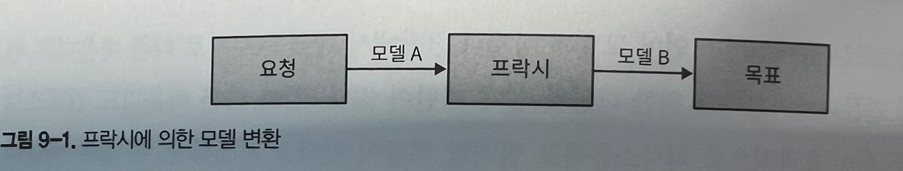

프록시 구현은 동기식/비동기식에 따라 다르다.

#### 동기

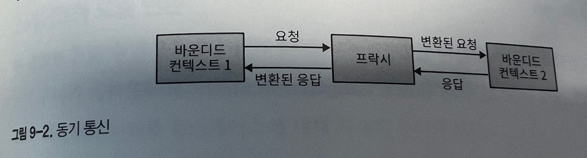
일반적인 방법은 코드베이스에 변환 로직을 포함하는 것이다. 오픈 호스트 서비스에서 공용 언어로 변환은 유입되는 요청을 처리할 때 발생하고 충돌 방지 계층에서는 업스트림 바운디드 컨텍스트를 호출 할 떄 발생한다.

경우데 따라 변환 로직을 API게이트 웨이 패턴과 같은 외부 컴포넌트로 넘기는 것이 더 비용 효과적이고 편할 수 있다. API게이트웨이 컴포넌트는 Kong, KrakenD 같은 오픈소스 소프트웨어 기반 솔루션이거나 AWS API Gateway, Google Apigee, Azure API Management 같은 클라우드 업체의 관리형 서비스일 수 있다.

오픈 호스트 패턴을 구현하는 바운디드 컨텍스트의 경우 API 게이트웨이는 내부 모델을 통합에 최적화된 공표된 언어로 변환하는 역할을 한다. 게다가 명시적 API 게이트웨이를 사용하면
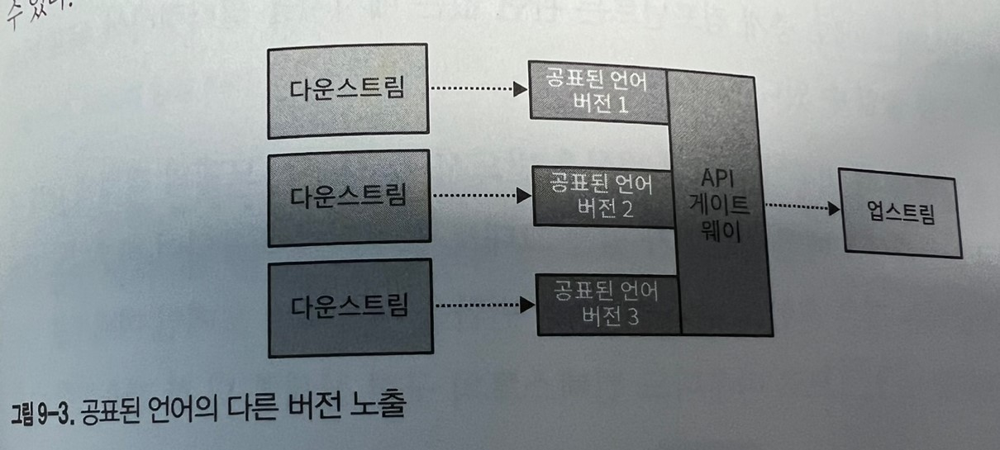
바운디드 컨텍스트 API의 여러 버전을 관리하고 제공하는 프로세스를 도울 수 있다.

API 게이트 웨이를 사용하여 구현된 충돌 방지 계층은 여러 다운 스트림 바운디드 컨텍스트에서 사용할 수 있다. 이러한 경우 충돌 방지 게층은 통합 관련 바운디드 컨텍스트 역할을 한다.
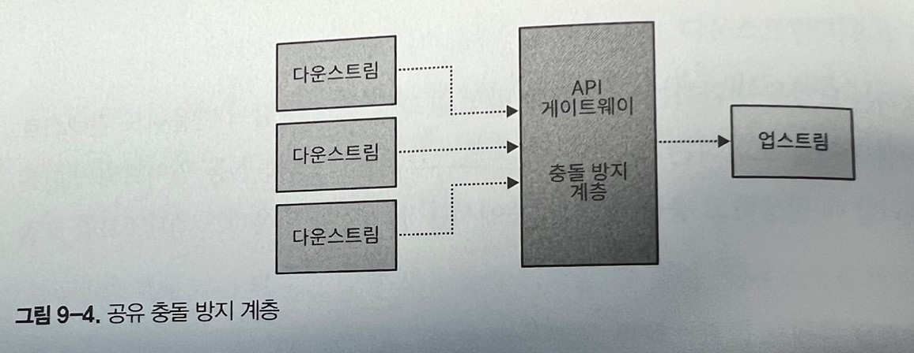

이러한 바운디드 컨텍스트는 종종 교환 컨텍스트라고도 부른다.

#### 비동기

비동기 통신에 사용하는 모델을 변환하기 위해 메시지 프록시를 구현할 수 있다. 메시지 프록시는 소스 바운디드 컨텍스트에서 오는 메시지를 구독하는 중개 컴포넌트다.
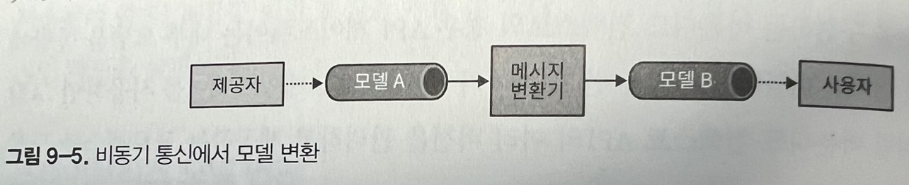

프록시는 필요한 모델 변환을 적용하고 결과 메시지를 대상 구독자에게 전달한다.

메시지 모델을 변환하는 것 외에도 중개 컴포넌트는 관련 없는 메시지를 필터링하여 목표 바운디드 컨텍스트의 노이즈를 줄일 수 있다.

오픈 호스트 서비스를 구현할 때 비동기식 모델 변환은 반드시 필요하다. 모델의 객체에 대해 공표된 언어를 설계하고 노출해서 도메인 이벤트가 있는 그래도 발행되게 허용하여 바운디드 컨텍스트의 구현 모델을 노출하는 것은 흔한 실수다. 비동기 변환을 사용하면 도메인 이벤트를 가로채서 공표된 언어로 변환할 수 있으므로 바운디드 컨텍스트의 구현 상세를 더 잘 캡슐화할 수 있다.

메시지를 공표된 언어로 변환하면 바운디드 컨텍스트의 내부 요구사항을 위한 프라이빗 이벤트와 다른 바운디드 컨텍스트와 연동하기 위해 설계된 퍼블릭 이벤트를 구분할 수있다.
15장에서 도메인 주도 설계와 이벤트 주도 아키텍처 간의 관계와 프라이빗/퍼블릭 이벤트라는 주제에 대해 다시 확장해서 논의할 것이다.
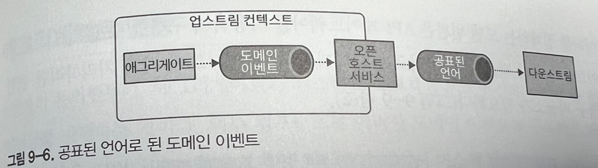

### 스테이트 풀 모델 변환

더 중요한 모델 변환의 경우 스테이트 풀 변환이 필요할 수 있다. 원천데이터를 집계하거나 여러 개의 요청에서 들어오는 데이터를 단일 모델로 통합해야 하는 변환 메커니즘의 경우다.

#### 들어오는 데이터 집계하기

바운디드 컨텍스트가 들어오는 요청을 집계하고 성능 최적화를 위해 일괄 처리에 관심이 있다고 가정해보자. 동기와 비동기 요청 모두에 대한 집계가 필요할 수 있다.
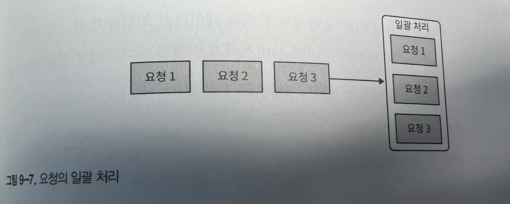

소스 데이터를 집계하는 또 다른 유스케이스는 여러개의 세분화된 메시지를 단일 메시지로 결합하는 것이다.
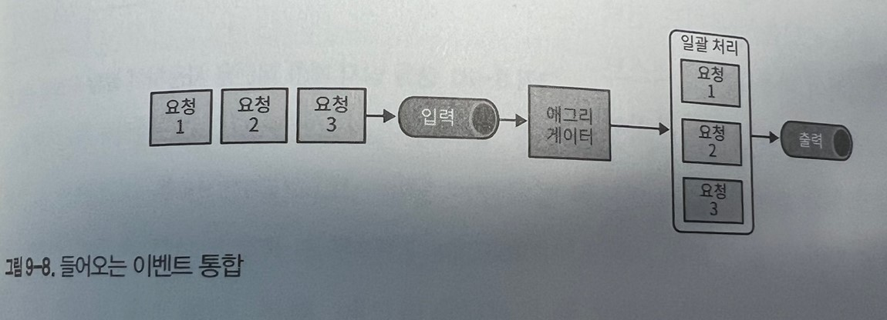

유입되는 데이터를 집계하는 모델 변환은 API 게이트웨이를 사용하여 구현할 수 없으므로 좀 더 정교한 스테이트 풀 처리가 필요하다. 들어오는 데이터를 추적하고 그에 따라 처리하려면 변환 로직에 자체 영구 저장소가 필요하다.
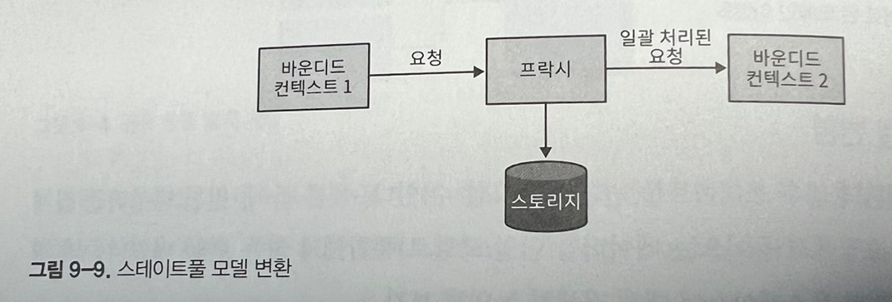

일부 유스케이스에서는 상용 제품을 사용함으로써 스테이트풀 변환을 위한 맞춤 제작 솔루션을 구현하지 않는 경우도 있다. 예로 스트림 처리 플랫폼(Kafka, AWS Kinesis등) 또는 일괄 처리 솔루션(Apache NiFi, AWS Glue, Spark등)을 사용할 수 있다.

#### 여러 요청 통합

다른 바운디드 컨텍스트를 포함하여 여러 요청에서 집계된 데이터를 처리해야 할 수도 있다.
이에 대한 일반적인 예는 사용자 인터페이스가 여러 서비스에서 발생하는 데이터를 결합해야 하는 프런트엔드를 위한 벡엔드 패턴이다.

여러 다른 컨텍스트의 데이터를 처리하고 이를 위해 복잡한 비즈니스 로직을 구현해야 하는 바운디드 컨텍스트다.
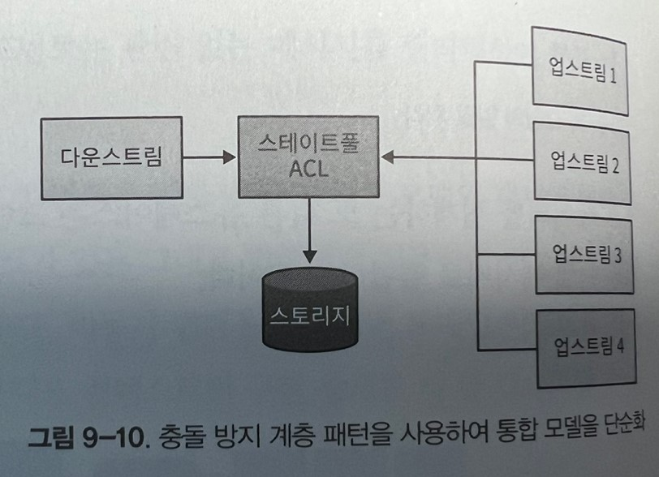
다른 모드 바운디드 컨텍스트에서 데이터를 집계하는 충돌 방지 계층(ACL)을 바운디드 컨텍스트 전면에 배치하여 연동과 비즈니스 로직의 복잡성을 분리하는 것이 유리할 수 있다.

## 애그리게이트 연동

에그리게이트가 시스템의 나머지 부분과 통신하는 방법 중 하나는 도메인 이벤트를 발행하는 것이다. 외부 컴포넌트는 이러한 도메인 이벤트를 구독하고 해당 로직을 실행할 수 있다.

이벤트 발행 프로세스에서 일어날 법한 몇 가지 일반적인 실수와 각 접근 방식의 결과를 보자.

```C#
public class Campaign
{
    // ...
    List<DomainEvent> _events;
    IMessageBus _messageBus;
    // ...

    public void Deactivate(string reason)
    {
        for (l in _locations.Values())
        {
            l.Deactivate();
        }

        IsActive = false;

        var newEvent = new CampaignDeactivated(_id, reason); //17행
        _events.Append(newEvent);
        _messageBus.Publish(newEvent);
    }
}
```

17행에서 새 이벤트가 인스턴스화 된다. 다음 두 줄에서 애그리게이트의 도메인 이벤트 내부 목록에 새 이벤트가 추가 되고 해당 이벤트는 메시지 버스로 발행된다.

도메인 이벤트 발행의 구현은 간단하지만 잘못됬다. 애그리게이트에서 바로 도메인 이벤트를 발행하는 것은 두 가지 이유로 좋지 않다.

-   애그리게이트의 새 상태가 DB에 커밋되기 전에 이벤트가 전달된다. 구독자는 캠페인이 비활성화되었다는 알림을 받을 수 있지만 실제 캠페인 상태와 모순된다.
-   경합 조건, 후족 애그리게이트 로직으로 인해 작업이 무효화되거나 단순이 DB의 기술적인 문제로 인해 DB 트랜잭션이 커밋되지 않으면?? 롤백되더라도 이벤트가 이미 발행되어버린다.

```
public class ManagementAPI
{
    // ...
    private readonly IMessageBus _messageBus;
    private readonly ICampaignRepository _repository;
    // ...
    public ExecutionResult DeactivateCampaign(CampaignId id, string reason)
    {
        try
        {
            var campaign = repository.Load(id);
            campaign.Deactivate(reason);
            _repository.CommitChanges(campaign);

            var events = campaign.GetUnpublishedEvents();
            for (IDomainEvent e in events)
            {
                _messageBus.publish(e);
            }
            campaign.ClearUnpublishedEvents();
        }
        catch(Exception ex)
        {
            // ...
        }
    }
}
```

앞의 예제에서는 새 도메인 이벤트를 발행할 책임을 애플리케이션 게층으로 이전했다. 11~13행에서 캠페인 애그리게이트 관련 인스턴스가 로드되고 비활성화 커맨드가 실행되며 갱신된 상태가 데이터베이스에 성공적으로 커밋된 후 15~20행에서 새 도메인 이벤트가 메시지 버스에 발행된다. 이 코드는 신뢰할 수 없다!

이경우 어떤 이유로 로직을 실행하는 프로세스가 도메인 이벤트를 발행하지 못할 수 있다. 어쩌면 메시지 버스가 다운되었을 수도 있다. 또는 코드를 실행하는 서버가 데이터베이스 트랜잭션을 커밋한 직후 이벤트를 발행하기 전에 실패하면 시스템은 여전히 일관성 없는 상태로 중료된다. 트랜잭션은 커밋되지만 도메인 이벤트는 발행되지 않는다.

이러한 극단적인 경우는 아웃박스 패턴을 사용하여 해결할 수 있다.

### 아웃박스

아웃박스 패턴은 다음 알고리즘을 사용하여 도메인 이벤트의 안정적인 발행을 보장한다.

-   업데이트된 애그리게이트의 상태와 새 도메인 이벤트는 모두 동일한 원자성 트랜잭션으로 커밋된다.
-   메시지 릴레이는 데이터베이스에서 새로 커밋된 도메인 이벤트를 가져온다.
-   릴레이는 도메인 이벤트를 메시지 버스에 발행한다.
-   성공적으로 발행되면 릴레이는 이벤트를 데이터베이스에 발행한 것으로 표시하거나 완전히 삭제한다.

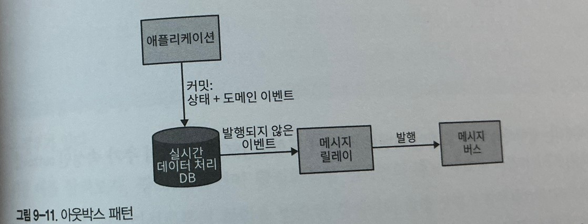
관계형 db를 사용할 때 그림과 같이 두 개의 테이블에 원자적으로 커밋하고 메시지를 저장하기 위한 전용 테이블을 사용하는 데이터베이스의 기능을 활용하는 것이 좋다.

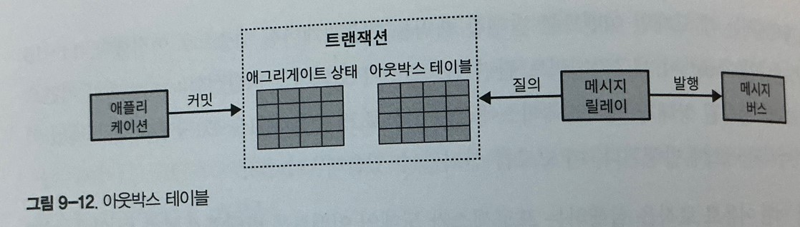

다중 문서 트랜잭션을 지원하지 않는 NoSQL 데이터베이스를 사용할 때 전달될 도메인 이벤트는 애그리게이트 레코드에 포함되어야 한다.

```json
{
	"campaign-id": "364b33c3-2171-446d-b652-8e5a7b2be1af",
	"state": {
		"name": "Autumn 2017",
		"publishing-state": "DEACTIVATED",
		"ad-locations": ["..."],
		"...": "..."
	},
	"outbox": [
		{
			"campaign-id": "364b33c3-2171-446d-b652-8e5a7b2be1af",
			"type": "campaign-deactivated",
			"reason": "Goals met",
			"published": false
		}
	]
}
```

도메인 이벤트 목록이 포함된 json 문서의 추가 속성인 outbox를 볼 수 있다.

### 발행되지 않은 이벤트 가져오기

발행 릴레이는 풀 기반 또는 푸쉬 기반 방식으로 새 도메인 이벤트를 가져올 수 있다.

-   풀 : 발행자 폴링
    -   릴레이는 발행되지 않은 이벤트에 대해 데이터베이스를 지속해서 질희할 수 있다. 지속적인 폴링으로 인한 데이터베이스 부하를 최소화하려면 적절한 인덱스가 있어야 한다.
-   푸시 : 트랜잭션 로그 추적
    -   데이터베이스의 기능을 활용하여 새 이벤트가 추가될 때마다 발행 릴레이를 호출할 수 있다. 예를 들어, 일부 관계형 데이터베이스는 데이터베이스의 트랜잭션 로그를 추적하여 업데이트/삽입된 레코드에 대한 알림을 받을 수 있다, 일부 NoSql 데이터베이스는 커밋된 변경사항을 이벤트 스트림으로 노출하기도 한다.

아웃박스 패턴은 적어도 한 번은 메시지 배달을 보장한다는 점에 유의해야 한다. 메시지를 발행한 후 릴레이가 실패했지만 데이터베이스에 발행한 것으로 표시하기 전에 릴레이가 실패하면 다음 이터레이션에서 같은 메시지가 다시 발행된다.

다음으로 도메인 이벤트의 안정적인 발행을 활용하여 애그리게이트 설계 원칙으로 인해 발생한 몇 가지 제한사항을 극복할수 있는 방법들이다.

### 사가

핵심 애그리게이트 설계 원칙 중 하나는 각 트랜잭션을 애그리게이트의 단일 인스턴스로 제한하는 것이다. 이렇게 하면 애그리게이트의 경계를 신중하게 고려하고 응집된 비즈니스 기능 집합을 캡슐화할 수 있다. 그러나 여러 애그리게이트에 걸쳐 있는 비즈니스 프로세스를 구현해야 하는 경우가 있다.

광고 캠페인이 활성화 되면 캠페인의 광고 자료를 퍼블리셔에게 자동으로 제출해야 한다. 퍼블리셔로부터 확인을 받으면 캠페인의 발행 상태가 발행됨으로 변경되어야 한다. 거부한경우 거부됨으로 표시되어야 한다.

광고 캠페인과 퍼블리셔라는 두 가지 비즈니스 엔티티에 걸쳐 있다. 동일한 애그리게이트 경계에 두 가지 엔티를 배치하는 것은 명백하게 잘못됐다. 이들은 책임 다르고 다른 바운디드 컨텍스트에 속할 수 있는 분명히 다른 비즈니스 엔티티이기 때문이다. 대신 이 흐름을 사가로 구현할 수 있다.

사가는 오래 지속되는 비즈니스 프로세스다. 사가가 몇 초에서 몇 년까지 계속될 수 있지만, 반드시 시간 측정이 아니라 트랜잭션 측면에서 보는 것이다. 즉, 여러 트랜잭션에 걸쳐 있는 비즈니스 프로세스를 말한다. 트랜잭션은 애그리게이트 뿐만 아니라 도메인 이벤트를 내보내고 커맨드에 응답하는 모든 컴포넌트에서 처리할 수 있다.

사가는 관련 컴포넌트에서 발생하는 이벤트를 수신하고 다른 컴포넌트에 후속 커맨드를 발행한다. 발행 단계중 하나가 실패하면 사가는 상태를 일관되게 유지하도록 적절한 보상 조치를 발생하는 일을 담당한다.
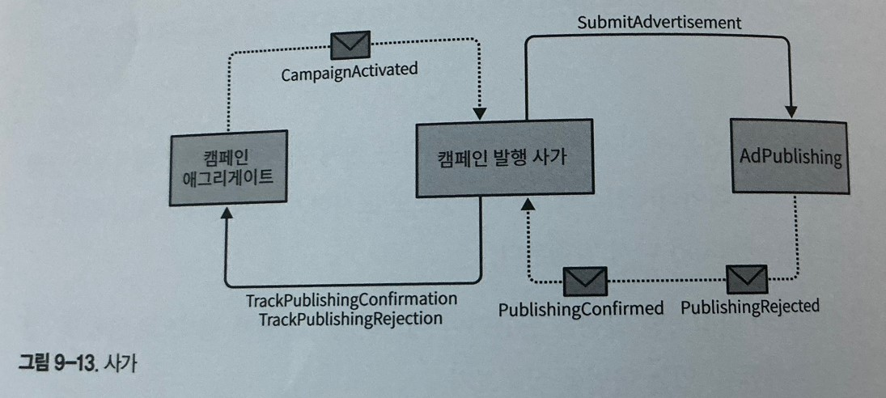

발행 프로세스를 구현하기 위해 사가는 Campaign 애그리게이트로부터 CampaignActivated이벤트를 , AdPublishing 바운디드 컨텍스트로 부터 PublishingConfirmed와 PublishingRejected 이벤트를 기다린다. 사가는 AdPublishing 에서 SubmitAdvertisement 커맨드를 실행하고 Campaign 애그리게이트에서 TrackPublishingConfirmation과 TrackPublishingRejection 커맨드를 실행해야 한다.

이예에서 TrackPublishingRejection 커맨드는 광고 캠페인이 활성 상태가 되지 않도록 하는 보상 조치를 실행하는 역할을한다 다음은 코드이다.

```c#
public class CampaignPublishingSaga
{
    private readonly ICampaignRepository _repository;
    private readonly IPublishingServiceClient _publishingService;
    // ...

    public void Process(CampaignActivated @event)
    {
        var campaign = _repository.Load(@event.CampaignId);
        var advertisingMaterials = campaign.GenerateAdvertisingMaterials);
        _publishingService.SubmitAdvertisement(@event.CampaignId,
                                              advertisingMaterials);
    }

    public void Process(PublishingConfirmed @event)
    {
        var campaign = _repository.Load(@event.CampaignId);
        campaign.TrackPublishingConfirmation(@event.ConfirmationId);
        _repository.CommitChanges(campaign);
    }

    public void Process(PublishingRejected @event)
    {
        var campaign = _repository.Load(@event.CampaignId);
        campaign.TrackPublishingRejection(@event.RejectionReason);
        _repository.CommitChanges(campaign);
    }
}
```

앞의 예는 메시징 인프라에 의존하여 관련 이벤트를 전달하고 관련 커맨드를 실행하여 이벤트에 반응한다. 이것은 사가의 비교적 단순한 예로, 상태 관리가 필요 없다.

또 다른 예로 상태 관리가 필요한 사가가 있다. 실행된 작업을 추적하여 실패 시 적절한 보상 조치를 발행할 수 있다.

이러한 상황에서 사가는 이벤트 소싱 애그리게이트로 구현되어 수신된 이벤트와 발행된 커맨드의 전체 기록을 유지할 수 있다. 그러나 커맨드 실행 로직은 도메인 이벤트가 아웃박스 패턴으로 전달하는 방식과 유사하게 사가 패턴 자체에서 벗어나 비동기적으로 실행된다.

```C#
public class CampaignPublishingSaga
{
    private readonly ICampaignRepository _repository;
    private readonly IList<IDomainEvent> _events;
    // ...

    public void Process(CampaignActivated activated)
    {
        var campaign = _repository.Load(activated.CampaignId);
        var advertisingMaterials = campaign.GenerateAdvertisingMaterials);
        var commandIssuedEvent = new CommandIssuedEvent(
            target: Target.PublishingService,
            command: new SubmitAdvertisementCommand(activated.CampaignId,
            advertisingMaterials));

        _events.Append(activated);
        _events.Append(commandIssuedEvent);
    }

    public void Process(PublishingConfirmed confirmed)
    {
        var commandIssuedEvent = new CommandIssuedEvent(
            target: Target.CampaignAggregate,
            command: new TrackConfirmation(confirmed.CampaignId,
                                           confirmed.ConfirmationId));

        _events.Append(confirmed);
        _events.Append(commandIssuedEvent);
    }

    public void Process(PublishingRejected rejected)
    {
        var commandIssuedEvent = new CommandIssuedEvent(
            target: Target.CampaignAggregate,
            command: new TrackRejection(rejected.CampaignId,
                                        rejected.RejectionReason));

        _events.Append(rejected);
        _events.Append(commandIssuedEvent);
    }
}
```

이 예에서 아웃박스 릴레이는 CommandIssuedEvent의 각 인스턴스에 대한 관련 엔드 포인트에서 커맨드를 실행해야 한다. 도메인 이벤트 발행의 경우 사가 상태의 전환을 커맨드 실행과 분리하면 프로세스가 어느 단계에서 실패하더라도 커맨드가 안정적으로 실행될 수 있다.

### 일관성

사가 패턴이 다중 컴포넌트의 트랜잭션을 조율하기는 하지만 관련된 컴포넌트의 상태는 궁극적으로 일관성을 갖는다. 그리고 사가가 결국 관련 커맨드를 실행한다고 해도 두 개의 트랜잭션은 원자적으로 간주되지 않으므로 모두 성공하거나 실패할 수 없다. 이것은 또 다른 애그리게이트 설계 원칙과 관련이 있다.

**애그리게이트 경계 내의 데이터만 강한 일관성을 가진다. 외부의 모든 것은 궁극적으로 일관성을 갖는다.**

부적절한 애그리게이트 경계를 보상하기 위해 사가를 남용하지 않는 지침을 따르는 것을 원칙으로 하자. 동일한 애그리게이트에 속해야 하는 비즈니스 작업에는 강한 일관성을 갖는 데이터가 필요하다.

사가 패턴은 종종 다른 패턴인 프로세스 관리자와 혼동된다. 사가와 프로세스 관리자는 구현은 비슷하지만 다른 패턴이다.

### 프로세스 관리자

사가 패턴은 단순하고 선형적인 흐름을 관리한다. 사가는 이벤트를 해당 커맨드와 일치시킨다. 사가 구현을 시연하는 데 사용한 에제에서도 실제로 이벤트와 커멘드를 간단하게 일치 시켰다.

-   CampaignActivated 이벤트와 PublishingService.SubmitAdvertisement 커맨드
-   PublishingConfirmed 이벤트와 Campaign.TrackConfirmation 커맨드
-   PublishingRejected 이벤트와 Campaign.TrackRejection 커맨드
    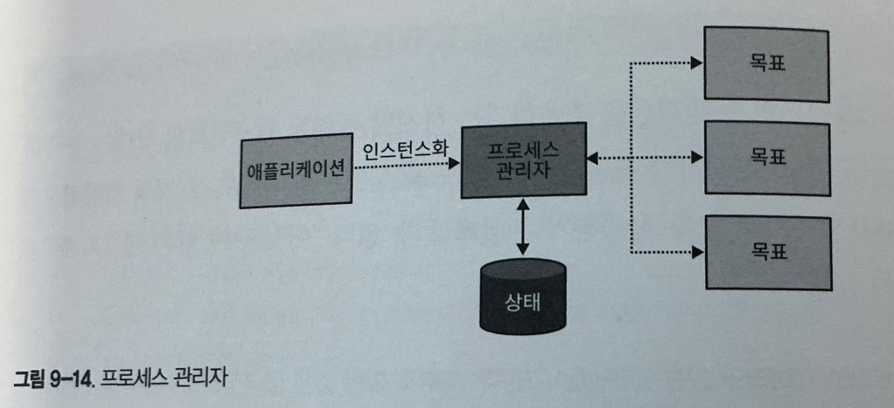
    프로세스 관리자 패턴은 비즈니스 로직 기반 프로세스를 구현하기 위한 것이다. 프로세스 관리자는 시퀀스의 상태를 유지하고 다음 처리 단계를 결정하는 중앙 처리 장치로 정의한다.

사가의 올바른 동작 과정을 선택하는 if-else문이 포함되어 있다면 아마도 프로세스 관리자일것이다.

프로세스 관리자와 사가의 또 다른 차이점은 이전 예제의 CampaignActivated와 같이 특정 이벤트가 관찰될 때 사가가 암시적으로 인스턴스화된다는 것이다. 반면 프로세스 관리자는 단일 소스이벤트에 바인딩될 수 없다. 대신 여러 단계로 구성된 응집된 비즈니스 프로세스다. 따라서 프로세스 관리자는 명시적으로 인스턴스화 해야 한다.

출장 예약은 가장 비용 효과적인 비행 경로를 선택하고 지원에게 승인을 요청하는 라우팅 알고리즘으로 시작한다.

-   직원이 다른 경로를 선호하는 경우 직속 관리자가 승인해야 한다.
-   항공편을 예약한 후 사전 승인된 호텔 중 하나를 적절한 날짜에 예약해야 한다.
-   이용 가능한 호텔이 없으면 취소해야 한다.

이 예제에는 출장 예약 프로세스를 트리거하는 중앙 엔티티가 없다. 출장 예약은 프로세스이며, 프로세스 관리자로 구현해야 한다.
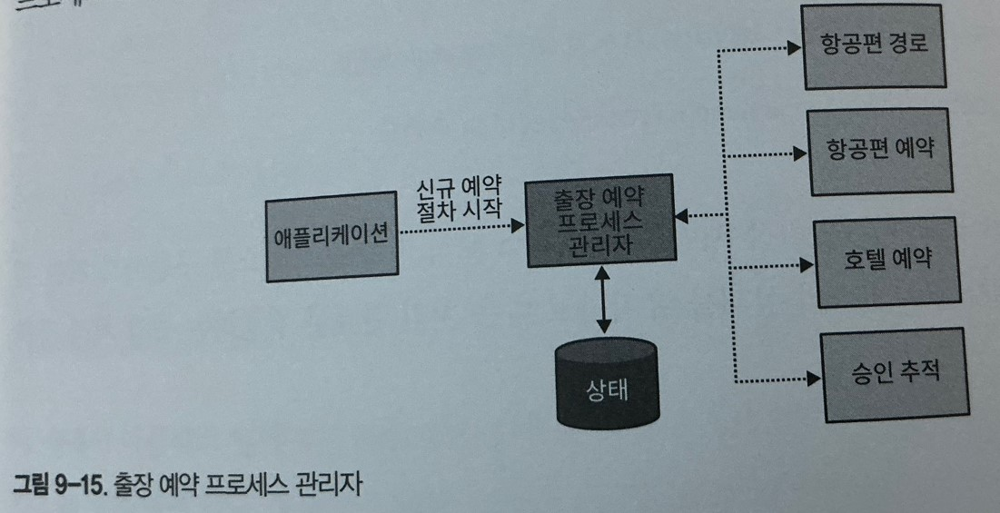

구현 관점에서 프로세스 관리자는 종종 상태 기반 또는 이벤트 소싱의 애그리게이트로 구현된다.

```C#
public class BookingProcessManager
{
    private readonly IList<IDomainEvent> _events;
    private BookingId _id;
    private Destination _destination;
    private TripDefinition _parameters;
    private EmployeeId _traveler;
    private Route _route;
    private IList<Route> _rejectedRoutes;
    private IRoutingService _routing;
    // ...

    public void Initialize(Destination destination,
                           TripDefinition parameters,
                           EmployeeId traveler)
    {
        _destination = destination;
        _parameters = parameters;
        _traveler = traveler;
        _route = _routing.Calculate(destination, parameters);

        var routeGenerated = new RouteGeneratedEvent(
            BookingId: _id,
            Route: _route);

        var commandIssuedEvent = new CommandIssuedEvent(
            command: new RequestEmployeeApproval(_traveler, _route)
        );

        _events.Append(routeGenerated);
        _events.Append(commandIssuedEvent);
    }

    public void Process(RouteConfirmed confirmed)
    {
        var commandIssuedEvent = new CommandIssuedEvent(
            command: new BookFlights(_route, _parameters)
        );

        _events.Append(confirmed);
        _events.Append(commandIssuedEvent);
    }

    public void Process(RouteRejected rejected)
    {
        var commandIssuedEvent = new CommandIssuedEvent(
            command: new RequestRerouting(_traveler, _route)
        );

        _events.Append(rejected);
        _events.Append(commandIssuedEvent);
    }

    public void Process(ReroutingConfirmed confirmed)
    {
        _rejectedRoutes.Append(route);
        _route = _routing.CalculateAltRoute(destination,
                                            parameters, rejectedRoutes);
        var routeGenerated = new RouteGeneratedEvent(
            BookingId: _id,
            Route: _route);

        var commandIssuedEvent = new CommandIssuedEvent(
            command: new RequestEmployeeApproval(_traveler, _route)
        );

        _events.Append(confirmed);
        _events.Append(routeGenerated);
        _events.Append(commandIssuedEvent);
    }

    public void Process(FlightBooked booked)
    {
        var commandIssuedEvent = new CommandIssuedEvent(
            command: new BookHotel(_destination, _parameters)
        );

        _events.Append(booked);
        _events.Append(commandIssuedEvent);
    }

    // ...
}
```

프로세스 관리자는 예약해아 하는 출장을 설명하는 명시적ID와 영속성 상태가 있다. 앞의 사가 패턴 예제처럼 프로세스 관리자는 워크 플로를 제어하는 이벤트(RouteConfirmed, RouteRejected, ReroutingConfirmed 등)를 구독하고 실제 커맨드를 실행하기 위해 아웃박스 릴레이에서 처리될 CommandIssuedEvent 타입의 이벤트를 인스턴스화 한다.

## 결론

이번 장에서는 시스템 컴포넌트를 연동하기 위한 다양한 패턴을 배웠다. 충돌 방지 게층 또는 오픈 호스트 서비스를 구현하는 데 사용할 수 있는 모델 변환 패턴을 살펴보는 것으로 시작했다. 즉석에서 변환될 수 있거나 상태 추적이 필요한 경우 좀 더 복잡한 로직을 구현해야 한다.

아웃박스 패턴은 애그리게이트의 도메인 이벤트를 발행하는 안정적인 방법이다. 다른 프로세스실패에 직면해도 도메인 이벤트를 항상 발행한다.

사가 패턴은 간단한 교차 컴포넌트 비즈니스 프로세스를 구현하는 데 사용할 수 있다. 프로세스 관리자 패턴을 사용하여 좀 더 복잡한 비즈니스 프로세스를 구현할 수 있다. 두 패턴 모두 도메인 이벤트에 대한 비동기식 반응과 커맨드 발행에 의존한다.
