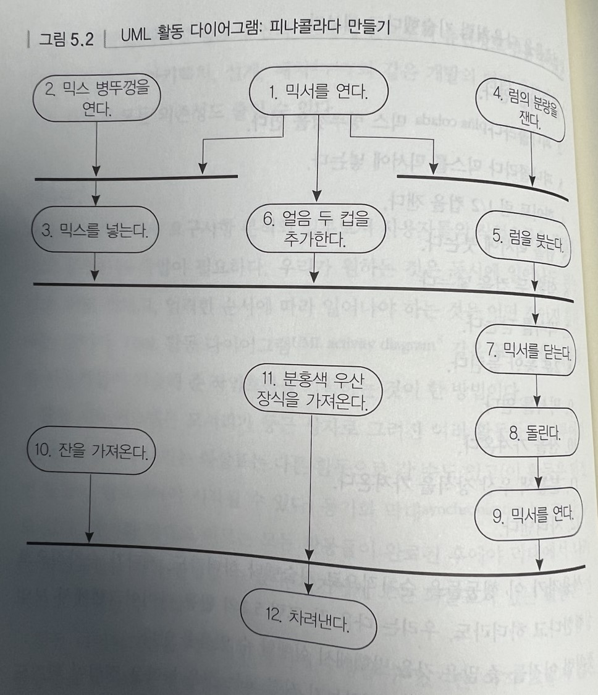

# 구부러지거나 부러지거나

## 결합도 줄이기와 디미터 법칙

코드를 세포(모듈)로 구성하고 이들 간의 상호작용을 제한하라. 그러면 한 모듈이 변경되거나 교체된다 하더라도 다른 모듈은 이상 없이 수행될 수 있을 것이다.

### 결합도 줄이기

불필요한 의존이 많은 시스템은 유지보수하기 어렵고, 이로 인해 비용이 많이 들며 시스템 자체가 매우 불안정한 경향이 있다.

의존도 최소화를 위해 디미터 법칙을 사용하여 ㅔ섣 함수를 설계한다.

### 디미터 함수 법칙

**한 객체가 제공하는 메서드에 접근하기 위해 또 다른 객체들을 통하는 것을 허용하지 않는다.**

**모듈간의 결합도를 최소화하라**

응답집합은 클래스의 메서드가 직접 호출하는 함수의 수를 의미한다.
디미터의 법칙을 따르면 함수를 호출하는 클래스의 응답집합 크기를 줄일 수 있기 때문에 좀 더 에러가 적은 클래스들을 만들 수 있다.

## 메타 프로그래밍

세부사항은 우리의 깔끔한 코드를 어질러 놓는다. 특히 변화가 잦을 때는 더더욱 그러하다.

세부사항에서 벗어나라

### 동적 설정

시스템을 되도록 설정 가능하게 만들기 바란다.
**통합하지 말고 설정하라**

메타데이터를 이용하여 반환 매개변수, 사용자 선호사항, 설치 디렉터리와 같은 애플리케이션 설정 옵션을 기술하라.

### 메타데이터 주도 애플리케이션

**코드에는 추상화를, 메타데이터에는 세부 내용을**

-   설계의 결합도를 줄여 좀 더 유연하고 적응성 있는 프로그램을 만들 수 있다.
-   세부사항을 코드 밖으로 몰아냄으로써 보다 강하고 추상적인 디자인을 만들 수 있다.
-   애플리케이션을 커스터마지이하기 위해 다시 컴파일할 필요가 없다. 이런 방식의 커스터마이징을 통해 실제 제작 공정 시스템에서 일어날 수 있는 치명적인 버그에서 벗어나는 우회로를 쉽게 만들 수 있다.
-   메타데이터는 범용 프로그래밍 언어보다 문제 도메인에 가까운 방식으로표현될 수 있다.
-   동일한 애플리케이션 엔진과 상이한 메타데이터를 이용해 여러 다른 프로젝트를 진행할 수 있게 된다.

## 시간적 결합

시간에는 우리에게 의미 있는 두가지 측면이 있다.

-   동시성(같은 시각에 일어나는 일들)
-   순서(시간 속에서 일들의 상대적인 위치)

### 작업 흐름

많은 프로젝트에서 요구사항 분석의 일부로서 사용자들의 작업흐름을 모델화하고 분석하는 작업이 필요하다.

활동 다이어그램은 모서리가 둥근 상자로 그려진 여러 활동들로 이루어진다.

**작업흐름 분석을 통해 동시성을 개선하라**

예로 믹서 프로젝트에서 사용자가 현재 작업흐름을 다음처럼 기술했다고 해보자.

1. 믹서를 연다.
2. 피냐콜라다 믹스 병뚜껑을 연다.
3. 피냐콜라다 믹스를 믹서에 넣는다.
4. 화이트 럼 1/2 컵을 잰다.
5. 럼을 믹서에 붓는다.
6. 얼음 두 컵을 넣는다.
7. 믹서를 닫는다.
8. 2분 동안 돌린다.
9. 믹서를 연다.
10. 잔을 가져온다.
11. 분홍색 우산 장식을 가져온다.
12. 차려낸다.

사용자가 이 행동들을 순차적으로 기술했다 하더라도, 게다가 순차적으로 실행한다고 하더라도, 활동 다이어그램에서 보인것처럼 이것들 중 많은 것을 병행해서 실행할 수 있음을 안다.

최상위 작업들(1,2,4,10,11)은 제일 먼저, 동시에 수행될 수 있는 일들이다. 그 후에 3,5,6 작업이 동시에 수행될 수 있다.

### 아키텍처

**서비스를 사용해서 설계하라.**

### 동시성을 고려한 설계

쓰레드를 쓰는 프로그래밍은 몇 가지 설계상의 제약을 받게 되는데 이것은 좋은 일이다. 이 제약들은 코드의 결합을 끊고 우연에 맡기는 프로그래밍과 싸우는데에 도움이 된다.

여러일이 동시에 일어날 수 있기 때문에, 갑자기 전에 못보던 시간에 관련된 의존성들이 보이기 시작한다.

-   모든 전역변수나 정적 변수들을 동시 접근으로부터 보호해야 한다.
-   호추 순서와 관계없이 일관성 있는 상태 정보를 보일 수 있는지도 확인해 봐야 한다.

**언제나 동시성을 고려해 설계하라**

## 단지 뷰일 뿐이야

잘 정의된 하나의 책임만 가지는 것 이라는 말이야 말로 모듈(또는 클래스)에 대한 좋은 정의가 된다.

프로그램을 책임에 따른 여러 모듈로 나누었다면 어떻게 서로 이야기하게 만들어야 하는가 논리적 의존성은 어떻게 관리해야 하나 등등..

이벤트는 단지 무슨일이 발생했다고 알리는 특별한 메시지일 뿐이다.

이벤트를 이용하면 객체들 사이의 결합을 최소화할 수 있다.

### 출판/구독

모든 이벤트를 루틴 하나에 몰아 넣는일은 나쁘다. 객체 캡슐화에 위배되기 때문 단 하나의 루틴이 여러 객체들 사이의 상호작요에 대한 상세한 지식을 지니게 된다. 그리고 결합도도 증가된다.

객체들 역시 이벤트에 대한 지식을 가져야 하기 때문에 dry원칙, 직교성을 어기게된다.

### MVC

**모델에서 뷰를 분리하라**

### GUI를 넘어서

MVC는 GUI 개발이라는 맥락에서 가르치지만 일반적으로도 쓸 수 있는 프로그래밍 기법이다

-   모델 : 대상 객체를 나타내는 추상 데이터 모델. 모델은 어떤 뷰나 컨트롤러에 대해서도 직접적인 지식을 지니지 않는다.

-   뷰 : 모델을 해석하는 방법. 뷰는 모델의 변화 그리고 컨트롤러가 보내는 논리적 사건을 구독한다.

-   컨트롤로 : 뷰를 제어하고 모델에 새로운 데이터를 제공하는 방법, 모델과 뷰 둘 모두에 이벤트를 보낸다.

## 칠판

**칠판을 사용해 작업흐름을 조율하라**
