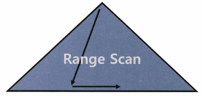
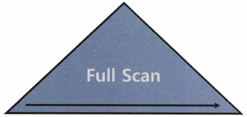
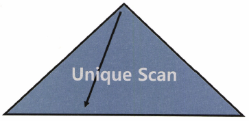
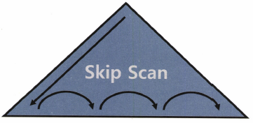
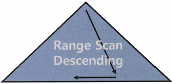

# 인덱스 기본

## 2.1 인덱스 구조 및 탐색

### 2.1.1 미리 보는 인덱스 튜닝

#### 데이터를 찾는 두 가지 방법

-   테이블 전체를 스캔한다.
-   인덱스를 이용한다.

#### 인덱스 튜닝의 두 가지 핵심 요소

인덱스는 큰 테이블에서 소량 데이터를 검색할 때 사용한다. 온라인 트랜잭션 처리 (OLTP) 시스템에서는 주로 소량의 데이터를 주로 검색하므로 인덱스 튜닝이 무엇보다 중요하다.

인덱스 튜닝의 핵심 요소

-   인덱스 스캔 과정에서 발생하는 비효율을 줄이는 것, `인덱스 스캔 효율화 튜닝`

-   테이블 액세스 횟수를 줄이는것
    -   인덱스 스캔 후 테이블 레코드를 액세서할 때 랜덤 I/O방식을 사용하므로 이를 `랜덤 액세스 최소화 튜닝` 이라고 한다.

`SQL 튜닝은 랜덤 I/O와의 전쟁이다.`

#### SQL 튜닝은 랜덤 I/O와의전쟁

DB성능이 느린 이유는 디스크I/O 떄문이다.

조인 메소드 중 가장 일반적으로 사용하는 NL조인이 대량 데이터 조인할 떄는 느린 이유도 램덤 I/O 때문이다.

그래서 소트머지 조인과 해시 조인이 개발됐으므로 이들 조인메소드도 느린 랜ㄷ머 I/O를 극복하기 위해서 개발된 기능이다.

### 2.1.2 인덱스 구조

DB에서도 인덱스 없이 데이터를 검색하려면, 테이블을 처음부터 끝까지 모두 읽어야 한다.

인덱스를 이용하면 일부만 읽고 멈출 수 있다. `즉 범위 스캔`이 가능하다. (인덱스가 정렬되어 있기 때문)

DBMS는 일반적으로 B\*트리 인덱스를 사용한다.

루트와 브랜치 블록에 있는 각 레코드는 하위 블록에 대한 주소값을 갖는다.

키값은 하위 블록에 저장된 키값의 범위를 나타낸다. 예로 루트블록 '서'레코드가 가리키는 하위 오른쪽 블록에는 '서'보다 크거나 같은 레코드가 저장돼 있다.

루트와 브랜치 블록에는 키값을 갖지 않는 특별한 레코드가 있다. 가장 왼쪽 첫번째 레코드다 이를 LMC(Leftmost Child)라고 한다.

`LMC가 가리키는 주소에는 키값을 가진 첫번째 레코드 보다 작거나 같은 레코드가 저장돼어 있다.` 가장 왼쪽이라 키값이 필요없지

인덱스 키 값이 같으면 ROWID 순으로 정렬된다. 인덱스 스캔하는 이유는 검색 조건을 만족하는 소량의 데이터를 빨리 찾고 ROWID를 얻기 위해서

ROWID는 아래와 같이 DBA와 로우번호로 구성되므로 이 값을 알면 테이블 레코드를 찾아갈 수 있다.

-   ROWID : 데이터 블록 주소 + 로우 번호
-   DBA : 데이터 파일 번호 + 블록 번호
-   블록 번호 : 데이터파일 내에서 부여한 상대적 순번
-   로우 번호 : 블록 내 수번

인덱스 탐색과정은 두자기로 나눌 수 있다.

-   수직적 탐색 : 인덱스 스캔 시작지점을 찾는 과정
-   수평적 탐색 : 데이터를 찾는 과정

### 2.1.3 인덱스 수직적 탐색

정렬된 인덱스 레코드 중 조건을 만족하는 첫 번째 레코드를 찾는 과정 즉 `인덱스 스캔 시작지점을 찾는 과정 `

수직적 탐색은 루트 블록에서 시작해 브랜치 블록에 저장된 각 인덱스 레코드는 하위 블록에 대한 주소값을 갖는다. 루트에서 시작해 리프까지 수직적 탐색이 가능한 이유

`수직적 과정은 조건을 만족하는 레코드를 찾는 과정이 아니라 조건을 만족하는 첫 번째 레코드를 찾는 과정`

### 2.1.4 인덱스 수평적 탐색

수직적 탐색을 통해 스캔 시작점을 찾았으면, 찾고자 하는 데이터가 더 안나타날 떄까지 인덱스 리프 블록을 수평적으로 스캔한다.

인덱스에서 본격적으로 데이터를 찾는 과정 인덱스 리프 블록까지는 서로 앞뒤 블록에 대한 주소값을 가진다. (양방향 연결리스트 구조)

수평적 탐색의 이유

-   조건절을 만족하는 데이터를 모두 찾기 위해서
-   ROWID를 얻기 위해서
    -   커버드인덱스처럼 필요한 데이터를 인덱스가 모두 가지고 있으면 스캔만 하고 종료

### 2.1.5 결합 인덱스 구조와 탐색

인덱스 선두 컬럼을 모두 = 조건으로 검색할 때는 어느 컬럼을 인덱스 앞쪽에 두든 블록 I/O 개수가 같으므로 성능도 똑같다.

잘못된 오해

```sql
select 이름
     , 성별
  from 사원
 where 성별 = '여자'
   and 이름 = '유관순'
```

`잘못된 관념`

-   인덱스를 성별 + 이름 순으로 구성한 경우

    -   사원 50명중에서 성별 = 여자인 레코드 25를 찾고 거기서 이름을 검사해 최종적으로 2명 출력 -> 25검사

-   인덱스를 이름 + 성별 순으로 구성한 경우
    -   사원 50명 중에서 이름 = 유관순인 레코드 2건을 찾고 거기서 성별을 검사해 최종적으로 2명 출력 -> 2번의 검사

DBMS가 사용하는 B\*Tree 인덱스는 엑셀처럼 평면 구조가 아니다.

-   루트에서 브랜치를 거려 리프블록까지 탐색하면서 여자 이변서 유관순인 첫 번째 사원을 바로 찾아간다.
-   거기서 두 건을 스캔한다. (정확히는 유관순이 아닌 레코드를 만날때 까지 3건을 스캔)

-   `인덱스 구성에 따라 성능에 차이가 나는 것은 맞지만 위의 예시는 잘못된 예시`

## 2.2 인덱스 기본 사용법

인덱스 기본 사용법은 인덱스를 Range Scan 하는 방법을 의미한다.

색인이 정렬돼 있더라도 가공한 값이나 중간값(중간에 포함된값)으로 스캔 시작점을 찾을 수 없다(그래서 %String은 인덱스를 타지 않음) 스캔하다가 중간에 멈출 수도 없다.

가공한 값이나 중간값을 찾을 때도 색인을 사용할 수 있지만, 색인 전체를 스캔해야 한다.

인덱스 컬럼(선두 컬럼)을 가공하지 않아야 인덱스를 정상적으로 사용할 수 있다.(Index Range Scan)

인덱스 컬럼을 가공해도 인덱스를 사용할 수는 있지만, 스캔 시작점을 찾을 수 없고 멈출 수도 없어 리프 블록 전체를 스캔해야 한다(Index Full Scan)

### 2.2.2 인덱스를 Range Scan 할 수 없는 이유

`인덱스 컬럼을 가공하면 인덱스를 정상적으로 사용(Range Scan)할 수 없다.`

인덱스 컬럼을 가공했을 때 인덱스를 정상적으로 사용할 수 없는 이유는 `인덱스 스캔 시작지점을 찾을 수 없기 때문`

인덱스에는 가공되지 않은 값이 저장돼 있는데, 가공한 값을 기준으로 검색하려면 어디서 시작해야 할지 모른다(ex 생년월일 정렬시 5월에 태어난 사람 찾기 그러면 풀스캔 해야함)

LIKE로 중간 값을 검색할 때도 마찬가지 글자%는 가능하지만 %글자는 불가능

OR조건도 수직적 탐색을 하지 못해 Range Scan을 할 수 없다.

IN조건도 OR조건을 표현하는 다른 방식일 뿐이라 불가능(그래서 SQL 옵티마이저가 IN-List Iterator방식을 사용 List개수만금 Index Range Scan을 반복하는것 = 으로 UNION ALL 처럼)

UNION ALL 방식은 각 브랜치 별로 인덱스 스캔 시작점을 찾을 수 있다.

`인덱스를 정상적으로 사용한다 라는 표현은 수직적 탐색을 통해 시작점을 찾고 스캔하다가 중간에 멈추는것` (Index Range Scan)

```sql
-- 기본적으로 Index Range Scan이 불가능한 코드들
-- OR또는 IN 조건절은 옵티마이저의 쿼리 변환 기능을 통해  Index Range Scan으로 처리되기도 한다.
where substr(생년월일, 5, 2) = '05'
where nvl(주문수량, 0) < 100
where 업체명 like '%대한%'
where (전화번호 = :tel_no or 고객명 = :cust_nm)
where 전화번호 in ( :tel_no1, :tel_no2 )
```

### 2.2.3 더 중요한 인덱스 사용조건

`인덱스를 Range Scan 하기 위한 가장 첫번째 조건은 인덱스 선두 컬럼이 조건절에 있어야 한다는 것`

아래 SQL은 인덱스를 가공했는데 어떻게 Range Scan을 할 수 있는가?

```sql
인덱스 (기준연도 + 과세구분코드 + 보고회차 + 실명확인번호)
select * from TXA1234
where 기준연도 := stdr_year
and substr(과세구분코드, 1, 4) = :txtn_dcd
and 보고회차 = :rpt_tmrd
and 실명확인번호 = :rnm_cnfm_no
```

`인덱스 선두 컬럼이 가공되지 않은 상태로 조건절에 있으면 Range Scan은 무조건 가능하다.

#### 인덱스 잘 타니까 튜닝 끝?

```sql
Execution Plan
--------------------------------------------
0        SELECT STATEMENT Optimizer = ALL_ROWS
1    0    TABLE ACCESS (BY INDEX ROWID) OF '주문상품' (TABLE)
2    1      INDEX (RANGE SCAN) OF '주문상품_N1' (INDEX)
```

인덱스를 정말 잘 타는지는 인덱스 리프 블록에서 스캔하는 양을 따져와야 알 수 있다.

```sql
select *
  from 주문상품
 where 주문일자 = :ord_dt
   and 상품번호 LIKE '%PING%';

select *
  from 주문상품
 where 주문일자 = :ord_dt
   and substr(상품번호, 1, 4) = 'PING';
```

위 SQL에서 상품번호는 스캔범위를 줄이는 데 전혀 역할을 하지 못한다.
중간값 검색과, 컬럼 가공때문에

### 2.2.4 인덱스를 이용한 소트 연산 생략

인덱스를 Range Scan할 수 있는 이유는 데이터가 정렬돼 있기 떄문 그렇게 때문에 일정 부분만 읽다가 멈출 수 있다.

옵티마이저는 이런 속성을 활용해 SQL에 ORDER BY가 있어도 정렬 연산을 따로 수행하지 않는다. PK 인덱스를 스캔하면서 출력한 결과 집합은 어차피 변경순번 순으로 정렬되기 때문

정렬 연산을 생략할 수 있게 인덱스가 구정돼 있지 않다면 SORT ORDER BY연산 단계가 추가된다.

```shell
Execution Plan
--------------------------------------------
0        SELECT STATEMENT Optimizer = ALL_ROWS (Cost = 86 Card = 81 Bytes 5k)
1    0  SORT(ORDER BY) (Cost = 86 Card = 81 Bytes 5k)
2    1    TABLE ACCESS (BY INDEX ROWID) OF '상태변경 이력' (TABLE) (...)
3    2      INDEX (RANGE SCAN) OF '상태변경이력_PK' (INDEX) (...)
```

인덱스 리프 블록은 양방향 연결리스트기 떄문에 내림차순도 가능

```shell
Execution Plan
--------------------------------------------
0        SELECT STATEMENT Optimizer = ALL_ROWS (Cost = 86 Card = 81 Bytes 5k)
1    0  SORT(ORDER BY) (Cost = 86 Card = 81 Bytes 5k)
2    1    TABLE ACCESS (BY INDEX ROWID) OF '상태변경 이력' (TABLE) (...)
3    2      INDEX (RANGE SCAN DESCENDING) OF '상태변경이력_PK' (INDEX) (...)
```

### 2.2.5 ORDER BY 절에서 컬럼 가공

`인덱스 컬럼을 가공하면 인덱스를 정상적으로 이용할 수 없다`는 주로 조건절에 사용한 컬럼을 말한다. 하지만 `ORDER BY, SELECT-LIST 에서 컬럼을 가공함`으로 인해 인덱스를 정상적으로 사용할 수 없는 경우도 종종있다.

### 2.2.6 SELECT-LIST에서 컬럼 가공

MIN, MAX 연산같은 경우는 수직레코드를 탈 수 있다 왼쪽 또는 오른쪽 레코드 하나(FIRST ROW)만 읽고 멈춘다.

```sql
select nvl(max(to_number(변경순번)),0) 은 정렬연산 생략 x

select nvl(to_number(max(변경순번)),0) 은 가능
```

### 2.2.7 자동 형변환

인덱스 컬럼과 다른 타입으로 변환해서 비교할경우 인덱스를 탈 수 없다 인덱스 컬럼의 타입에 맞는 타입으로 변환하여 비교 해야 한다.

## 2.3 인덱스 확장기능 사용법

### 2.3.1 Index Range Scan

인덱스 루트에서 리프 블록까지 수직적으로 탐색한 후 `필요한 범위만`스캔



```sql

select * from emp where deptno = 20;

Execution Plan
--------------------------------------------
0        SELECT STATEMENT Optimizer = ALL_ROWS
1    0    TABLE ACCESS (BY INDEX ROWID) OF 'EMP' (TABLE)
3    2      INDEX (RANGE SCAN) OF 'EMP_DEPTNO_IDX' (INDEX)
```

`선두 컬럼을 가공하지 않은 상태로 조건절에 사용`

### 2.3.2 Index Full Scan

수직적 탐색 없이 인덱스 리프 블록을 처음부터 끝까지 수평적으로 탐색



```sql
create index emp_ename_sql_idx on emp(ename, sql);

select * from emp where sql > 2000 order by ename;

Execution Plan
--------------------------------------------
0        SELECT STATEMENT Optimizer = ALL_ROWS
1    0    TABLE ACCESS (BY INDEX ROWID) OF 'EMP' (TABLE)
3    2      INDEX (FULL SCAN) OF 'EMP_ENAME_SAL_IDX' (INDEX)
```

Index Full Scan은 대게 데이터 검색을 위한 최적의 인덱스가 없을 때 차선으로 선택된다.

위 SQL에서 선두컬럼인 ENAME이 조건절에 없으므로 range scan은 불가능 뒤쪽이긴 하지만 sal컬럼이 인덱스에 있으므로 index full scan을 통해 sal 2000 보다 큰 레코드를 찾을 수 있다.

#### Index Full Scan의 효용성

위 SQL 처럼 인덱스 선두 컬럼이 조건절에 없으면 옵티마이저는 Table Full Scan을 고려한다. 대용량 테이블이라서 부담이 크다면 옵티마이저는 인덱스 활용을 다시 고려한다.

이방식은 적적한 인덱스가 없어 차선책으로 선택한것 수행빈도가 낮다면 상관이 없지만 그렇지 않다면 sal컬럼이 선두인 인덱스를 생성하는 것이 좋음

#### 인덱스를 이용한 소트 연산 생략

인덱스를 Full Scan하면 Range Scan과 마찬가지로 결과집합이 정렬되어있어 sort order by 연산을 생략할 목적으로 사용할 수도 있다

이경우는 차선책이 아니라 옵티마이저가 전략적으로 선택한 경우

```sql
select /*+ first_rows*/ *
from emp
where sal > 1000
order by ename;

Execution Plan
--------------------------------------------
0        SELECT STATEMENT Optimizer = HINT: FIRST_ROWS
1    0    TABLE ACCESS (BY INDEX ROWID) OF 'EMP' (TABLE)
3    2      INDEX (FULL SCAN) OF 'EMP_ENAME_SAL_IDX' (INDEX)
```

대부분의 사원이 sql > 1000 조건을 만족하는 상태에서 Index Full Scan을 선택하면 모든 레코드에 대한 테이블 액세스가 발생하므로 Table Full Scan보다 오히려 불리하다.

sal이 선두 컬럼이여서 range scan하더라도 마찬가지다 (위경우는 힌트때문에 옵티마이저가 사용)

사용자가 처음 의도 (부분처리 활용)와 달리 fetch를 멈추지 않고 데이터를 끝까지 읽는다면 Table Full Scan보다 훨씬 더 많이 I/O를 일으키고 느려진다.

### 2.3.3 Index Unique Scan

수직적 탐색만으로 데이터를 찾는 방식



```sql
create unique index pk_emp on emp(empno);

select empno, ename from emp where empno = 7788;

Execution Plan
--------------------------------------------
0        SELECT STATEMENT Optimizer = HINT: FIRST_ROWS
1    0    TABLE ACCESS (BY INDEX ROWID) OF 'EMP' (TABLE)
3    2      INDEX (UNIQUE SCAN) OF 'PK_EMP' (INDEX)
```

`Unique인덱스가 존재하는 컬럼은 중복 값이 입력되지 않게 DBMS가 정합성을 관리해준다. `

Unique 인덱스라고 해도 범위검색 조건(between, 부등호, like)으로 검색할 때는 index Range Scan으로 처리된다. (ex. empno >= 7788)

### 2.3.4 Index Skip Scan

인덱스 선두 컬럼을 조건절에 사용하지 않으면 옵티마이저는 기본적으로 Table Full Scan을 선택한다. (더 I/O를 줄일 수 있으면 or 정렬된 결과를 쉽게 얻을 수 있거나 할때는 Index Full Scan 사용)

Index Skip Scan은 조건절에 빠진 인덱스 `선두 컬럼의 Distinct Value 개수가 적고 후행 컬럼의 Distinct Value개수가 많을 때 유용`

-   Distinct Value 개수가 적다 : 카디널리티 수치가 낮다 : 중복도가 높다(성별)

-   Distinct Value 개수가 많다 : 카디널리티 수치가 높다. : 중복도가 낮다.(고객번호)

카디널리티 수치가 낮은게 선행 높은게 후행으로 올때 유용

```sql
select * from 사원 where 성별 = '남' and 연봉 between 2000 and 4000
```

Index Skip Scan은 루트 또는 브랜치 블록에서 읽은 컬럼 값 정보를 이용해 조건절에 부합하는 레코드를 포함할 `가능성이 있는 ` 리프 블록만 골라서 액세스 하는 스캔방식



#### index skip scan이 작동하기 위한 조건

`Distinct value 개수가 적은 (중복도가 높은 , 카디널리티 수치가 낮은) 선두 컬럼이 조건절에 없고 후행 컬럼의 Distinct value 개수가 많은(중복도가 낮은, 카디널리티 수치가 높은)때 효과적`

인덱스 선두 컬럼이 없을때만 Index Skip Scan이 작동하는 것은 아님

선두 컬럼에 대한 조건절은 있고, 중간 컬럼에 대한 조건절이 없는 경우에도 Skip Scan을 사용할 수 있다.

```sql
SELECT /*+ INDEX_SS(A 일별업종별거래_PK) */
기준일자, 업종코드, 체결건수, 체결수량, 거래대금
FROM 일별업종별 거래 A
WHERE 업종유형코드 = '01'
AND 기준일자 BETWEEN '20080501' AND '20080531'
```

인덱스는 기본적으로 Range Scan을 목표로 설계해야하며 수행 횟수가 적은 SQL을 위해 인덱스를 추가하는 것이 비효율적일 때 이들 스캔 방식을 차선책으로 활용하는 전략이 바람직하다

### 2.3.5 Index Fast Full Scan

Index Fast Full Scan은 Index Full Scan보다 빠르다 논리적인 인덱스 트리 구조를 무시하고 인덱스 세그먼트 전체를 Multiblock I/O 방식으로 스캔하기 떄문

디스크로부터 대량의 인덱스 블록을 읽어야 할 때 큰 효과를 발휘

속도는 빠르지만, 인덱스 리프노드가 갖는 연결 리스트 구조를 무시한채 읽기 때문에 인덱스 키순서대로 정렬되지 않는다.

쿼리에 사용한 컬럼이 모두 인덱스에 포함돼 있을때만 사용할 수 있다(커버링 인덱스??)

인덱스가 파티션 돼 있지않아도 병렬쿼리가능 병렬쿼리시에는 DIRECT PATH I/O방식을 사용

### 2.3.6 Index Range Scan Descending

index range scan과 동일한 스캔방식 단지 뒤에서 부터 읽어서 내림차순으로 정렬된 결과를 얻음

내림차순으로 정렬하고자 할때 옵티마이저가 알아서 거꾸로 읽는 실행계획을 수립(아니면 힌트로 유도 max값 같은것을 얻을때도 사용 뒤에서 하나만 읽으면 되니까)


