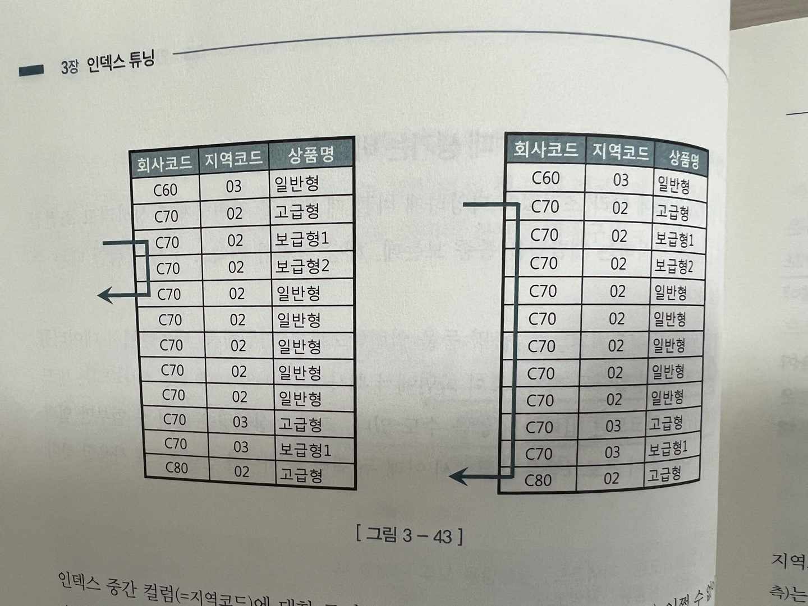
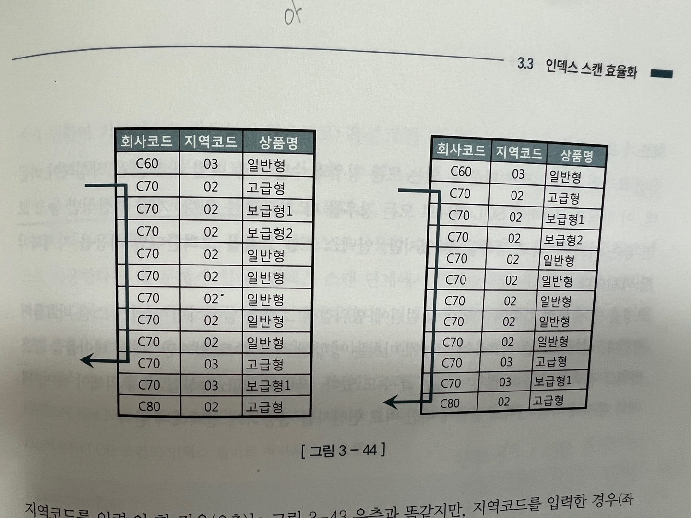

# 인덱스 튜닝

## 3.1 테이블 액세스 최소화

### 3.1.1 테이블 랜덤 액세스

파티셔닝을 사용하는 이유는 대량 데이터를 조회하는 순간 빠르던 인덱스는 한없이 느려진다.

#### 인덱스 ROWID는 물리적 주소? 논리적 주소?

인덱스가 필요한 정보(컬럼)를 모두 포함하는 경우(커버드 인덱스?)가 아니면 인덱스를 스캔한 후에 반드시 테이블을 액세스한다.

```sql
select * from 고객 where 지역 = '서울';
-- TABLE ACCESS BY INDEX ROWID가 인덱스 정보를 가지고 테이블엑세스 했다는 뜻
Execution Plan
------------------------------
0   SELECT STATEMENT Optimizer = ALL_ROWS
1 0   TABLE ACCESS BY INDEX ROWID OF '고객' (TABLE)
2 1     INDEX RANGE SCAN OF '고객_지역_IDX' (INDEX)
```

인덱스를 스캔하는 이유는, 검색 조건을 만족하는 소량의 데이터를 인덱스에서 빨리 찾고 거기거 테이블 레코드를 찾아가기 위한 주소값(ROWID)를 얻으려는데 있다.

ROWID는 물리적으로 직접 연결되지 않고 테이블 레코드를 찾아가기 위한 논리적 주소 정보를 담고 있다.

인덱스 ROWID는 포인터가 아니다. ROWID는 논리적 주소다. 디스크 상에서 테이블 레코드를 찾아가기 위한 위치 정보를 담는다.

#### 메인 메모리 DB와 비교

메인 메모리 DB의 경우 인스턴스를 기동하면 디스크에 저장된 데이터를 버퍼캐시로 로딩하고 이어서 인덱스를 생성한다.

이때 인덱스는 오라클처럼 디스크 상의 주소정보를 갖는 게 아니라 메모리상의 주소정도, 즉 포인터를 갖는다.

반면 오라클은 `테이블 블록이 수시로 버퍼캐시에서 밀려났다가 다시 캐싱되며, 그때마다 다른 공간에 캐싱되기 때문에` 인덱스에서 포인터로 직접 연결할 수 없는 구조다.

메모리 주소 정보(포인터)가 아닌 디스크 주소 정보(DBA)를 이용해 해시 알고리즘으로 버퍼 블록을 찾아간다.

#### I/O 메커니즘 복습

DBA(Data Block Address)는 디스크 상에서 블록을 찾기 위한 주소 정보다. 매번 디스크에서 블록을 읽을 수는 없다. I/O성능을 높이려면 버퍼캐시를 활용해야 한다.

블록을 읽을때는 디스크로 가기전에 버퍼캐시부터 찾아본다. 읽고자 하는 DBA를 해시 함수에 입력해서 해시 체인을 찾고 거기서 버퍼헤더를 찾는다.

해싱 알고리즘으로 버퍼 헤더를 찾고, 거기서 얻은 포인터로 버퍼 블록을 찾아간다.

인덱스로 테이블 블록을 액세스할 떄는 리프 블록에서 읽은 ROWID를 분해해서 DBA를 얻고, 테이블을 Full Scan할 때는 익스텐트 맵을 통해 읽을 블록들의 DBA정보를 얻는다.

인덱스 논리적인 주소인 ROWID가 가리키는 테이블 블록을 버퍼캐시에서 먼저 찾아보고 못 찾을 떄만 디스크에서 블록을 읽는다. (버퍼캐시에 적재후)

모든 데이터가 캐싱돼 있더라도 테이블 레코드를 찾기 위해 매번 DBA해싱과 래치획득 과정을 반복해야 한다. 동시 액세스가 심할 때는 캐시버퍼 체인 래치와 버퍼 Lock에 대한 경합까지 발생한다.

인덱스 ROWID를 이용한 테이블 액세스는 생각보다 고비용 구조다.

#### 인덱스 ROWID는 우편주소

디스크 DB를 우편주소에 메인 메모리 DB가 사용하는 포인터를 전화번호에 비유할 수 있다.

-   전화통신은 물리적으로 연결된 통신망을 이용하므로 곧바로 상대방과 통신한다.

-   우편통신은 봉투에 적힌 대로 우체부 아저씨가 일일이 찾아다니는 구조

오라클에서 하나의 레코드를 찾아가는 데 있어 가장 빠르다는 알려진 ROWID에 의한 테이블 액세스는 고비용 연산이다.

### 3.1.2 인덱스 클러스터링 팩터

클러스터링 팩터는 특정 컬럼을 기준으로 같은 값을 갖는 데이터가 서로 모여있는 정도를 의미한다.

CF가 좋은 컬럼에 생성한 인덱스는 검색효율이 매우 좋다.

오라클은 래치 획득과 해시 체인 스캔과정을 거쳐 어렵게 찾아간 테이블 블록에 대한 포인터를 바로 해제하지 않고 일단 유지한다.(이를 버퍼 Pinning) 이라고 부른다.

다음 인덱스 레코드를 읽었는데, 마침 직전과 같은 테이블 블록을 가리킨다면 래치 획득과 해시 체인 스캔과정을 생략하고 바로 테이블 블록을 읽을 수 있다.

CF가 좋은 인덱스를 사용하면 테이블 액세스 횟수에 비해 블록 I/O가 적게 발생하는 이유

### 3.1.3 인덱스 손익분기점

인덱스 ROWID를 이용한 테이블 액세스는 생각보다 고비용 구조다. 읽어야 할 데이터가 일정량을 넘는 순간, 테이블 전체를 스캔하는 것보다 오히려 느려진다.

Index Range Scan에 의한 테이블 액세스가 Table Full Scan보다 느려지는 지점을 인덱스 손익분기점이라고 한다.

Table Full Scan은 성능이 일정한다. 인덱스를 이용해 테이블을 액세스할 때는 전체 1000만 건 중 몇 건을 추출하느냐에 따라 성능이 크게 달라진다. (추출건수가 많을수록 느려진다. 테이블 랜덤 액세스때문)

-   Table Full Scan은 시퀀셜 액세스인 반면 인덱스 ROWID를 이용한 테이블 액세스는 랜덤 액세스 방식이다.

-   Table Full Scan은 Multiblock I/O인 반면 인덱스 ROWID를 이용한 테이블 액세느느 Single Block I/O방식이다.

인덱스 손익분기점은 보통 5~20% 낮은 수준에서 결정된다. 그리고 또한 CF에 따라 크게 달라진다

조회 건수가 늘수록 데이터를 버퍼캐시에서 찾을 가능성이 작아지기 때문에 나타나는 현상

인덱스를 스캔하면서 읽은 테이블 블록을 뒤에서 다시 읽을 가능성이 작기 때문에 거의 모든 데이터를 디스크에서 읽게 된다.

만 건만 넘어도 시퀀셜 액세스와 Multiblock I/O 방식, 즉 Table Full Scan 방식으로 읽는 게 빠를 수 있다.

`테이블 스캔이 항상 나쁜것은 아니며, 인덱스 스캔이 항상 좋은 것도 아니다`

#### 온라인 프로그램 튜닝 VS 배치 프로그램튜닝

온라인 프로그램은 보통 소량 데이터를 읽고 갱신하므로 인덱스를 효과적으로 활용하는 것이 무엇보다 중요하다.

NL조인은 인덱스를 이용하는 조인방식이다.

대량 데이터를 읽고 갱신하는 배치 프로그램은 항상 전체범위 처리기준으로 튜닝해야 한다. 대량 데이터를 빠르게 처리하려면, 인덱스와 NL조인보다 Full Scan과 해시 조인이 유리하다.

조건절에 해당하는 데이터가 적다면 인덱스와 NL조인 (주민번호), 조건절에 해당하는 데이터가 많다면 (구객구분코드 만족 조건 100만개)Full Scan과 해시조인이 효과적

대량 배치 프로그램에선 인덱스보다 Full Scan이 효과적이지만, 초대용량 테이블을 Full Scan하면 오래걸리기 때문에 배치프로그램에서는 파티션 활용 전략에 매우 중요한 튜닝 요소이고, 병렬 처리까지 더할 수 있으면 금상첨화

테이블을 파티셔닝하는 이유는 결국 Full Scan을 빠르게 처리하기 위해서다.

인덱스는 다양한 튜닝도구 중 하나일 뿐이며, 큰 테이블에서 아주 적은 일부 데이터를 빨리 찾고자 할 때 주로 사용한다.

### 3.1.4 인덱스 컬럼 추가

테이블 액세스 최소화를 위해 가장 일반적으로 사용하는 튜닝 기법은 인덱스에 컬럼을 추가하는것

인덱스 스캔량은 줄지 않지만, 테이블 랜덤 액세스 횟수를 줄여주기 때문

### 3.1.5 인덱스만 읽고 처리 (커버드 인덱스)

테이블 랜덤 액세스가 아무리 많아도 필터 조건에 의해 버려지는 레코드가 거의 없다면 거기에 비효율은 없다.

비효율이 없더라도 인덱스 스캔 과정에서 얻은 데이터가 많다면 그만큼 테이블 랜덤 액세스가 많이 발생하므로 성능이 느릴 수 밖에 없다.

쿼리에 사용된 컬럼을 모두 인덱스에 추가해서 테이블 액세스가 아예 발생하지 않게 하는 방법을 고려해 볼 수 있다. 이것을 `Covered 쿼리`라고 부르며 그 쿼리에 사용한 인덱스를 `Covered 인덱스`라고 부른다.

이방법이 효과는 매우 좋지만 추가해야 할 컬럼이 많아 실제 적용하기 곤란한 경우도 많다.

#### include 인덱스

### 3.1.6 인덱스 구조 테이블

인덱스를 이용한 테이블 액세스가 고비용 구조라고 하니, 랜덤 액세스가 아예 발생하지 않도록 테이블을 인덱스 구조로 생성하는 것 (Mysql 의 클러스터드 인덱스)

오라클에서는 IOT(Index-Organized Table) 인덱스의 리프 블록이 곧 데이터 블록이다

-   Mysql에서는 Pk생성시 자동으로 인덱스 생성 및 인덱스 키값으로 물리적
    저장

-   Oracle에서는 Pk고유 유니크인덱스는 생성하지만 인덱스와 데이터 별도 관리

오라클의 기본 테이블 저장 방식은 MySQL InnoDB와 달리 힙 테이블(heap-organized table) 입니다. 즉, 기본적으로 테이블 데이터는 특정 인덱스(예: 기본 키 인덱스)에 따라 물리적으로 정렬되어 저장되지 않습니다.

```sql
-- 테이블을 인덱스 구조로 만드는 구문
create table index_org_t( a number, b varchar(10)
                        , constraint index_org_t_pk primary key(a))

organization index;

-- 일반테이블은 힙 구조 테이블이라고 부른다
create table index_org_t( a number, b varchar(10)
                        , constraint index_org_t_pk primary key(a))
organization heap; -- 보통 테이블을 생성할때 생략
```

IOT는 인위적으로 CF를 좋게 만드는 방법 중 하나다.
같은 값을 가진 레코드들이 100% 정렬된 상태로 모여있으므로 랜덤 액세스(리프노드에서 블록접근)가 아닌 시퀀셜 방식(리프노드에서 순차탐색)으로 데이터를 액세스

이떄문에 BETWEEN이나 부등호 조건으로 넓은 범위를 읽을 때 유리

데이터 입력과 조회 패턴이 서로 다른 테이블에도 유용하다. 실적등록은 일자별로 진행되지만, 실적조회는 주로 사원별로 이루어진다.

이쿼리에 인덱스를 사용한다면, 사원마다 랜덤 액세스 방식으로 365개 테이블 블록을 읽어야 한다. CF가 매우 안좋으므로 조회 건수만큼 블록 I/O가 발생한다.

```sql
select substr(일자, 1, 6) 월도, sum(판매금액) 총판매금액, avg(판매금액) 평균판매금액
from 영업실적
where 사번 = 'S1234'
and   일자 between '20180101' and '20181231'
group by substr(일자, 1, 6)
```

이처럼 입력과 조회 패턴이 서로 다를 때, 아래와 같이 사번이 첫 번째 정렬 기준이 되도록 IOT를 구성해 주면 네 개 블록만 읽고 처리할 수 있다

```sql
create table 영업실적( 사번 varchar2(5), 일자 varchar2(8), ...,
    constraint 영업실적_pk primary key(사번, 일자) ) organization index;
```

### 3.1.7 클러스터 테이블

#### 인덱스 클러스터 테이블

같은 클러스터키 키를 가지는 레코드를 한블럭 공간에 저장 (정렬 x) 한 블록에 모두 담을 수 없다면 새로운 블록을 할당후 클러스터 체인으로 연결

인덱스 클러스터 테이블을 구성하려면 먼저 아래와 같이 클러스터를 생성한다.

```sql
create cluster c_dept# ( dept number(2)) index;
```

클러스터에 테이블을 담기 전에 아래와 같이 클러스터 인덱스를 반드시 정의해야 한다. 클러스터 인덱스는 데이터 검색 용도로 사용할 뿐만 아니라 데이터가 저장될 위치를 찾을때도 사용하기 때문

```sql
create index c_dept#_idx on cluster c_dept#;
```

클러스터 인덱스를 만들었으면 아래와 같이 클러스터 테이블을 생성한다.

```sql
create table dept(
  deptno number(2) not null
, dname varchar2(14) not null
, loc varchar2(13))
cluster c_dept#(deptno);
```

클러스터 인덱스도 일반 B\*Tree 인덱스 구조를 사용하지만, 테이블 레코드를 일일이 카리키지 않고 해당 키 값을 저장하는 첫 번째 데이터 블록을 가리킨다.

즉, 일반 테이블에 생성한 인덱스 레코드는 테이블 레코드와 1:1 대응 관계를 갖지만, 클러스터 인덱스는 테이블 레코드와 1:M 관계를 갖는다. 따라서 클러스터 인덱스의 키값은 항상 Unique하다.

```sql
select * from dept where deptno = :deptno;

Execution Plan
------------------------------------------
0   SELECT STATEMENT Optimizer = ALL_ROWS
1 0    TABLE ACCESS (CLUSTER) OF 'DEPT' (CLUSTER)
2 1     INDEX(UNIQUE SCAN) OF 'C_DEPT#_IDX' (INDEX (CLUSTER))
```

#### 해시 클러스터 테이블

해시 클러스터는 인덱스를 사용하지 않고 해시 알고리즘을 사용해 클러스터를 찾아간다는 점만 다르다.

클러스터를 생성한다.

```sql
create cluster c_dept# (deptno number(2)) hashkeys 4
```

아래와 같이 클러스터 테이블을 생성한다.

```sql
create table dept(
  deptno number(2) not null,
  dname varchar(2) not null,
  ioc varchar2(13))
  cluster c_dept#(dept no);
```

해시 클러스터를 조회할 때 실행 계획은 아래와 같다.

```sql
select * from dept where deptno = :deptno;

Execution Plan
--------------------------------
0     SELECT STATEMENT Optimizer = ALL_ROWS
1  0  TABLE ACCESS (HASH) OF 'DEPT' (CLUSTER (HASH))
```

## 3.2 부분범위 처리 활용

부분범위 처리 원리를 활용하면 인덱스로 액세스할 대상 레코드가 아무리 많아도 아주 빠른 응답속도를 낼 수 있다.

### 3.2.1 부분범위 처리

DBMS가 클라이언트에게 데이터를 전송할 때도 일정량씩 나누어 전송한다. 전체 결과 집합중 아직 전송하지 않은 분량이 많이 남아있어도 서버 프로세스는 클라이언트로부터 추가 Fetch Call을 받기 전까지 그대로 멈춰 서서 기다린다.

OLTP 환경에서 대용량 데이터를 빠르게 핸들링할 수 있는 원리다. SQL 1억 건에 이르는 대용량 테이블이어도 실행 결과는 버튼을 클릭하자마자 곧바로 화면에 출력된다.

DBMS가 데이터를 모두 읽어 한 번에 전송하지 않고 먼저 읽는 데이터부터 일정량(Arrays Size)을 전송하고 점추기 때문

데이터를 전송하고 나면 서버 프로세스는 CPU를 OS에 반환하고 대기 큐에서 잠을 잔다. (그다음 fetch call을 받으면 큐에서 나와서 또 일정량 전송)

데이터 전송 단위인 Arrays Size는 클라이언트 프로그램에서 설정한다 JAVA에서 Array Size 기본값은 10이다.

JAVA 프로그램이 데이터를 읽어 들이는 메커니즘

-   최소 rs.next() 호출 시 Fetch Call을 통해 DB서버로부터 전송받은 데이터 10건을 클라이언트 캐시에 젖아한다.
-   이후 rs.next() 호출 시 Fetch Call을 발생하지 않고 캐시에서 데이터를 읽는다.
-   캐시에 저장된 데이터를 모두 소진한 상태에서 rs.next() 호출 시 추가 Fetch 콜을 통해 10건을 전송받는다.
-   원하는 건을 다 읽을 때까지 2~3번 과정을 반복한다.

`어떤 오라쿨 튜닝 서적을 보면 쿼리 수행 시 결과 집합을 모두 버퍼캐시에 적재하고 나서 사용자에 전송한다고 되어있는데 이것은 틀린말 이렇게 하면 매우 느리다.`

#### 정렬 조건이 있을 때 부분범위 처리

만약 쿼리문에 order by를 추가한다면 부분범위 처리가 되지 않고 DB서버는 '모든' 데이터를 다 읽어 created순으로 정렬을 마치고서야 클라이언트에게 데이터 전송을 시작할 수 있다. (전체 범위 처리)

Sort Area와 Temp 테이블 스페이스까지 이용해 데이터 정렬을 마치고 나면 일정량 씩 나눠 클라이언트에게 데이터를 전송한다.

created 컬럼이 선두인 index가 있으면 부분범위 처리 가능 (이미 정렬되어 있으므로)

#### Array Size 조정을 통한 Fetch Call 최소화

네트워크를 통해 전송해야 할 데이터량에 따라 Array Size를 적절히 조절할 필요가 있다. 대량 데이터의 경우 모두 전송해야 하므로 사이즈를 늘리고 (Fetch Call 감소) 소량 데이터의 경우 불필요한 데이터 전송을 줄이기 위해 사이즈를 줄인다.

#### 쿼리 툴에서 부분범위 처리

모든 DBMS는 데이터를 조금씩 나눠서 전송한다. 즉 부분범위 처리 방식으로 결과 집합을 전송한다.

중간에 멈췄다가 사용자가 추가 요청이 있을 떄마다 데이터를 가져도오록 구현하고 안하고는 클라이언트 프로그램을 개발하는 개발자의 몫

보통 개발자가 일일이 이렇게 구현할 순 없고, 개발 프레임워크에 미리 구현돼 있는 기능을 활용한다.

### 3.2.3 OLTP 환경에서 부분범위 처리에 의한 성능개선 원리

OLTP는 Online Transaction Processing의 줄임말이다. 온라인 트랜잭션은 일반적으로 소량 데이터를 읽고 갱신한다.

OLTP성 업무에서 쿼리 결과집합이 아주 많을 때 사용자가 모든 데이터를 일일이 다 확인하지는 않는다. 특정한 정렬 순서로 상위 일부 데이터만 확인한다.(게시판..같이 주로 목록을 조회하는경우) 정렬상태를 유지하는 인덱스를 이용하면 정렬 작성을 생략하고 부분범위 처리가 가능하다.

```sql
-- 예시
select 게시글ID, 제목, 작성자, 등록일시
from 게시판
where 게시판구분코드 ='A'
order by 등록일시 desc
```

인덱스 선두 컬럼을 (게시판 구분코드 + 등록일시) 순으로 구성하지 않으면(게시판구분코드 단일 컬럼 or 게시판구분코드 바로 뒤에 등록일시가 위치하지 않으면) `소트 연산을 생략할 수 없다.`

```sql
| Id   | Operation                   | Name        | Rows  | Bytes | Cost (%CPU) |
| ---- | --------------------------- | ----------- | ----- | ----- | ----------- |
| 0    | SELECT STATEMENT            |             | 40000 | 3515K | 2041(1)     |
| 1    | SORT ORDER BY               |             | 40000 | 3515K | 2041(1)     |
| 2    | TABLE ACCESS BY INDEX ROWID | 게시판      | 40000 | 3515K | 1210(1)     |
| * 3  | INDEX RANGE SCAN            | 게시판\_X01 | 40000 |       | 96(2)       |

Predicate Information (identified by operation id):
---------------------------------------------------
2 - access("게시판구분코드" = 'A')
```

인덱스를 게시판 구분코드 + 등록일시 순으로 구성하면 Sort Order By 연산을 생략할 수 있다

SQL문에 Order By절이 있음에도 불구하고 Sort Order By 오퍼레이션이 자동으로 제거됨

```sql
| Id   | Operation                   | Name        | Rows  | Bytes | Cost (%CPU) |
| ---- | --------------------------- | ----------- | ----- | ----- | ----------- |
| 0    | SELECT STATEMENT            |             | 40000 | 3515K | 1372(1)     |
| 1    | TABLE ACCESS BY INDEX ROWID | 게시판      | 40000 | 3515K | 1372(1)     |
| * 2  | INDEX RANGE SCAN DESCENDING | 게시판\_X01 | 40000 |       | 258 (2)     |

Predicate Information (identified by operation id):
---------------------------------------------------
2 - access("게시판구분코드" = 'A')
```

이 방식으로 수행하면 게시판구분코드 = 'A' 조건을 만족하는 전체 로우를 읽지 않고도 바로 결과집합 출력을 시작할 수 있다.

#### 멈출 수 있어야 의미있는 부분범위 처리

`문제는 앞쪽 일부만 출력하고 멈출 수 있는가`이다 클라이언트 프로그램이 DB서버에 직접 접속하는 2-Tier환경에ㅐ서는 그렇게 구현할 수 있지만 WAS, AP 서버 등이 존재하는 n-Tier 아키텍처에서는 클라이언트가 DB커넥션을 독점할 수 없다.

#### 배치I/O

디스크 랜덤 I/O성능을 높이려고 나온 배치 I/O는 읽는 블록마다 건건이 I/O Call을 발생시키는 비효율을 줄이기 위해 고안한 기능이다.

인덱스를 이용해 테이블을 액세스하다가 버퍼 캐시에서 블록을찾지 못하면 일반적으로 디스크 블록을 바로 읽는데, 이 기능이 작동하면 테이블 블록에 대한 디스크 I/O Call을 미뤘다가 읽을 블록이 일정량이 쌓이면 한꺼번에 처리한다.

물론 배치 I/O기능이 작동하면 인덱스를 이용해서 출력하는 데이터 정렬 순서가 매번 다를 수 있다는 사실에 주목해야 한다.

인덱스로 소트 연산을 생략할 수 없거나 SQL에 ORDER BY 가없으면 랜덤 I/O성능을 향상시키는 좋은 기능이다.

하지만 이 기능을 활성화 하면 인덱스를 이용했을때 결과집합이 자동으로 정렬되는걸 고려해서 order by를 생략해서 사용하는걸 할 수 없다. (order by를 명시하는 것이 바람직함)

## 3.3 인덱스 스캔 효율화

IOT, 클러스터, 파티션은 테이블 랜덤 액세스를 최소화 하는 데 매우 효과적인 저장 구조이지만, 운영 시스템 환경에서 이를 적용하려면 성능 검증을 위해 많은 테스트를 진행해야 하므로 어려움이 따른다. 시스템 개발 단계에서 물리 설계가 중요한 이유

운영 환경에서 가능한 일반적인 튜닝 기법은 인덱스 컬럼 추가다.

### 3.3.1 인덱스 탐색

가장 왼쪽에 있는 LMC(Leftmost Child) 레코드다. LMC는 자식 노트 중 가장 왼쪽 끝에 위치한 블록을 가리킨다.

LMC가 가리키는 주소로 찾아간 블록에는 `키값을 가진 첫 번째 레코드보다 작거나 같은 값`을 갖는 레코드가 갖는 레코드가 저장돼 있다.

작거나 같은 값이기 때문에 2번째 키값에 3이더라도 1번째 키값을 가지는 레코드에도 3이 있을 수 있다.

`수직적 탐색은 스캔 시작점을 찾는 과정`

### 3.3.2 인덱스 스캔 효율성

인덱스 선행 컬럼이 조건절에 없으면, 인덱스 선행 컬럼이 조건절에 없다나 '='조건이 아니면 인덱스 스캔 과정에 비효율이 발생한다.

#### 인덱스 스캔 효율성 측정

SQL 트레이스를 통해 쉽게 알 수 있다.

```sql
| Rows | Row Source Operation                                                               |
| ---- | ---------------------------------------------------------------------------------- |
| 10   | TABLE ACCESS BY INDEX ROWID BIG_TABLE (cr = 7471 pr = 1466 pw = 0 time = 22137 us) |
| 10   | INDEX RANGE SCAN BIG_TABLE_IDX (cr = 7463 pr = 1466 pw = 0 time = 22328 us)        |
```

-   cr = 논리적 블록 I/O
-   pr = 물리적 블록 I/O

위 트레이스는 인덱스를 스캔하고 얻은 레코드가 10개인데 그 과정에서 7463개 블록을 읽었다는 사실을 알 수 있다.

인덱스 리프 블록에는 테이블 블록보다 훨씬 더 많은 레코드가 담긴다. 한블록당 500개 레코드라 가정하면 3731500 (= 7463 \* 500)개 레코드를 읽은 셈이다. 그 많은 데이터를 읽고 열 개를 얻었다면 매우 비효율적이다.

-   선두 컬럼 : 인덱스 구성상 맨 앞쪽에 있는 컬럼을 지칭
-   선행 컬럼 : 어떤 컬럼보다 상대적으로 앞쪽에 놓은 컬럼 지칭

### 3.3.3 액세스 조건과 필터 조건

인덱스 스캔 효율성에는 액세스 조건과 필터 조건이 있다.

-   액세스 조건 : 인덱스 스캔 범위를 결정하는 조건 `인덱스 수직적 탐색을 통해 스캔 시작점을 결정하는데 영향을 미치는 조건절`이다. 인덱스 수직적 탐색을 통해 스캔 시작점을 결정하는데 영향을 미치고, 인덱스 리프 블록을 스캔하다가 어디서 멈출지를 결정하는 데 영향을 미치는 조건절 (ragne)

-   인덱스 필터 조건 : 테이블로 액세스할지를 결정하는 조건절이다.

-   인덱스를 이용하던, 테이블을 Full Scan하든, 테이블 액세스 단계에서 처리되는 조건절은 모두 필터 조건이다.

-   테이블 필터 조건 : 쿼리 수행 다음 단계로 전달하거나 최종 결과집합에 포함할지를 결정한다.

#### 옵티마이저의 비용 계산 원리

```
인덱스를 이용한 테이블 액세스 비용

비용 = 인덱스 수직적 탐색 비용 + 인덱스 수평적 탐색 비용 + 테이블 랜덤 액세스 비용
     = 인덱스 루트와 브랜치 레벨에서 읽는 블록 수 +
       인덱스 리프 블록을 스캔하는 과정에 읽는 블록 수 +
       테이블 액세스 과정에 읽는 블록 수
```

### 3.3.4 비교 연선자 종류와 컬럼 순서에 따른 군집성

테이블과 달리 인덱스에는 '같은 값'을 갖는 레코드들이 서로 군집해 있다. '같은 값'을 찾을때 '='연산자를 사용하므로 인덱스 컬럼을 앞쪽부터 누락없이 '=' 연산자로 조회하면 조건절을 만족하는 레코드는 모두 모여있다.

어느 하나를 누락하거나 '=' 고전이 아닌 연산자로 조회하면 조건즐을 만족하는 레코드가 서로 흩어진 상태가 된다.

| C1  | C2  | C3  | C4  |
| --- | --- | --- | --- |
| 1   | A   | 가  | a   |
| 1   | A   | 가  | a   |
| 1   | A   | 가  | c   |
| 1   | A   | 나  | a   |
| 1   | A   | 나  | a   |
| 1   | A   | 나  | a   |
| 1   | A   | 나  | b   |
| 1   | A   | 나  | b   |
| 1   | A   | 나  | c   |
| 1   | A   | 다  | a   |
| 1   | A   | 다  | c   |
| 1   | B   | 가  | b   |
| 1   | B   | 나  | a   |
| 1   | B   | 나  | b   |
| 1   | B   | 다  | b   |
| 2   | A   | 가  | b   |

...

```sql
-- 모두 = 조건으로 비교시 만족하는 레코드들이 모두 연속해서 모여있다. (5~7)
where C1 = 1
AND C2 = 'A'
AND C3 = '나'
AND C4 = 'a'
```

```sql
-- 선행컬럼은 모두 = 조건으로
-- 마지막 컬럼만 범위검색 조건일 때도 조건을 만족하는 레코드가 모여있다.
-- (5~10)
where C1 = 1
AND C2 = 'A'
AND C3 = '나'
AND C4 >= 'a'
```

```sql
-- 중간 컬럼이 범위검색 조건일 경우
-- C1 ~ C3까지 세 조건을 만족하는 인덱스 레코드는 모여있지만
-- C4 조건까지 만족하는 레코드는 흩어지게 된다(2,3,5,6,7,11)
where C1 = 1
AND C2 = 'A'
AND C3 between '가' and '나'
AND C4 = 'a'
```

```sql
-- 두번째 컬럼인 C2가 범위검색 조건인 경우
-- C1 ~ C2까지 두조건을 만족하는 인덱스 레코드는 모여 있지만 2~16
-- C3와 C4 조건까지 만족하는 레코드는 흩어진다. 5,6,7,8,9,14,15
where C1 = 1
and C2 <= 'B'
and C3 = '나'
and C4 between 'a' and 'b'
```

`선행 컬럼이 모두 '='조건인 상태에서 첫 번째 나타나는 범위검색 조건까지만 만족하는 인덱스 레코드는 모두 연속해서 모여 있지만, 그 이하 조건까지 만족하는 레코드는 비교 연산자 종류에 상관없이 흩어진다.` (우연히 모여있을 수는 있음)

선투 컬럼인 c1이 범위검색 조건이면 c1조건을 만족하는 레코드는 서로 모여있고 나머지는 흩어져 있다.

후위 조건들도 스캔량을 줄이긴 하지만 대게 무시할만한 수준이다. 하지만 결국 줄이기는 하기 때문에 인덱스 컬럼에 대한 조건절은 모두 액세스 조건에 표시된다.

`첫번째 나타나는 범위검색 조건까지가 인덱스 액세스 조건이고, 나머지는 필터조건이라 생각하자`

### 3.3.5 인덱스 선행 컬럼이 등치(=) 조건이 아닐 떄 생기는 비효율

인덱스 스캔 효율성은 인덱스 컬럼을 조건절에 모두 등치(=)조건으로 사용할 때 가장 좋다.

리프 블록을 스캔하면서 읽은 레코드는 하나도 걸러지지 않고 모두 테이블 액세스로 이어진다.

인덱스 컬럼 중 일부가 조건절에 없거나 등치 조건이 아니더라도 그것이 뒤쪽 컬럼일 때는 비효율이 없다.

인덱스 선행 컬럼이 조건절에 없거나 부등호, between, like 같은 범위검색 조건이면, 인덱스를 스캔하는 단게에서 비효율이 생긴다.(흩어져 있으니까)

인덱스 (아파트시세코드 + 평형 + 평형타입 + 인터넷 매물) 순으로 구성한 상황에서 아래 SQL을 수행하는 경우

```sql
select 해당층, 평당가, 입력일, 해당동, 매물구분, 연사용일수, 중개업소코드
from 매물아파트매매
where 아파트시세코드='A01011450900056'
and 평형 = '59'
and 평형타입 = 'A'
and 인터넷매물 between '1' and '3'
order by 입력일 desc
```

이경우 인터넷매물이 between 조건이지만 선행 컬럼들이 등치조건이기 떄문에 전혀 비효율 없이 조건을 만족하는 세 건을 빠르게 찾았다.

조건을 만족하는 세 건을 빠르게 찾고 마지막 4번째 스캔은 조건을 만족하는 레코드가 더 없음을 확인하기 위하 one-plus 스캔이므로 불가피하다.

`인덱스 선행 컬럼이 모두 = 조건일 때 필요한 범위만 스캔하고 멈출 수 있는 것은, 조건을 만족하는 레코드가 모두 한데 모여있기 때문`

인덱스 구성을 (인터넷매물 + 아파트시세코드 + 평형 + 평형타입) 순으로 바꾼 후 같은 SQL 을 수행하면 인덱스 스캔 범위가 넓어진다.

인덱스 선두 컬럼 인터넷매물에 BETWEEN 연산자를 사용하면 나머지 조건을 만족하는 레코드들이 인터넷매물 값 별로 뿔뿔이 흩어져 있게 된다.

### 3.3.6 BETWEEN을 IN-List로 전환

BETWEEN조건을 IN-List로 바꿔주면 큰 효과를 얻는 경우가 있다.

```sql
select 해당층, 평당가, 입력일, 해동동, 매물구분, 연사용일수, 중개업소코드
from 매물아파트매매
where 인터넷매물 in ('1', '2', '3')
and 아파트시세코드='A01011350900056'
and 평형= '59'
and 평형타입 = 'A'
order by 입력일 desc
```

이렇게 하면 수직적 탐색이 세번 발생하게 된다.

| Id  | Operation                   | Name               | Rows | Bytes | Cost |
| --- | --------------------------- | ------------------ | ---- | ----- | ---- |
| 0   | SELECT STATEMNET            |                    |      |       | 6    |
| 1   | INLIST ITERATOR             |                    |      |       |      |
| 2   | TABLE ACCESS BY INDEX ROWID | 매물아파트매매     | 3    | 37    | 6    |
| 3   | INDEX RANGE SCAN            | 매물아파트매매\_PK | 3    |       | 5    |

dbms_xplan, display_cursor 함수를 이용해 Row Source별 수행 통계를 출력해 보면, 아래와 같이 Index Range Scan단계 (ID=3)의 Starts 항목이 3으로 나타난다.

```sql
-- 인덱스를 세 번 탐색한다는 것은 SQL을 아래와 같이 작성한 것과 같다. 모든 컬럼이 '='조건인 것에 주목
select 해당층, 평당가, 입력일, 해당동, 매물구분, 연사용일수, 중개업소코드
from 매물아파트매매
where 인터넷매물 = '1'
and 아파트시세코드='A0101135090056'
and 평형 = '59'
and 평형타입 = 'A'
union all
select 해당층, 평당가, 입력일, 해당동, 매물구분, 연사용일수, 중개업소코드
from 매물아파트매매
where 인터넷매물 = '2'
and 아파트시세코드='A0101135090056'
and 평형 = '59'
and 평형타입 = 'A'
union all
select 해당층, 평당가, 입력일, 해당동, 매물구분, 연사용일수, 중개업소코드
from 매물아파트매매
where 인터넷매물 = '3'
and 아파트시세코드='A0101135090056'
and 평형 = '59'
and 평형타입 = 'A'
```

IN-List 개수만큼 UNION ALL 브랜치가 생성되고 각 브랜치마다 모든 컬럼을 '='조건으로 검색하므로 앞서 선두 컬럼에 BETWEEN을 사용할 떄와 같은 비효율이 사라진다.

Index Skip Scan 방식으로 유도해도 비슷한 효과를 얻을 수 있다. `IN-List` 항목 개수가 늘어날 수 있다면 BETWEEN을 IN-List로 전환하는 방식은 사용하기 곤란하다. 그럴 때는 아래처럼 NL방식의 조인문이나 서브쿼리로 구현하면 된다

```sql
select /*_ ordered use_nl(b) */ b.해당층, b.평당층, b.입력일
    , b.해당동, b.매물구분, b.연사용일수, b.중개업소코드
from 통합코드 a, 매물아파트매매 b
where a.코드구분 = 'CD064' -- 인터넷 매물구분
and a.구분 between '1' and '3'
and b.인터넷매물 = a.코드
and b.아파트시세코드 = 'A01011350900056'
and b.평형 = '59'
and b.평형타입 = 'A'
order by b.입력일 desc
```

#### BETWEEN 조건을 IN-List로 전환할 떄 주의사항

IN-List 개수가 많지 않아야 한다는 것. IN-List 개수가 많으면 수직적 탐색이 많이 발생한다. 그러면 BETWEEN 조건 때문에 리프 블록을 많이 스캔하는 비효율보다 IN-List 개수만큼 브랜치 블록을 반복 탐색하는 비효율이 더 클 수 있다.

인덱스 스캔 과정에 선택되는 레코드들이 서로 멀리 떨어져 있을 때만 유용하다는 사실도 기억해야 한다.

`데이터 분포나 수직적 탐색 비용을 따져보지도 않고 BETWEEN IN-List로 변환하는 우를 범하면 안된다.`

### 3.3.7 Index Skip Scan 활용

between을 in-list조건으로 변환하지 않고도 index skip scan을 활용하면 같은 효과를 낼 수 있다.

```sql
create table 월별고객별판매집계
as
select rownum 고객번호
      , '2018' || lpad(ceil(rownum/100000), 2, '0') 판매월
      , decode(mod(rownum, 12), 1, 'A', 'B') 판매구분
      , round(dbms_random.value(1000, 100000), -2) 판매금액
from dual
connect by level <= 1200000;
```

2018년 1월부터 12월까지 월별로 10만개 (총 120만개) 판매 데이터가 있을 때(A가 10만개 B가 110만개)

```sql
select count(*)
from 월별고객별판매집계 t
where 판매구분 = 'A'
and 판매월 between '201801' and '201812'
```

이 쿼리를 최적으로 수행하려면 = 조건인 판매구분이 선두컬럼에 위치하도록 인덱스를 구성해야 한다.

```sql
create index 월별고객별판매집계_IDX1 on 월별고객별판매집계(판매구분, 판매월);

| Rows   | Row Source Operation                                                         |
| ------ | ---------------------------------------------------------------------------- |
| 1      | SORT AGGREGATE (cr = 281 pr = 0 pw = 0 time = 47753us)                       |
| 100000 | INDEX RANGE SCAN 월별고객별판매집계_IDX1 (cr = 281 pr = 0 pw = 0 time = ..)  |
```

인덱스를 스캔하면서 281 블록 I/O가 발생했지만 테이블 액세스는 전혀 발생하지 않았다.

```sql
-- BETWEEN 조건의 판매월 컬럼이 선두인 아래 인덱스를 사용하는 경우
create index 월별고객별판매집계_IDX2 on 월별고객별판매집계(판매월, 판매구분);

select /*+ index(t 월별고객별판매집계_IDX2) */ count(*)
from 월별고객별판매집계 t
where 판매구분 = 'A'
and 판매월 between '201801' and '201812'

-- 판매구분 A인 레코드는 1월부터 12월까지 각 판매월 앞쪽에 위치하며, 전체에서 차지하는 비중이 적으므로
-- 서로 멀리 떨어져있게 된다.
| Rows   | Row Source Operation                                                         |
| ------ | ---------------------------------------------------------------------------- |
| 1      | SORT AGGREGATE (cr = 3090 pr = 0 pw = 0 time = 47753us)                      |
| 100000 | INDEX RANGE SCAN 월별고객별판매집계_IDX2 (cr = 3090 pr = 0 pw = 0 time = ..) |
```

테이블을 전혀 방문하지 않았는데오 블록 I/O가 많이 발생한 이유는 인덱스 선두 컬럼이 BETWEEN 조건이어서 판매 구분인 'B' 레코드까지 모두 스캔하고서 버렸기 때문

```sql
-- IN-LIST방식으로 변경
select /*+ index(t 월별고객별판매집계_IDX2) */ count(*)
from 월별고객별판매집계 t
where 판매구분 = 'A'
and 판매월 in ('201801', '201802', '201803', '201804', '201805', '201806',
              '201807', '201808', '201809', '201810', '201811', '201812',)

| Rows   | Row Source Operation                                                         |
| ------ | ---------------------------------------------------------------------------- |
| 1      | SORT AGGREGATE (cr = 314 pr = 0 pw = 0 time = 47753us)                       |
| 100000 |  INLIST ITERATOR (cr = 314 pr = 0 pw = 0 time = ..) |
| 100000 | INDEX RANGE SCAN 월별고객별판매집계_IDX2 (cr = 314 pr = 0 pw = 0 time = ..)  |
```

3090개이던 블록 I/O 개수가 3145개로 감소하였다. 리프 블록을 스캔할 떄의 비효율을 제거함으로써 성능이 열 배 좋아졌다.

```sql
-- Index Skip Scan 으로 유도했을 경우
select /*+ INDEX_SS(t 월별고객별판매집계_IDX2) */ count(*)
from 월별고객별판매집계 t
where 판매구분 = 'A'
and 판매월 between '201801' and '201812'

| Rows   | Row Source Operation                                                         |
| ------ | ---------------------------------------------------------------------------- |
| 1      | SORT AGGREGATE (cr = 380 pr = 0 pw = 0 time = 47753us)                       |
| 100000 | INDEX SKIP SCAN 월별고객별판매집계_IDX2 (cr = 314 pr = 0 pw = 0 time = ..)   |
```

블록 I/O 횟수

-   IDX1 인덱스 : 281
-   Between : 3090
-   IN-List : 314
-   Skip Scan : 300

선두 컬럼이 BETWEEN이어서 나머지 검색 조건을 만족하는 데이터들이 서로 멀리 떨어져 있을 떄, Index skip scan의 위력이 나타난다.

### 3.3.8 IN 조건은 = 인가

IN 조건은 = 이 아니다. 따라서 인덱스를 어떻게 구성하느냐에 따라 성능도 달라질 수 있다.

```sql
select *
from 고객별가입상품
where 고객번호 = :cust_no
and 상품ID in ('NH00037', 'NH00041', 'NH00050')
```

IN-List Iterator 방식으로 SQL이 풀린다는건 IN 조건을 '='으로 처리 (union all) 그것이 아니면 IN 조건은 필터 조건

IN조건을 항상 = 조건으로 만들기 위해, 즉 액세스 조건으로 만들기 위해 IN-List Iterator 방식으로 푸는 것이 항상 효과적인 것은 아니다.

```sql
-- 인덱스가 상품 ID + 고객번호
select * from 고객별가입상품
where 고객번호 = :cust_no
and 상품ID in ('NH00037', 'NH00041', 'NH00050')
```

고객번호 기준으로는 같은 고객번호가 상품 ID에 따라 뿔뿔이 흩어진 상태 이렇게 구성된경우 IN-List Iterator방식이 효과적 데이터가 서로 멀리 떨어져있으니 수직적탐색 3번이 효과적

```sql
-- 인덱스가 고객번호 + 상품 ID
select * from 고객별가입상품
where 고객번호 = :cust_no
and 상품ID in ('NH00037', 'NH00041', 'NH00050')
```

이경우는 고객번호 하나의 블록에 다 모여있기 때문에 더 효율적 스캔 가능

#### NUM_INDEX_KEYS 힌트 활용

IN-List를 액새스 조건 또는 필터 조건으로 유도하는 방법 인덱스가 (고객번호 + 상품ID)로 구성된 상황에서 고객번호만 인덱스 액세스 조건으로 사용하려면 아래와 같이 힌트를 사용한다

```sql
--/*+ num_index_keys(a 고객별가입상품_X1 1)*/ 힌트의 세번째 인자 1은
-- 인덱스의 첫번째 칼럼만 액세스 조건으로 사용하라는 뜻
select /*+ num_index_keys(a 고객별가입상품_X1 1)*/ *
from 고객별가입상품 a
where 고객번호 = :cust_no
and 상품ID in ('NH00037', 'NH00041', 'NH00050')

Execution Plan
-----------------------------------------------------
  0     SELECT STATEMENT Optimizer=ALL_ROWS
  1  0    TABLE ACCESS (BY INDEX ROWID BATCHED) OF '고객별가입상품' (TABLE)
  2  1      INDEX (RANGE SCAN) OF '고객별가입상품_X1' (INDEX)

Predicate information (identified by operation id):
-----------------------------------------------------
  2 - access ("고객번호" = TO-NUMBER(:CUST_NO))
  2 - filter ("상품ID" = 'NH00037' OR "상품ID" = 'NH00041' OR
   "상품ID" = 'NH00050')
```

```sql
-- 힌트를 사용하지 않고 아래와 같이 인덱스 컬럼을 가공하는 방법
select *
from 고개별가입상품
where 고객번호 = :cust_no
and RTRIM(상품ID) in ('NH00037', 'NH00041', 'NH00050')

select *
from 고개별가입상품
where 고객번호 = :cust_no
and 상품ID || '' in ('NH00037', 'NH00041', 'NH00050')
```

상품ID까지 인덱스 액세스 조건으로 사용하려면 아래와 같이 힌트를 사용

```sql
select /*+ num_index_keys(a 고객별가입상품_X1 2)*/ *
from 고객별가입상품 a
where 고객번호 = :cust_no
and 상품ID in ('NH00037', 'NH00041', 'NH00050')

Execution Plan
-----------------------------------------------------
  0     SELECT STATEMENT Optimizer=ALL_ROWS
  1  0    INLIST ITERATOR
  2  1      TABLE ACCESS (BY INDEX ROWID BATCHED) OF '고객별가입상품' (TABLE)
  3  2        INDEX (RANGE SCAN) OF '고객별가입상품_X1' (INDEX)

Predicate information (identified by operation id):
-----------------------------------------------------
  3 - access ("고객번호" = TO-NUMBER(:CUST_NO)) AND ("상품ID" = 'NH00037' OR "상품ID" = 'NH00041' OR "상품ID" = 'NH00050')
```

### 3.3.9 BETWEEN 과 LIKE 스캔 범위 비교

개발자들이 LIKE를 더 선호하는 이유는 LIKE로 코딩하는 것이 더 편리하기 때문이다.

`LIKE 보다 BETWEEN을 사용하는 게 낫다. 사용하기엔 BETWEEN이 불편하지만 몸에 좋은약이 입에 쓴법 BETWEEN을 사용하면 적어도 손해는 안 본다.`

인덱스를 (판매월 + 판매구분) 으로 구성했다. 판매구분으로는 'A'(90%)와 'B'(10%) 두개의 값이 존재하는 상황에서 아래 두 조건절에 대한 인덱스 스캔량 비교

```sql
-- 조건절 1 판매월 = '201901' 이고 판매구분이 ='B'인 레코드부터 스캔
where 판매월 BETWEEN '201901' and '201912'
and 판매구분 = 'B'

-- 조건절 2 판매월 = '201901'인 첫 번째 레코드에서 스캔을 시작한다.
-- (201900이 있다면 그값도 읽어야 하므로 판매구분 ='B'인 지점으로 바로 내려갈 수 없다.)
where 판매월 LIKE '2019%'
and 판매구분 = 'B'
```

### 3.3.10 범위검색 조건을 남용할 때 생기는 비효율

다양한 조건절을 쉽게 구현하기 위해 LIKE로 조건절을 구사하는 개발팀을 종종 오는데 해당 컬럼이 인덱스 구성 컬럼일 떄는 주의가 필요하다

예로 회사코드, 지역코드, 상품명 등을 입력함으로 써 '가입상품' 테이블에서 데이터를 조회하는 프로그램이 있을때

조회 화면에서 회사코드는 필수고 지역코드는 옵션, 상품명은 단어 중 일부만 입력할 수 있을때

```sql
-- 쿼리 1 회사코드, 지역코드, 상품명을 모두 입력할 떄
SELECT 고객ID, 상품명, 지역코드,...
FROM 가입상품
WHERE 회사코드 = :com
AND 지역코드 = :reg
AND 상품명 LIKE :prod || '%'

-- 쿼리2 회사코드 상품명만 입력할때
SELECT 고객ID, 상품명, 지역코드,...
FROM 가입상품
WHERE 회사코드 = :com
AND 상품명 LIKE :prod || '%'
```



인덱스를 (회사코드 + 지역코드 + 상품명)순으로 구성했을때 중간컬럼(지역코드)에 대한 조건이 없을때는 어쩔 수 없이 넓은 범위를 스캔하지만, 이조건이 있을 때는 세컬럼 모두 액세스 조건이므로 소량만 스캔한다.

두가지 상황을 SQL 하나로 처리하려고 아래와 같이 지역코드 컬럼 조건절에 LIKE 연산자를 사용한다면?

```sql
SELECT 고객ID, 상품명, 지역코드,...
FROM 가입상품
WHERE 회사코드 = :com
AND 지역코드 LIKE :reg || '%'
AND 상품명 LIKE :prod || '%'

```



지역코드를 입력하지 않은 경우는 기존 우측과 똑같지만 입력한 경우는 기존에 비해 인덱스 스캔 범위가 늘어난 것을 볼 수 있다.

액세스 조건이던 상품명이 필터 조건으로 바뀌면서 생긴 변화

또다른 예로 아래와 같이 모든 조건절이 BETWEEN으로 처리하는 개발팀을 본적이 있다.

```sql
SELECT 거래일자, 종목코드, 투자자유형코드
     , 주문매체코드, 체결건수, 체결수량, 거래대금
  FROM 일별종목거래
WHERE 거래일자 BETWEEN :시작일자 AND :종료일자 -- 필수
AND 종목코드 BETWEEN :종목1 AND :종목2 -- 옵션
AND 투자자유형코드 BETWEEN :투자자유형1 AND :투자자유형2 -- 옵션
AND 주문매체구분코드 BETWEEN :주문매체구분1 AND :주문매체구분2 -- 옵션
```

종목코드를 최대 6 자리 까지 입력가능할때 사용자가 종목코드를 입력하면 양쪽변수에 같은값을 입력한다 입력하지 않으면 왼쪽 변수에는 '**\_\_**' 오른쪽변수에는 'ZZZZZZ'를 입력한다.

옵션 조건이 세 개이므로 나올 수 있는 모든 경우의 수만큼 총 8개의 sql을 작성해야 하지만 이 방식을 사용하면 하나로 모든 경우를 다 처리할 수 있다.

개발생산성은 좋을 지 몰라도 인덱스 스캔 효율을 고려한다면 사용을 자제해야 할 패턴이다.

코딩을 쉽게 하려고 이처럼 인덱스 컬럼에 범위검색 조건을 남용하면 인덱스 스캔 비효율이 생긴다.

### 3.3.11 다양한 옵션 조건 처리 방식의 장단점 비교

#### OR 조건 활용

```sql
select * from 거래
where (:cust_id is null or 고객ID = :cust_id)
and 거래일자 between :dt1 and :dt2

Execution Plan
--------------------------------------------------------
0       SELECT STATEMENT Optimizer=ALL_ROWS
1   0     TABLE ACCESS (FULL) OF '거래' (TABLE)
```

쿼리변환이 기본적으로 작동하지 않으므로 옵션 조건 컬럼을 선두에 두고 (고객ID + 거래일자)순으로 인덱스를 구성해도 이를 사용할 수 없다

`따라서 인덱스 선두 컬럼에 대한 옵션 조건에 OR조건을 사용해서는 안된다.`

(거래일자 + 고객 ID) 순으로 구성한 인덱스는 사용할 수 있다. 하지만 고객ID를 필터 조건으로 사용한다는 데 문제가 있다. 인덱스 스캔 단계에서 필터링해도 비효율적인다, 테이블 액세스 단계에서 필터링 한다.

거래일자 BETWEEN 조건을 찾기 위해 인덱스에서 100만건을 스캔하면, 그만큼 테이블을 랜덤 액세스한 후에 고객ID를 필터링한다. (인덱스에 Not Null 컬럼이 포함된 경우, 즉 모든 테이블 레코드가 인덱스에 저장돼 있음이 보장되는 경우, 18c버전부터 or조건도 인덱스 필터로 처리)

```sql
Execution Plan
------------------------------------------------------

0 SELECT STATEMENT Optimizer=ALL_ROWS
1 0 FILTER
2 1 TABLE ACCESS (BY INDEX ROWID) OF '거래' (TABLE)
3 2 INDEX(RANGE SCAN) OF '거래\_IDX3' (INDEX)

Predicate information (identified by operation id):
-----------------------------------------------------
  1 - filter(TO_DATE(:DT1)<=TO_DATE(:DT2))
  2 - filter(:CUST_ID IS NULL OR "고객ID"=TO_NUMBER(:CUST_ID))
  3 - access("거래일자">=:DT1 AND "거래일자"<=:DT2)
```

인덱스에 포함되지 않은 컬럼에 대한 옵션 조건은 어차피 테이블에서 필터링 할 수밖에 없으므로 그럴때는 OR조건을 사용해도 무방하다.

OR조건을 활용한 옵션 조건 처리 정리

-   인덱스 액세스 조건으로 사용불가 (인덱스 범위 결정)
-   인덱스 필터 조건으로도 사용불가 (인덱스정보에서 필터링)
-   테이블 필터 조건으로만 사용가능 (테이블 액세스해서 필터링)
-   인덱스 구성 컬럼 중 하나 이상이 NotNull컬럼이면, 18c부터 인덱스 필터 조건으로 사용가능

이 특성을 고려하면 OR조건을 이용한 옵션 조건 처리는 가급적 사용하지 않아야 한다.

`아래와 같은 형태의 OR조건절에는 OR-Expansion을 통해 인딕스 사용이 가능`

```sql
select * from 거래
where 고객ID = :cust_id
and ((:dt_type = 'A' AND 거래일자 between :dt1 and :dt2)
    or
    (:dt_type = 'B' AND 거래일자 between :dt1 and :dt2))

Execution Plan
------------------------------------------------------
0     SELECT STATEMENT Optimize=ALL_ROWS
1  0    CONCATENATION
2  1      FILTER
3  2        TABLE ACCESS (BY LOCAL INDEX ROWID) OF '거래' (TABLE)
4  3         INDEX(RANGE SCAN) OF '거래_IDX1' (INDEX) -- 고객ID + 거래일자
5  1     FILTER
6  5        TABLE ACCESS (BY LOCAL INDEX ROWID) OF '거래' (TABLE)
7  6          INDEX (RANGE SCAN) OF '거래_IDX2' (INDEX) -- 고객ID + 결제일자
```

#### LIKE/BETWEEN 조건 활용

필수 저곤 컬럼을 인덱스 선두에 두고 액세스 조건으로 사용하면 LIKE/BETWEEN이 인덱스 필터 조건이어도 충분히 좋은 성능을 낼 수 있다.

```sql
-- 인덱스 : 등록일시 + 상품 분류 코드
select * from 상품
where 등록일시 >= trunc(sysdate) -- 필수
and 상품분류코드 like :prd_cls_cd || '%' -- 옵션
```

필수 조건이 아래와 같이 = 이면 옵션 조건인 상품 분류 코드가지도 인덱스 액세스 조건이므로 최적의 성능을 낼 수 있다.

```sql
-- 인덱스 : 상품명 + 상품 분류 코드
select * from 상품
where 상품명 = :prd_nm -- 필수
and 상품분류코드 like :prd_cls_cd || '%' -- 옵션
```

문제는 필수 조건의 변별력이 좋지 않을 때 아래 SQL에서 상품대분류코드만으로 조회할 때는 Table Full Scan이 유리하다. 하지만 옵티마이저는 상품코드까지 입력할 때를 기준으로 Index Range Scan을 선택한다. (상품코드까지 입력하면 회적의 성능을 내겠지만, 아니면 성능문제가 생긴다.)

```sql
-- 인덱스 : 상품대분류코드 + 상품코드
select * from 상품
where 상품대분류코드 = :prd_lcls_cd -- 필수
and 상품코드 like :prd_cd || '%' -- 옵션
```

LIKE/BETWEEN 패턴을 사용하고자 할때는 아래 네 가지 경우에 속하는지 반드시 점검해야 한다. (속한다면 사용 금물)

1. 인덱스 선두 컬럼(BETWEEN/LIKE)
2. NULL 허용 컬럼(BETWEEN/LIKE)
3. 숫자형 컬럼(LIKE)
4. 가변 길이 컬럼(LIKE)

컬럼 값 길이가 가변적일 때는 변수 값 길이가 같은 레코드만 조회되도록 아래와 같은 조건절을 추가해야 한다.

```sql
where 고객명 like :cust_nm || '%'
and length(고객명) = length(nvl(:cust_nm, 고객명))

또는
where 고객명 like :cust_nm -- 고객명 입력않을 때 % 입력
```

#### UNION ALL 활용

아래와 같이 UNION ALL을 이용하는 방법도 있다.

```sql
--인덱스 (거래일자), (고객ID + 거래일자)
select * from 거래
where :cust_id is null
and 거래일자 between :dt1 and :dt2
union all
select * from 거래
where :cust_id is not null
and 고객ID = :cust_id
and 거래일자 between :dt1 and :dt2
```

:cust_id 변수에 값을 입력하지 않으면 위쪽 브랜치에서 거래일자가 선두인 인덱스를 활용하고

변수에 값을 입력하면 아래쪽 브랜치에서 고객ID + 거래일자 인덱스를 사용하고 있다.

이패턴을 사용하면 변수에 값을 입력하든 안하든, 인덱스를 가장 최적으로 사용한다.

LIKE 패턴도 인덱스 사용은 가능하지만 필수 조건인 거래일자가 BETWEEN이면 옵션 조건 컬럼을 필터 조건으로 사용한다

반면 UNION ALL 방식은 옵션 조건 컬럼도 인덱스 액세스 조건으로 사용

#### NVL/DECODE 함수 활용

NVL을 사용하던 DECODE 둘 중 어느 것을 사용하던 실행 계획은 똑같다.

OR EXpansion 쿼리 변환이 일어나지 않으면 NVL, DECODE 함수를 사용하는 패턴도 인덱스 액세스 조건으로 사용이 불가능하다.

#### Dynamic sql

Dynamic SQL을 이용하면 옵션 조건에 = 연산자를 사용할 수 있다.

```xml
<select id="..." parameterClass="..." resultClass="...">
select * from 거래
where 거래일자 between #dt1# and #dt2#
  <isNotEmpty prepend = "and" property="cust_id">
   고객ID = #cust_id#
  </isNotEmpty>
</select>
```

`다이나믹 SQL을 이용해 옵션 조건에 = 연산자를 사용할 경우 변별력 있는 컬럼을 액세스 조건으로 사용할 수 있게 인덱스만 잘 구성해 주면 된다.`

마찬가지로 하드파싱에 의한 성능 문제가 발생하지 않도록 바인드 변수를 잘 사용하기

### 3.3.12 함수호출부하 해소를 위한 인데그 구성

#### PL/SQL 함수의 성능적 특성

PL/SQL 사용자 정의 함수는 매우 느리다. 특히 대량데이터를 조회해 보면 성능 차이를 확연히 느낄 수 있다.

느린 이유

-   가상머신(vm) 상에서 실행되는 인터프티러 언어
-   호출 시마다 컨텍스트 스위칭 발생
-   내장 SQL에 대한 Recursive Call발생

#### 효과적인 인덱스 구성을 통한 함수호출 최소화

조건절에 아래와 같이 PL/SQL 함수를 사용했을 때, 회원 테이블을 Full Scan방식으로 읽으면 함수는 테이블 건수만큼 수행된다.

```sql
select /*+ full(a) */ 회원번호, 회원명, 생년, 생월일, 등록일자
from 회원 a
where 암호화된_전화번호 = encryption(:phone_no)
```

아래와 같이 다른 조건절이 있으면, encryption 함수는 그 조건절(생년 = '1987')을 만족하는 건수만큼 수행된다.

```sql
select /*+ full(a) */ 회원번호, 회원명, 생년, 생월일, 등록일자
from 회원 a
where 생년 = '1987'
and 암호화된_전화번호 = encryption(:phone_no)
```

생년과 함수파라미터에 필요한 정보에 대한 인덱스를 구성하면 실행 횟수를 줄일 수 있다.

## 3.4 인덱스 설계

### 3.4.1 인덱스 설게가 어려운 이유

SQL 각각에 최적화된 인덱스를 마음껏 생성할 수 있다면, SQL 튜닝과 인덱스 설계만큼 쉬운 일도 없다.

하지만 그렇게 인덱스를 생성하다 보면 테이블마다 수십개의 인덱스가 생기게 되고 관리비용뿐만 아니라 시스템 부하를 증가시키는 요인이 된다.

인덱스가 많으면 생기는 이유

-   DML 성능 저하(TPS 저하)
-   데이터베이스 사이즈 증가(디스크 공간 낭비)
-   데이터베이스 관리 및 운영 비용 상승

테이블에 인덱스가 여섯 개 달려 있으면, 신규 데이터를 입력할 때마다 여섯 개 인덱스에도 데이터를 입력해야 한다.

인덱스를 정렬 상태를 유지해야 하므로 삽입 삭제시 성능저하가 발생한다, 또한 사이즈가 커지는 만큼 백업, 복제, 재구성 등을 위한 운영 비용도 상승한다.

#### 개발 단계에서 최적 인덱스 설계의 중요성

인덱스 개수를 최소화 하려면 기존 인덱스 구성을 변경함으로써 문제를 해결해야 하는데 변경에 따른 시스템 변경 영향도가 매우 커서 이 역시 쉽지 않다.

인덱스 추가는 시스템에 부하를 주고, 인덱스 변경은 운영 리스크가 크다.

### 3.4.2 가장 중요한 두 가지 선택 기준

`1. 조건절에 항상 사용하거나, 자주 사용하는 컬럼을 선정한다.`

`2. = 조건으로 자주 조회하는 컬럼을 앞쪽에 둔다.`

### 3.4.3 스캔 효율성 이외의 판단기준

-   수행빈도
-   업무상 중요도
-   클러스터링 팩터
-   데이터량
-   DML부하(기존 인덱스 개수, 초당 DML 발생량, 자주 갱신하는 컬럼 포함 여부)
-   저장 공간
-   인덱스 관리 비용 등

자주 수행하지 않는 SQL이면 스캔과정에서 약간의 비효율이 있어도 큰 문제가 아닐 수 있다.

수행빈도가 높다면 최적의 인덱스를 구성해 줘야 한다.

NL조인의 예로 inner쪽 인덱스는 = 조건컬럼을 선두에 두는 것이 중요하고, 될 수 있으면 테이블액세스 없이 인덱스에서 필터링을 마치도록 구성해야 한다.

### 3.4.4 공식을 초월한 전략절 설계

열 개 중 최적을 달성해야할 가장 핵심적인 액세스 경로 두 개를 전략적으로 선택해서 최적 인덱스를 설계하고, 나머지 액세스 경로는 약간의 비효율이 있더라도 목표 성능을 만족하는 수준으로 인덱스를 구성할 수 있어야 한다.

`업무 상황을 이해하고 나름의 판단 기준을 가지고 결정을 내려야 하는 것`

### 3.4.5 소트 연산을 생략하기 위한 컬럼 추가

조건절에 사용하지 않는 컬럼이어도 소트 연산을 생략할 목적으로 인덱스 구성에 포함시킴으로써 성능 개선을 도모할 수 있다

```sql
select 계약ID, 청약일자, 입력자ID, 계약상태코드, 보험시작일자, 보험종료일자
from 계약
where 취급지점ID = :trt_brch_id
and 청약일자 between :sbcp_dt1 and :sbcp_dt2
and 입력일자 >= trunc(sysdate - 3)
and 계약상태코드 in (:ctr_stat_cd1, :ctr_stat_cd2, :ctr_stat_cd3)
order by 청약일자, 입력자ID
```

성능을 고려하지 않아도 된다면 소트연산을 생략하는 인덱스는 order by절 순서대로 (청약일자, 입력자 ID)로 구성하면 된다.

= 조건절 컬럼은 order by 절에 없더라도 인덱스 구성에 포함할 수 있다. (청약일자 + 취급지점ID + 입력자ID 순으로 구성해도 생략 가능)

`=이 아닌 조건절 컬럼들은 반드시 order by 컬럼보다 뒤쪽에 두어야 소트 연산을 생략할 수 있다.` (청약일자 + 입력자ID + 입력일자 + 게약상태 코드)

이렇게 하면 소트는 생략하지만 문제는 성능

I/O를 최소화 하면서도 소트 연산을 생략하려면 아래 공식에 따라 인덱스를 구성한다.

1. `= 연산자로 사용한 조건절 컬럼 선정`
2. `order by 절에 기술한 컬럼 추가`
3. `= 연산자가 아닌 조건절 컬럼은 데이터 분포를 고려해 추가 여부결정`

위 공식에 따라 (취급지점ID + 청약일자 + 입력자ID)순으로 구성

입력일자와 계약 상태코드는 뒤쪽에 붙여도 되고 안붙여도 된다. 이들 조건을 만족하는 데이터가 적다면 붙여서 테이블 랜덤 액세스를 줄일 수 있다.

#### IN조건은 = 이 아니다.

IN 조건이 = 이 되려면 IN-List Iterator방식으로 풀려야한다. (union all)

결론적으로 소트연산을 생략하며면 IN 조건절이 IN-List Iterator방식으로 풀려서는 안된다.

IN 조건절을 인덱스 액세스 조건으로 사용하면 안된다. 필터 조건으로 사용해야 한다.

### 3.4.6 결합 인덱스 선택도

카티널리티가 높은 인덱스는 생성해봐야 효용가치가 별로 없다. (테이블 액세스가 많이 발생하기 때문)

`그렇다고 해서 카티널리티 수치가 높은 인덱스 컬럼을 앞에 두는 것이 유리한 것은 아님 둘다 액세스 조건이면 같음`

`중요한 것은 항상 사용하는 컬럼을 앞에 두고 그중 = 조건을 앞쪽이 위치시키는것`

`인덱스 생성 여부를 결정할때는 선택도(카티널리티)가 매우 중요하지만 컬럼간 순서를 결정할때는 선택도 보다 필수 조건 여부, 연산자 형태가 더 중요`

### 3.4.7 중복 인덱스 제거

아래 세 인덱스는 중복이다. X02 인덱스 선두 컬럼이 X01 인덱스 전체를 완전히 포함하고, X03 인텍스 선두 컬럼이 X01과 X02 인덱스 전체를 완전히 포함하기 때문

`완전중복` 이라 부르며 X03만 남기고 01,02는 삭제해도 된다.

-   X01 : 계약ID + 청약일자
-   X02 : 계약ID + 청약일자 + 보험개시일자
-   X03 : 계약ID + 청약일자 + 보험개시일자 + 보험종료일자.

아래 네 개 인덱스는 얼핏 보기엔 중복이 아니다. 선두 컬럼은 같지만 두 번째 컬럼이 모두 다르기 때문

-   X01 : 계약ID + 청약일자
-   X02 : 계약ID + 보험개시일자
-   X03 : 계약ID + 보험종료일자
-   X04 : 계약ID + 데이터생성일시

하지만 계약ID의 평균 카디널리티가 매우 낮다면 사실상 중복이다.

카디널리티가 5 계약ID를 = 조건으로 조회했을때 평균 5건이 조회된다면 이렇게 인덱스를 4개씩이나 만들 이유가 없다.

`이를 완전중복과 대비해 불완전 중복`이라고 부른다

위 상황은 하나의 인덱스로 충분

-   X01 : 계약ID + 청약일자 + 보험개시일자 + 보험종료일자 + 데이터생성일시

#### 중복 제거 실습1

(거래일자, 결제번호는 항상 BETWEEN 또는 부등호 조건으로 조회)

-   PK : 거래일자 + 관리지점번호 + 일련번호
-   N1 : 계좌번호 + 거래일자
-   N2 : 결제일자 + 관리지점번호
-   N3 : 거래일자 + 종목코드
-   N4 : 거래일자 + 계좌번호

NDL은

-   거래일자 : 2356
-   관리지점번호 : 127
-   일련번호 : 1850
-   계좌번호 : 5956
-   종목코드 : 1715
-   결제일자 : 2356

거래일자가 항상 BETWEEN 또는 부등호 조건이면 N3, N4는 둘다 거래일자가 인덱스 엑세스 조건이다. (N4인덱스를 제거하고 N3 뒤쪽에 계좌번호를 추가 or 그냥 N4인덱스를 제거)

계좌번호와 거래일자로 조회할 때는 N1인덱스를 사용하고, 그냥 거래일자만으로 조회할때는 N3인덱스를 사용하면 되기 때문

최종적으로 아래와 같이

-   PK : 관리지점번호 + 거래일자 + 일련번호
-   N1 : 계좌번호 + 거래일자
-   N2 : 결제일자 + 관리지점번호
-   N3 : 거래일자 + 종목코드
