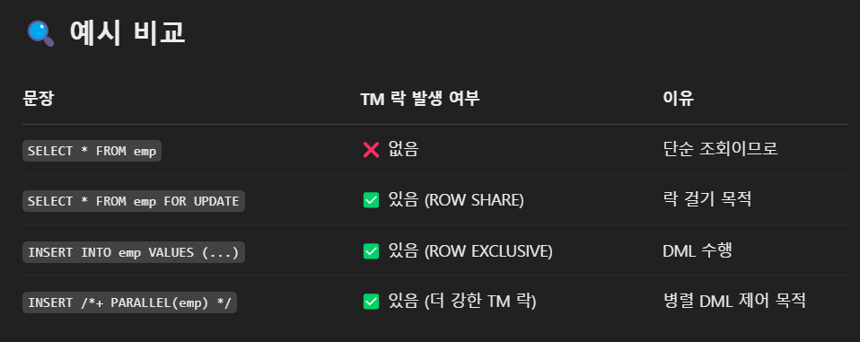

# DML 튜닝

## 6.1 기본DML 튜닝

### 6.1.1 DML 성능에 영향을 미치는 요소

-   인덱스
-   무결성 제약
-   조건절
-   서브쿼리
-   Redo로깅
-   Undo로깅
-   Lock
-   커밋

#### 인덱스와 DML 성능

테이블에 레코드를 입력하면 인덱스에도 입력해야 한다. 테이블은 Freelist(테이블마다 데이터 입력이 가능한 블록 목록)을 할당받지만 인덱스는 정렬된 자료구조이므로 수직적 탐색을 통해 입력할 블록을 찾아야 한다.

인덱스에 입력하는 과정이 더 복잡하므로 DML 성능에 미치는 영향도 크다. 삭제도 마찬가지 수정의 경우 삭제후 새로 삽입하는 방식으로 처리한다.

핵심 트랜잭션 테이블에서 인덱스 하나라도 줄이면 TPS는 그만컴 향상된다.

#### 무결성 제약과 DML 성능

-   개체 무결성
-   참조 무결성
-   도메인 무결성
-   사용자 정의 무결성

PK, FK 제약은 Check, Not Null 제약보다 성능에 더 큰 영향을 미친다. Check, Not Null은 정의한 제약 조건을 준수하는지만 확인하면 되지만 PK, FK 제약은 실제 데이터를 조회해 봐야 하기 떄문

#### 조건절과 DML 성능

조건절만 포함하는 가장 기본적인 DML 문과 실행 계획이다.

```sql
update emp set sal = sal * 1.1 where deptno = 40;

delete from emp where deptno = 40;
```

select 문과 실행게획이 다르지 않으므로 이들 DML 문에는 인덱스 튜닝원리를 그래도 적용할 수 있다.

#### 서브쿼리와 DML 성능

select 문과 실행게획이 다르지 않으므로 이들 DML 문에는 인덱스 튜닝원리를 그래도 적용할 수 있다.

#### Redo 로깅와 DML 성능

Redo 과거 데이터를 다시 최신으로 돌리는것 (ex. 웹사이트 다음페이지로가기)

오라클은 데이터파일과 컨트롤 파일에 가해지는 모든 변경사항을 Redo 로그에 기록한다. 이 Redo로그는 트랜잭션 데이터가 어떤 이유에서건 유실됐을 때, 트랜잭션을 재현함으로써 유실 이전상태로 복구하는 데 사용된다.

DML을 수행할 때마다 Redo로그를 생성해야 하므로 Redo 로깅은 DMl 성능에 영향을 미친다. INSERT작업에 Redo 로깅 생략 기능을 제공하는 이유가 여기에 있다.

Redo 로그의 세가지 목적

-   Database Recovery
    -   Redo 로그는 물리적으로 디스크가 깨지는 등의 Media Fail발생 시 DB를 복구하기 위해 사용한다.
    -   온라인 Redo 로그를 백업해 둔 Archived Redo 로그를 이용하게 된다.
    -   Media Recovery라고도 한다.
-   Cache Recovery (Instance Recovery 시 roll forward 단계)
    -   모든 DBMS가 버커패시를 도입하는 이유가 I/O 성능을 높이기 위해서인데 버퍼캐시는 휘발성이다.
    -   캐시에 저장된 변경사항이 디스크의 데이터블록에 아직 기록되지 않은상태에서 정잔 등이 발생해 인스턴스가 비정상 종료 등을 이유로 트랜잭션 데이터 유실에 대비해 로그를 남긴다.
-   Fast Commit
    -   변경된 메모리 버퍼 블록을 디스크의 데이터블록에 기록하는 작업은 랜덤 액세스 방식으로 이루어지므로 매우 느리다.
    -   로그는 Append 방식으로 기록되므로 상대적으로 빠르다.
    -   변경사항을 로그레 기록하고 메모리 버퍼블록과 디스크 블록간의 동기화는 적절한 수단(DBWR)을 이용해 배치 방식으로 일괄 수행한다.

#### Undo 로깅와 DML 성능

과거에는 롤백(Rollback)이라는 용어를 주로 사용했지만 9i부터 오라클은 Undo라는 용어를 사용하고 있다.

-   Redo는 트랜잭션을 재현함으로써 과거를 현재 상태로 되돌리는데 사용

    -   Redo에는 트랜잭션을 재현하는데 필요한 정보를 로깅

-   Undo는 트랜잭션을 롤백함으로써 현재를 과거상태로 되돌리는 데 사용한다.
    -   Undo에는 변경된 블록을 이전상태로 되돌리는 데 필요한 정보를 로깅

DML을 수행할 때마다 Undo를 생성해야 하므로 DML 성능에 영향을 미친다 (남기지 않는방법은 제공x)

Undo 로그의 세가지 목적

-   Transaction Rollback
    -   트랜잭션에 의한 변경사항을 최종 커밋하지 않고 롤백하조가 할때 Undo데이터 이용
-   Transaction Recovery (Instance Recovery rollback 단계)
    -   Instance Crash 발생후 Redo를 이용해 roll forward 단계과 완료되면 최종 커밋 되지 않은 변경사항까지 모두 복구된다.
    -   따라서 시스템이 셧다운된 시점에 아직 커밋되지 않았던 트랜잭션들을 모두 롤백해야 하는데, 이때 Undo 데이터 사용
-   Read Consistency
    -   읽기 일관성(Read Consistency)을 위해 사용
    -   읽기 일관성을 위해 Consistent모드로 데이터를 읽는 오라클에선 동시 트랜잭션이 많을수록 블록 I/O가 증가하면서 성능저하로 이어지기 떄문

MVCC(Multi-Version Concurrency Control) 모델

-   MVCC 모델을 사용하는 오라클은 데이터를 두 가지 모드로 읽는다.
-   Current : 디스크에서 캐시로 적재된 원본 블록을 현재 상태 그대로 읽는 방식
-   Consistent
    -   쿼리가 시작된 이후에 다른 트랜잭션에 의해 변경된 블록을 만나면 원본 블록으로부터 복사본 블록을 만든다.
    -   거기에 Undo 데이터를 적용함으로써 쿼리가 시작된 지점으로 되돌려서 읽는 방식

Consistent모드를 이해하려면 SCN에대한 이해가 필요하다

-   오라클은 시스템에서 마지막 커밋이 발생한 시점정보를 SCN(System Commit Number)이라는 Global 변수값으로 관리한다.

-   이값은 각 트랜잭션이 커밋할 때마다 1씩 증가하고 오라클 백그라운드 프로세서에 의해서도 조금씩 증가한다.

-   각 블록이 마지막으로 변경된 시점을 관리하기 위해 모든 블록 헤더에 SCN을 기록하는데 블록 SCN이라고 한다.

-   모든 쿼리는 Global 변수인 SCN값을 확인하고 읽기작업을 시작하는데 이를 쿼리 SCN이라고 한다.

-   Consistent모드는 쿼리 SCN과 블록 SCN을 비교함으로써 쿼리수행 도중에 블록이 변경됐는지를 확인하면서 데이터를 읽는방식 (낙관적 락 확인하는 방식 같네)

-   데이터를 읽다가 블록 SCN이 쿼리 SCN보다 더 큰 블록을 만나면 복사본 블록을 만들고 Undo를 적용함으로 써 쿼리가 시작된 지점으로 되돌린다.

    -   Undo데이터가 다른 트랜잭션에 의해 재사용됨으로써 되돌리는 작업이 실패할때 Snapshot too old (ORA-01555)에러가 발생한다.

-   SELECT 문은 항상 (몇몇 예외를 제외하고) Consistent모드로 데이터를 읽고 DML문은 Current모드로 작업한다.

#### Lock과 DML 성능

Lock을 필요이상으로 사용하거나 레벨을 높일수록 DML 성능은 느려진다.

성능과 데이터 품질은 트레이드 오프 관계여서 어렵다.

#### 커밋과 DML 성능

커밋은 DML과 별개로 실행하지만 DML을 끝내려면 커밋까지 완료애햐 하므로 서로 밀접한 관련이 있다.

DML이 Lock에 의해 블로킹된경우 Lock을 푸는 열쇠는 커밋이다.

Fast Commit의 도움으로 커밋을 순간적으로 처리하긴 하지만, 커밋은 결코 가벼운 작업이 아니다.

1. DB 버퍼캐시

    - DB의 모든일을 처리하는 서버 프로세스는 버퍼캐시를 통해 데이터를 읽고 쓴다.
    - 변경된 데이터 블록을 모아 주기적으로 DBWR프로세스가 배치 처리한다.

2. Redo 로그 버퍼

    - 버퍼 캐시는 휘발성이므 DBWR가 Dirty블록들을 데이터파일에 반영할 때까지 불안한 상태라고 생각할 수 있다.
    - Redo 로그도 파일이다. Append 방식으로 기록하더라도 디스크 I/O는 느리다.
    - Redo 로깅 성능 문제를 해결하기 위해 로그 버퍼를 사용한다. (나중에 LGWR이 배치방식으로 기록)

3. 트랜잭션 데이터 저장과정

    - DML문을 실행하면 Redo 로그 버퍼에 변경사항을 기록한다.
    - 버퍼블록에서 데이터를 변경한다. 물론, 버퍼캐시에서 데이터를 찾지 못하면 데이터파일에서 읽는 작업부터한다.
    - 커밋한다.
    - LGWR 프로세스가 Redo 로그버퍼내용을 로그파일에 일괄저장한다.
    - DBWR 프로세스가 변경된 버퍼블록들을 데이터파일에 일괄 저장한다.
    - 오라클은 변경하기 전에 항상 로그부터 기록하고 LGWR, DBWR는 주기적으로 깨어나 파일에 기록한다. LGWR은 커밋을 발행했다고 신호를 보낼때도 깨어나서 활동한다.
        - 커밋시점에는 Redo 로그버퍼 내용을 로그파일에 기록한다는 뜻 (Log Force at Commit)

4. 커밋=저장버튼
    - 커밋은 서버 프로세스가 그때까지 했던 작업을 디스크에 기록하라는 명령어
    - 저장을 완료할 때까지 서버 프로세스는 다름 작업을 진행할 수 없다.
    - LGWR 작업을 완료했다는 신호를 받아야 다음 작업을 진행할 수 있다. (Sync방식)
    - LGWR 프로세스가 Redo로그를 기록하는 작업은 디스크 I/O 작업이다. 커밋은 생각보다 느리다.

### 6.1.2 데이터베이스 Call 과 성능

트레이스 리포트에서 Call 통계를 보면 알 수 있듯 SQL은 아래 세 단계로 나누어 실행된다.

-   Parse Call : SQL 파싱과 최적화를 수행하는 단계, SQL과 실행계획을 라이브러리 캐시에서 찾으면, 최적화 단계는 생략할 수 있다.

-   Execute Call : 말 그대로 SQL을 실행하는 단계. DML은 이 단계에서 모든 과정이 끝나지만 SELECT 문은 Fetch 단계를 거친다.

-   Fetch Call : 데이터를 읽어서 사용자에게 결과집합을 전송하는 과정 전송할 데이터가 많을 때는 Fetch Call이 여러 번 발생한다.

Call이 어디서 발생하느냐에 따라 User Call과 Recursive Call로 나눌 수 있다.

-   User Call은 네트워크를 공유해 DBMS외부로부터 인입되는 Call

    -   DBMS 입장에서는 사용자는 WAS다.

-   Recursive Call 은 DBMS 내부에서 발생하는 Call이다.

    -   SQL 파싱과 최적화 과정에서 발생하는 데이터 딕셔너리 조회
    -   PL/SQL로 작성한 사용자 정의 함수/프로시저/트리거에 내장된 SQL을 실행할 때 발생하는 Call이 해당

-   User Call이든 Recursive Call이든 SQL을 실행할 때마다 Parse, Execute, Fetch Call 단계를 거친다 DB Call이 많으면 성능이 느릴 수 밖에 없다. 특히 네트워크를 거치는 User Call은 더더욱

#### 커밋과 성능

커밋을 너무 자주 발생시키면 성능도 문제이지만 트랜잭션 원자성에도 문제가 발생한다.

그렇다고 매우 오래 걸리는 트랜잭션을 한번도 커밋하지 않고 진행하면 Undo 공간 부족으로 인해 시슽메에 여러 부작용을 초래할 수 있다.

적당한 주기로 커밋을 해야 한다.

#### One SQL의 중요성

아래와 같이 Insert Into Select 구문으로 수행해보자.

```sql
insert into target
select * from source;
```

단 한번의 Call 로 처리하여 빠른시간에 처리가 완료된다. 업무 로직이 복잡하면 절차적으로 처리할 수 밖에 없지만 그렇지 않다면 가급적 One SQL로 구현하려고 노력해야 한다.

절차적으로 구현된 프로그램을 OneSQL로 구현하는 데 매우 유용한 구문 활용법들

-   Insert Into Select
-   수정가능 조인 뷰
-   Merge 문

### 6.1.3 Array Processing 활용

실무에서 절차적 프로그램을 One SQL로 구현하는 일은 절대 쉽지 않다. 복잡한 업무 로직을 포함하는 경우가 많기 떄문

이때 Array Processing 기능을 활용하면 One SQL로 구현하지 않고도 Call 부하를 획기적으로 줄일 수 있다.

| 항목                 | Bulk Insert                                               | Oracle Array Processing (`FORALL`)   |
| -------------------- | --------------------------------------------------------- | ------------------------------------ |
| **사용 환경**        | Java, Python, JDBC, ORM 등                                | Oracle PL/SQL 내부                   |
| **목적**             | 다건 데이터를 한 번에 삽입                                | 반복적인 SQL을 묶어서 실행           |
| **성능 최적화 방식** | DB round-trip 횟수 줄임                                   | PL/SQL ↔ SQL 간 컨텍스트 스위칭 줄임 |
| **예시**             | `JDBC batchInsert`, `INSERT ... VALUES (...), (...), ...` | `FORALL i IN ... INSERT INTO ...`    |

### 6.1.4 인덱스 및 제약 해제를 통한 대량 DML 튜닝

인덱스와 무결성 제약 조건은 DML 성능에 큰 영향을 끼친다. (그렇다고 OLTP 에서 이들 기능을 해제할 순 없다.)

반면 동시 트랜잭션 없이 대량 데이터를 적재하는 배치프로그램에서는 이들 기능을 해제함으로써 큰 성능개선 효과를 얻을 수 있다.

테스트를 위해 테이블과 인덱스를 생성하고 1000만건을 입력

```sql
create table source
as
select b.no, a.*
from   (select * from emp where rownum <= 10) a
    ,  (select rownum as no from dual connect by level <= 1000000) b;


create table target
as
select * from source where 1 = 2;

alter table target add
constraint target_pk primary key(no, empno);

create index target_x1 on target(ename);
```

PK제약을 생성하면 Unique 인덱스를 자동으로 생성된다. 추가로 일반 인덱스를 만들었으므로 인덱스는 총 두개다.

이상태에서 TARGET 테이블에 1000만건을 입력

```sql
-- 1분 19초 소요
set timing on;
insert /*+ append */ into target
select * from source;

commit;
```

#### PK제약과 인덱스 해제 1-PK제약에 Unique인덱스를 사용한 경우

PK제약과 인덱스를 해제한 상태에서 데이터 입력

```sql
truncate table target;
alter table target modify constraint target_pk disable drop index;

alter index target_x1 unsable;
```

인덱스가 Unusable인 상태에서 데이터를 입력하려면

```sql
alter session set skip_unusable_indexes = true; -- true로 설정해야 입력가능 기본값 true
```

똑같이 1000만건을 입력시 5.84초만에 입력완료 다시 PK제약을 활성화해 PK인덱스 자동생성

```sql
alter table target modify constraint target_pk enable NOVALIDATE; -- NOVALIDATE : PK적용시 기입력된 데이터에 대한 무결성 체크 생략

alter index target_x1 rebuild;
```

#### PK 제약과 인덱스 해제2 - PK제약에 Non-Unique인덱스를 사용한 경우

PK인덱스를 Drop 하지 않고 Unusable 상태에서 데이터를 입력하고 싶다면 PK제약에 Non-Unique 인덱스를 사용하면 된다.

```sql
set timing off;
truncate table target;

alter table target drop primary key drop index;

create index target_pk on target(no, empno); -- Non-unique 인덱스 생성

alter table target add
constraint target_pk primary key(no, empno) --이러면 복합키
using index target_pk; --pk 제약에 Non-Unique 인덱스 사용하도록 지정
```

아래와 같이 PK제약을 비활성화 하고 인덱스를 Unusable상태로 변경하자. PK제약을 비활성화 했지만 인덱스는 Drop하지 않고 남겨놨다.

```sql
alter table target modify constraint target_pk disable keep index;

alter index target_pk unusable;

alter index target_x1 unusable
```

이제 대량 INSERT작업을 진행하는 데 아무런 문제가 없다.
작업을 마쳤으면 인덱스를 재생성하고 PK제약을 다시 활성화 한다.

```sql
alter index target_x1 rebuild;
alter index target_pk rebuild;
alter table target modify constraint target_pk enable novalidate;
```

### 6.1.5 수정가능 조인 뷰

전통적인 방식의 UPDATE
아래와 같이 작성된 UPDATE 문을 종종 볼 수 있다.

```sql
update 고객 c
set 최종거래일시 = (select max(거래일시) from 거래
                     where 고객번호 = c.고객번호
                       and 거래일시 >= trunc(add_months(sysdate, -1)))
   , 최근거래횟수 = (select count(*) from 거래
                      where 고객번호 = c.고객번호
                        and 거래일시 >= trunc(add_months(sysdate,-1)))
   , 최근거래금액 = (select sum(거래금액) from 거래
                      where 고객번호 = c.고객번호
                        and 거래일시 >= trunc(add_months(sysdate, -1)))
where exists (select 'x' from 거래
               where  고객번호 = c.고객번호
                 and 거래일시 >= trunc(add_months(sysdate,-1)))
```

위 업데이트문은 아래와 같이 고칠 수 있다.

```sql
update 고객 c
set    (최종거래일시, 최근거래횟수, 최근거래금액) =
       (select max(거래일시), count(*), sum(거래금액)
          from 거래
         where 고객번호 = c.고객번호
           and 거래일시 >= trunc(add_months(sysdate, -1)))
where exists (select 'x' from 거래
               where 고객번호 = c.고객번호
                 and 거래일시 >= trunc(add_months(sysdate, -1)))
```

위방식에도 비효율이 없는건 아니다. 한 달 이내 고객별 거래 데이터를 두 번 조회하기 떄문 (총 고객수와 한달 이내 거래 고객 수에 따라 성능이 좌우된다.)

총 고객수가 아주 많다면 Exists 서브쿼리를 해시 시메 조인으로 유도하는 것도 고려할 수 있다.

```sql
update 고객 c
set    (최종거래일시, 최근거래횟수, 최근거래금액) =
       (select max(거래일시), count(*), sum(거래금액)
          from 거래
         where 고객번호 = c.고객번호
           and 거래일시 >= trunc(add_months(sysdate, -1)))
where exists (select /*+ unnest hash_sj*/'x' from 거래
               where 고객번호 = c.고객번호
                 and 거래일시 >= trunc(add_months(sysdate, -1)))
```

만약 한달이내 거래를 발생시킨 고객이 많아 update문이 대량 발생한다면 아래와 같이 변경하는 것을 고려할 수 있다.

하지만 모든 고객레코드에 Lock이 걸리는 것은 물론, 이전과 같은 값으로 갱신되는 비중이 높을 수록 Redo 로그 발생량이 증가해 오히려 비효율적일 수 있다.

```sql
update 고객 c
set    (최종거래일시, 최근거래횟수, 최근거래금액) =
       (select nvl(max(거래일시), c.최종거래일시)
             , decode(count(*), 0, c.최근거래횟수, count(*))
             , nvl(sum(거래금액), c.최근거래금액)
          from 거래
         where 고객번호 = c.고객번호
           and 거래일시 >= trunc(add_months(sysdate, -1)))
```

다른 테이블과 조인이 필요할 때 전통적인 UPDATE문을 사용하면 비효율을 완전히 해소할 수 없다.

#### 수정가능 조인뷰

`아래와 같이 수정가능 조인 뷰를 활용하면 참조 테이블과 두번 조인하는 비효율을 없앨 수 있다.`

아래 쿼리는 12c이상버전에서만 정상 실행 11g에서는 실행되지 않는다.

```sql
update
    (select  /*+ ordered use_hash(c) no_merge(t) */
             c.최종거래일시, c.최근거래횟수, c.최근거래금액
          ,  t.거래일시, t.거래횟수, t.거래금액
        from (select 고객번호
                   , max(거래일시) 거래일시, count(*) 거래횟수, sum(거래금액) 거래금액
                from 거래
               where 거래일시 >= trunc(add_months(sysdate, -1))
               group by 고객번호) t
               , 고객 c
      where c.고객번호 = t.고객번호
)
set 최종거래일시 = 거래일시
  , 최근거래횟수 = 거래횟수
  , 최근거래금액 = 거래금액
```

-   조인 뷰란 : FROM 절에 두 개 이상 테이블을 가진 뷰를 가리킨다.

-   수정가능 조인 뷰(Updateble/Modifiable Join View)는 말 그대로 입력, 수정, 삭제가 허용되는 뷰를 말한다. - 단 1쪽 집합과 조인하는 `M쪽 집합에만 입력, 수정, 삭제가 허용 된다.`

아래와 같이 생성한 조인 뷰를 통해 job = 'CLERK'인 레코드의 loc를 모두 'SEOUL'로 변경하는 것을 허용한다면?

```sql
create table emp as select * from scott.emp;
create table dept as select * from scott.dept;

create or replace view EMP_DEPT_VIEW as
select e.rowid emp_rid, e.*, d.rowid dept_rid, d.dname, d.loc
from emp e, dept d
where e.deptno = d.deptno;

update EMP_DEPT_VIEW set loc = 'SEOUL' where job = 'CLERK'
```

다른 job을 가진 사원의 부서 소재재지까지 바뀐다. 왜? 부서에는 다른 직업을 가진 사원도 있으니까

아래 update문장은? 1쪽(DEPT)과 조인하는 M쪽(EMP)테이블의 컬럼을 수정하므로 문제가 없어보인다.

```sql
-- 허지만 ORA-01779 에러 발생
update EMP_DEPT_VIEW set comm = nvl(comm, 0) + (sal * 0.1) where sal <= 1500;
```

옵티마이저가 어느 테이블이 1쪽 집합인지 알 수 없기 떄문에 발생하는 에러 (insert, delete도 허용하지 않음)

1쪽 집합에 PK제약을 설정하거나 Unique인덱스를 생성해야 수정가능 조인 뷰를 통한 입력/수정/삭제 가 가능하다.

```sql
alter table dept add constraint dept_pk primary key(deptno);

update EMP_DEPT_VIEW set comm = nvl(comm, 0) + (sal * 0.1) where sal <= 1500;
```

위와 같이 PK제약을 설정하면 EMP테이블은 키-보존 테이블이 되고 DEPT 테이블은 비 키-보존 테이블로 남는다.

#### 키 보존 테이블이란?

키 보존 테이블 : 조인된 결과집합을 통해서도 중복 값 없이 Unique하게 실별이 가능한 테이블 Unique한 1쪽 집합과 조인되는 테이블이어야 조인된 결과집합을 통한 식별이 가능하다.

```sql
select rowid, emp_rid, dept_rid, empno, deptno from EMP_DEPT_VIEW;
```

결과를 보면 dept_rid에 중복값이 나타난다. emp_rid에는 중복 값이 없으며 뷰의 rowid와 일치한다.

단적으로 말해 `키 보존 테이블이란` 뷰에 rowid를 제공하는 테이블을 말한다.

DEPT 테이블로부터 Unique 인덱스를 제거하면 키 보존 테이블이 없기 때문에 뷰에서 rowid를 출력할 수 없게 된다.

```sql
alter table dept drop primary key;

select rowid, emp_rid, dept_rid, empno, from EMP_DEPT_VIEW;
-- 오류 발생
-- ORA-01445 : cannot select ROWID from, or sample, a join view without a key-preserved table
```

#### ORA-01779 오류 회피

### 6.1.6 MERGE 문 활용

`DW에서 가장 흔히 발생하는 오퍼레이션은 기간계 시스템에서 가져온 신규 트랜잭션 데이터를 반영함으로써 두 시스템 간 데이터를 동기화 하는 작업`

고객테이블에서 발생한 변경분 데이터를 DW에 반영하는 프로세스는 다음과 같다.

```sql
-- 1. 전일 발생한 변경 데이터를 기간계 시스템으로부터 추출(Extraction)
create table customer_delta
as
select * from customer
where mod_dt >= trunc(sysdate) -1
and   mod_dt < trunc(sysdate);

-- 2. CUSTOMER_DELTA 테이블을 DW시스템으로 전송 (Transportation)

-- 3. DW시스템으로 적재(Loading)
merge into customer t using customer_delta s on (t.cust_id = s.cust_id)
when matched then update
    set t.cust_nm = s.cust_nm, t.email = s.email...
when not matched then insert
    (cust_id, cust_nm, email, tel_no, region, addr, reg_dt) values
    (s.cust_id, s.cust_nm, s.email, s.tel_no, s.region, s.addr, s.reg_dt);
```

MERGE 문은 Source 테이블(원천) 기준으로 Target테이블(dw)과 Left Outer 방식으로 조인해서 조인에 성공하면 UPDATE, 실패하면 INSERT한다.

MERGE문은 UPSERT(update + insert)라고 부르는 이유다.

#### Optional Clauses

아래와 같이 UPDATE와 INSERT를 선택적으로 처리할 수도 있다.

```sql
merge into customer t using customer_delta s on (t.cust_id = s.cust_id)
when matched then update
    set t.cust_nm = s.cust_nm, t.email = s.email, ...;
marge into customer t using customer_delta s on (t.cust_id = s.cust_id)
when not matched then insert
    (cust_id, cust_nm, email, tel_no, region, addr, reg_dt) values
    (s.cust_id, s.cust_nm, s.email, s.tel_no, s.region, s.addr, s.reg_dt);
```

이 확장 기능을 통해 아래와 같이 수정가능 조인 뷰 기능을 대체할 수 있게 되었다.

```sql
-- 수정가능 조인 뷰
update
    (select d.deptno, d.avg_sal as d_avg_sal, e.avg_sal as e_avg_sal
      from (select deptno, round(avg(sal), 2) avg_sal from emp group by deptno) e, dept d
     where d.deptno = e.deptno)
  set d_avg_sal = e_avg_sal;

-- MERGE 문
merge into dept d
using (select deptno, round(avg(sal), 2) avg_sal from emp group by deptno) e
on (d.deptno = e.deptno)
when matched then update set d.avg_sal = e.avg_sal;
```

#### Conditional Operations

ON 절에 기술한 조인문 외에 아래와 같이 추가로 조건절을 기술할 수도 있다.

```sql
merge into customer t using customer_delta s on (t.cust_id = s.cust_id)
when matched then update
    set t.cust_nm = s.cust_nm, t.email = s.email ...
  where reg_dt >= to_date('20000101', 'yyymmdd')
when not matched then insert
    (cust_id, cust_nm, email, tel_no, region, addr, reg_dt) values
    (s.cust_id, s.cust_nm, s.email, s.tel_no, s.region, s.addr, s.reg_dt)
    where reg_dt < trunc(sysdate);
```

#### DELETE Clause

이미 저장된 데이터를 조건에 따라 지우는 기능도 제공한다.

```sql
merge into customer t using customer_delta s on (t.cust_id = s.cust_id)
when matched then
    update set t.cust_nm = s.cust_nm, t.email = s.email ...
    delete where t.withdraw_dt is not null -- 탈퇴일시가 null이 아닌 레코드 삭제
when not matched then insert
    (cust_id, cust_nm, email, tel_no, region, addr, reg_dt) values
    (s.cust_id, s.cust_nm, s.email, s.tel_no, s.region, s.addr, s.reg_dt)
```

위 MERGE문에서 update가 이루어진 결과로써 탈퇴일시가 null이 아닌 레코드만 삭제한다는 사실

`즉 탈퇴일시가 null이아니였어도 merge문을 수행한 결과가 null이면 삭제마지 않는다.`

MERGE문 DELETE 절은 조인에 성공한 데이터만 삭제할 수 있다. Source 테이블에서 삭제된 데이터는 Target 테이블에서도 지우고 싶을 텐데, MERGE 문 DELETE절이 그 역할까지는 못한다.

Source에서 삭제된 데이터는 조인에 실패하기 때문

`조인에 실패한 데이터는 삭제도, 수정도 할 수 없다.` 결국 DELETE 절은 조인에 match에 성공한 데이터를 모두 update하고서 그 결과값이 delete where조건절을 만족하면 삭제하는 기능이다.

#### MERGE Into 활용 예

저장하려는 레코드가 기존에 있던것이면 update 없으면 insert 그럴때 아래와 같이 처리하면 SQL을 항상 두번씩 (select 한번 insert 또는 update 한번) 수행한다.

```sql
select count(*) into :cnt from dept where deptno = :val1;

if :cnt = 0 then
    insert into dept(deptno, dname, loc) values (:val1, :val2, :val3);
else
    update dept set dname = :var2, loc = :var3 where deptno =:val1;
end if;
```

아래와 같이하면 SQL을 최대 두번 수행한다.

```sql
update dept set dname = :val2, loc = :val3 where deptno = :val1;

if sql%rowcount = 0 then
    insert into dept(deptno, dname, loc) values (:val1, :val2, :val3);
end if;
```

아래와 같이 merge 문을 활용하면 sql을 '한 번만' 수행한다

```sql
merge into dept a
using (select :val1 deptno, :val2 dname, :val3 loc from dual) b
on (b.deptno = a.deptno)
when matched then
    update set dname = b.dname, loc = b.loc
when hot matched then
    insert (a.deptno, a.dname, a.loc) values (b.deptno, b.dname, b.loc)
```

## 6.2 Direct Path I/O 활용

OLTP 은 기준성 데이터, 특정 고객, 특정 상품, 최근 거래 등을 반복적으로 읽기 때문에 버퍼캐시가 성능 향상에 도움을 준다.

반면 정보계시스템(DW, OLAP등) 이나 배치 프로그램에서 사용하는 SQL은 주로 대량 데이터를 처리하기 때문에 버퍼캐시를 경유하는 I/O메커니즘이 오히려 성능을 떨어트릴 수 있다.

오라클은 버퍼캐시를 경유하지 않고 바로 데이터 블록을 읽고 쓸 수 있는 Direct Path I/O 기능을 제공한다.

### 6.2.1 Direct Path I/O

대량데이터를 버퍼캐시에서 건건이 탐색하는 건 성능에 오히려 안좋다 블록에서 찾을 가능성이 거의 없기 때문이다.

또한 읽은후 버퍼캐시에 적재하고서 읽어야 한는 부담도 크다. 그렇게 적재한 블록을 재사용할 수 있느냐도 중요한데 대게 재사용성이 낮다.

버퍼캐시를 경유하지 않고 곧바로 데이터를 읽는 Direct Path I/O는 아래의 경우들에 작동한다.

-   병렬쿼리로 Full Scan을 수행할 때
-   병렬 DML을 수행할 때(Direct Path Read, Direct Path Insert)
-   Direct path Insert를 수행할때
-   Temp 세그먼트 블록들을 읽고 쓸 때
-   direct 옵션을 지정하고 export를 수행할 때
-   nocache 옵션을 지정한 LOB 컬럼을 읽을 때

#### 병렬쿼리

1~3번이 가장 중요하고 활용도가 높다

1번의경우 쿼리문에 아래처럼 parallel 또는 parallel_index 힌트를 사용하면, 지정한 병렬도 만큼 병렬 프로세스가 떠서 동시에 작업을 한다.

```sql
select /*+ full(t) parallel(t 4) */ * from big_table t

select /*+ index_ffs(t big_table_x1) parallel_index(t big_table_x1 4) * */ count(*)
from big_table t
```

병렬도를 4로 지정하면, 성능이 4배 빨라지는 것이 아닌 수십 배 빨라진다. Direct Path I/O 때문에 나타나는 효과다.

버퍼캐시를 탐색하지 않고 디스크로부터 버퍼캐시에 적재하는 부담도 없으니 빠른것

`Order by, Group by, 해시조인, 소트 머지 조인등을 처리할 때는 힌트로 지정한 병렬도보다 두 배 많은 프로세스가 사용된다.`

### 6.2.2 Direct Path Insert

일반적인 INSERT가 느린이유

-   데이터를 입력할 수 있는 블록을 Freelist에서 찾는다.

    -   테이블 HWM(High-Water Mark) 아래쪽에 있는 블록 중 데이터 입력이 가능한 블록목록을 관리하는데, 이를 Freelist

-   Freelist에서 할당받은 블록을 버퍼캐시에서 찾는다.
-   버퍼캐시에 없으면, 데이터파일에서 읽어 버퍼캐시에 적재한다.
-   INSERT 내용을 Undo 세그먼트에 기록한다.
-   INSERT 내용을 Redo 로그에 기록한다.

Direct Path Insert 방식을 사용하면, 대량 데이터를 일반적인 INSERT 보다 훨씬 빠르게 입력할 수 있다.

-   INSERT...SELECT 문에 append 힌트사용
-   parallel 힌트를 이용해 병렬모드로 INSERT
-   direct 옵션을 지정하고 SQL\*Loader(sqlldr)로 데이터 적재
-   CTAS(create table .. as select)문 수행

빠른이유는 다음과 같다.

-   Freelist를 참조하지 않고 HWM바깥 영역에 데이터 순차 입력
-   블록을 버퍼캐시에서 탐색하지 않는다
-   버퍼캐시에 적재하지 않거, 데이터 파일에 직접 기록한다.
-   Undo 로깅을 안한다.
    -   HWM 뒤쪽에 입력한 데이터는 커밋하기 전까지 다른세션이 읽지 않으므로
    -   Read Consistency를 위해 Undo로그를 남기지 않아도 된다.
    -   커밋하면 HWM를 이동하고 롤백하면 해당 익스텐드에 대한 딕셔너리 정보만 롤백하면 된다.
-   Redo 로깅을 안 하게 할 수 있다.
    -   ```sql
          alter table t NOLOGING;
        ```
    -   참고로 일반 insert를 로깅하지 않게 하는 방법은 없다.

Array Processing도 Direct Path Insert 방식으로 처리할 수 있다. append_valeus 힌트를 사용하면 된다.

```sql
...
procedure insert_target( p_source in typ_source) is
begin
    forall i in p_source.first..p_source.last
        insert /*+ append_values */ into target values p_source(i)
end insert_target;
```

Direct Path Insert를 사용할 떄 주의점

-   이 방식을 사용하면 성능은 비교할 수 없이 빨라지지만 Exclusive 모드 TM Lock이 걸린다.
    -   따라서 커밋하기 전까지 다른 트랜잭션은 해당 테이블에 DML을 수행하지 못한다.
    -   트랜잭션이 빈번한 주간에 이 옵션을 사용하는 것은 절대 금물이다.
-   Freelist를 조회하지 않고 HWM 바깥영역에 입력하므로 테이블에 여유공간이 있어도 재활용하지 않는다는 사실
    -   과거 데이터를 주기적으로 DELETE해서 여유공간이 생겨도 이방식으로만 계속 INSERT 하면 테이블의 사이즈가 줄지 않고 커져만 간다.
    -   RANGE 파티션이면 과거 데이터를 DELETE가 아닌 파티션 DROP방식으로 지워야 공간 반환이 제대로 이루어진다.
        -   DELETE 방식으로 지우면 공간 반환이 자동으로 되지 않는다. INSERT시 재사용
        -   drop or Truncate으로 지우거나

### 6.2.3 병렬 DML

병렬 쿼리와 병렬 DDL은 기본적으로 활성화 돼 있어 언제든 병렬처리 가능하다.

병렬 DML은 기본적으로 비활성화돼 있다. 따라서 DML을 병렬로 처리하려면 활성화 해야한다.

```sql
alter session enable parallel dml;
```

그리고 나서 각DML문에 아래와 같은 힌트를 사용하면 레코드를 찾는 작업은 물론 추가/변경/삭제도 병렬로 진행한다.

```sql
insert /*+ parallel(c 4)*/ into 고객 c
select /*+ full(o) parallel(o 4)*/ from 외부가입고객 o;

update /*+ full(c) parallel(c 4)*/ 고객 c set 고객상태코드 = 'WD'
where 최종거래일시 < '20100101';

delete /*+ full(c) parallel(c 4)*/ from 고객 c
where 탈퇴일시 < '20100101';
```

힌트를 제대로 기술했지만 병렬 DML을 활성화 하지 않으면 대상 레코드를 찾는 작업은 병렬로 진행하지만, 추가/변경/삭제는 QC(Query Coordinator)가 혼자 담당하므로 병목이 생긴다.

병령 INSERT는 append 힌트를 지정하지 않아도 Direct Path Insert방식을 사용한다.

하지만 혹시라도 작동하지 않을 것을 대비해 append 힌트를 같이 사용하는 것이 좋다 병렬 DML이 작동하지 않더라도 QC가 Direct Path Insert를 사용하면 만족할 만한 성능을 내기 때문

```sql
insert into /*+ append parallel(c 4) */ into 고객 c
select /*+ full(o) parallel(o 4) */ * from 외부가입고객 o;
```

12c 부터는 enable_parallel_dml 힌트도 지원한다.

`병렬 DML을 사용하면 테이블에 Exclusive 모드 TM Lock이 걸린다는 사실을 꼭 기억하자 트랜잭션이 빈번한 주간에 이 옵션을 사용하는 것은 절대 금물이다.`



#### 병렬 DML이 잘 작동하는지 확인하는 방법

DML 작업을 각 병렬 프로세스가 처리하는지 QC가 처리하는지 실행계획에서 확인할 수 있다.

UPDATE(또는 DELETE/INSERT)가 PX COORDINATOR의 `아래쪽`에 나타나면 병렬프로세스가 처리

```sql
UPDATE STATEMENT
    PX COORDINATOR
        PX SEND QC (RANDOM)
            UPDATE
                PX BLOCK ITERATOR
                    TABLE ACCESS FULL
```

반면 아래와 같이 UPDATE가 PX COORDINATOR의 `위쪽`에 아타나면 QC가 처리한다.

```sql
UPDATE STATEMENT
    UPDATE
        PX COORDINATOR
            PX SEND QC (RANDOM)
                PX BLOCK ITERATOR
                    TABLE ACCESS FULL
```

## 6.3 파티션을 활용한 DML 튜닝

파티션을 활용하면 대량 추가/변경/삭제 작업을 빠르게 처리할 수 있다.

### 6.3.1 테이블 파티션

파티셔닝은 테이블 또는 인덱스 데이터를 특정 컬럼(파티션 키)값에 따라 별도의 세그먼트에 나눠서 저장하는 것을 말한다.

-   관리적 측면 : 파티션 단위 백업, 추가, 삭제, 변경 -> 가용성 향상

-   성능적 측면 : 파티션 단위 조회 및 DML, 경합 또는 부하부산

#### Range 파티션

가장 기초적인 방식으로 주로 날짜 컬럼을 기준으로 파티셔닝한다.

```sql
create table 주문 (주문번호 number, 주문일자 varchar2(8), 고객ID varchar2(5), 배송일자 varchar2(8), 주문금액 number,...)

partition by range(주문일자)(
    partition P2017_Q1 values less than ('20170401')
    , partition P2017_Q2 values less than ('20170701')
    , partition P2017_Q3 values less than ('20171001')
    , partition P2017_Q4 values less than ('20180101')
    , partition P2018_Q1 values less than ('20180401')
    ..
)
```

읽을 떄도 검색 조건을 만족하는 파티션만 골라 읽을 수 있어 이력성 데이터를 Full Scan방식으로 조회할 때 성능을 크게 향상시킨다.

보관주기 정책에 따라 과거 데이터가 저장된 파티션만 백업하고 삭제하는 등 데이터 관리 작업을 효율적이고 빠르게 수행할 수 있는 장점 도 있다.

파이션 테이블에 대한 SQL 성능 향상원리는 파이션 Pruning에 있다.

파이션 Prunung은 SQL 하드파싱이나 실행 시점에 조건절을 분석해서 읽지 않아도 되는 파티션 세그먼트를 액세스 대상에서 제외하는 기능이다.

파티션도 클러스터, IOT와 마찬가지로 클러스터링 기술에 속한다. 클러스터와 다른 점은 세그먼트 단위로 모아서 저장한다는 것.

#### 해시 파티션

파티션 키 값을 해시 함수에 입력해서 반환받은 값이 같은 데이터를 같은 세그먼트에 저장하는 방식

파티션 개수만 사용자가 결정하고 데이터를 분산하는 알고리즘은 오라클 내부 해시 함수가 결정한다.

해시 파티션은 고객ID처럼 변별력이 좋고 데이터 분포가 고른 컬럼을 파티션 기준으로 해야 효과적

```sql
create table 고객(고객ID varchar2(5), 고객명 varchar2(10),...)
partition by hash(고객ID) partitions 4;
```

해시 알고리즘 특성상 등치 조건 또는 IN-List 조건으로 검색할 때만 파티션 Pruning이 작동한다.

#### 리스트파티션

사용자가 정의한 그룹핑 기준에 따라 데이터를 분할 저장하는 방식

```sql
create table 인터넷매물 (물건코드 varchar2(5), 지역분류 varchar2(4), ...)
partition by list(지역분류)(
    partition P_지역1 values ('서울')
  ,   partition P_지역2 values ('경기', '인천')
  ,   partition P_지역3 values ('부산', '대구', '대전', '광주')
  ,   partition P_기타 values (DEFAULT)
)
```

Reage 파티션에서 값의 순서에 따라 저장할 파티션이 결정되지만, 리스트 파티션에서는 순서와 상관없이 불연속적인 값의 목록에 의해 결정된다.

### 6.3.2 인덱스 파티션

테이블 파티션과 인덱스 파티션은 구분돼야 한다.

테이블 파티션의 구분

-   비파티션 테이블
-   파티션 테이블

인덱스도 파티션 테이블처럼 여부에 따라 나뉜다.

-   로컬 파티션 인덱스

    -   각 테이블 파티션과 인덱스 파티션이 1:1로 대응 관계가 되도록 오라클이 자동으로 관리하는 파티션 인덱스

-   글로벌 파티션 인덱스
    -   로컬이 아닌파티션 인덱스들
-   비파티션 인덱스

#### 로컬 파티션 인덱스

로컬 파티션 인덱스는 각각 파티션별로 별도 색인을 만드는 것

```sql
create index 주문_x01 on 주문 (주문일자, 주문금액) local;

create index 주문_x02 on 주문 (고객ID, 주문일자) local;
```

로컬 파티션 인덱스는 테이블과 정확히 1:1대응 관계를 갖도록 오라클이 파티션을 자동으로 관리해준다.

테이블 파티션 구성을 변경(add, drop, exchange 등)하더라도 인덱스를 재생성할 필요가 없다.

변경작업이 순식간에 끝나므로 피크 시간대만 피하면 서비스를 중단하지 않고도 작업할 수 있다.

#### 글로벌 파티션 인덱스

글로벌 파티션 인덱스는 파티션을 테이블과 다르게 구성한 인덱스다. 파티션 유형이 다르거나, 파티션 키가 다르거나, 기준값 정의가 다른 경우

비파티션 테이블이어도 인덱스는 파티셔닝할 수 있다.

```sql
create index 주문_x03 on 주문 (주문금액, 주문일자) global
partition by range(주문금액)(
    partition P_01 values less than (100000)
 ,  partition P_MX values less than (MAXVALUE) -- -> 주문금액 >= 100000
);
```

글로벌 파티션 인덱스는 테이블 파티션 구성을 변경(drop, exchange, split 등)하는 순간 Unsable 상태로 바뀌므로 곧바로 인덱스를 재생성 해줘야 한다.

그동한 해당 테이블을 사용하는 서비스를 중단해야 한다.

테이블과 인덱스가 정확히 1:1 관계가 되도록 DB관리자가 파티션을 직접 구성할 수도 있지만 그렇다고 로컬 파티션은 아니다.

#### 비파티션 인덱스

비파티션 인덱스는 말 그대로 파티셔닝 하지 않은 인덱스다.

```sql
create index 주문_x04 on 주문 (고객ID, 배송일자);
```

여러 테이블 파티션을 가리킨다. 비파티션 인덱스를 글로벌 비파티션 인덱스라고 부르기도 한다.

비파티션 인덱스는 테이블 파티션 구성을 변경(drop, exchange, split등)하는 순간 Unusable상태로 바뀌므로 곧바로 인덱스를 재생성 해줘야 한다. 그동안 해당 서비스를 중단해야 한다.

#### Prefixed vs Nonprefixed

파티션 인덱스를 Prefixed와 Nonprefiex로 나눌 수도 있다. 인텍스 파티션 키 컬럼이 인덱스 구성상 왼쪽 선두 컬럼에 위치하는지에 따른 구분이다.

-   Prefixed : 인덱스 파티션 키 컬럼이 인덱스 키 컬럼 왼쪽 선두에 위치한다.
-   Nonprefixed : 인덱스 파티션 키 컬럼이 인덱스 키 컬럼 왼쪽 선두에 위치하지 않는다.
    -   파티션 키가 인덱스 컬럼에 아예 속하지 않을 때도 여기에 속한다.

`글로벌 파티션 인덱스는 Prefixed 파티션만 지원되므로 `결과적으로는 세 개의 파티션 인덱스가 있고, 비 파티션 인덱스를 포함해 아래 네가지 유형으로 최종 정리할 수 있다.

-   로컬 Prefixed 파티션 인덱스
-   로컬 Nonprefixed 파티션 인덱스
-   글로벌 Prefixed 파티션 인덱스
-   비파티션 인덱스

#### 중요한 인덱스 파티션 제약

`Unique 인덱스를 파티셔닝하려면, 파티션 키가 모두 인덱스 구성 컬럼이어야 한다.`

그게 아니면 중복값이 있는지 확인하기 위해 인덱스 파티션으ㄹ 모두 탐색해야 한다. + 그 레코드를 입력하고 커밋하기 전까지 추가적인 Lock 메커니즘이 필요하다.

`서비스 중단없이 파티션 구조를 빠르게 변경하려면 PK를 포함한 모든 인덱스가 로컬 파티션 인덱스여야 한다.`

### 6.3.3 파티션을 활용한 대량 UPDATE 튜닝

인덱스가 DML 성능에 큰 영향을 미치므로 DML할때는 인덱스를 Drop 하거나 Unusable 상태로 변경하고서 작업하는 방법을 많이 활용한다. 손익 분기점은 5%정도

(“손익분기점이 5%”라는 의미는, 전체 데이터의 5% 이상 DML 작업(삽입, 수정, 삭제)할 경우)

인덱스 데이터를 재생성하는 것도 비용이 드니까 실무적으로 대용량 데이터라면 인덱스를 그대로 둔 상태에서 작업하는 경우가 많다.

#### 파티션 Exchange를 이용한 대량 데이터 변경

테이블이 파티셔닝돼 있고 인덱스도 다행히 로컬 파티션이라면, 수정된 값을 임시 세그먼트를 만들어 원본 파티션과 바꿔치기하는 방식을 사용할 수 있다.

1. 임시테이블을 생성한다. 할 수 있다면 nologgin 모드로 생성한다.

```sql
create table 거래_t
nologging
as
select * from 거래 where 1 = 2;
```

2. 거래 데이터를 읽어 임시 테이블에 입력하면서 상태코드 값을 수정한다.

```sql
insert /*+ append */ into 거래_t
select 고객번호, 거래일자, 거래순번 ...
     , (case when 상태코드 <> 'ZZZ' then 'ZZZ' else 상태코드 end) 상태코드
  from 거래
 where 거래일자 < '20150101';
```

3. 임시 테이블에 원본 테이블과 같은 구조로 인덱스를 생성한다. 할 수 있다면 nologging모드로 생성한다.

```sql
create unique index 거래_t_pk on 거래_t (고객번호, 거래일자, 거래순번) nologging;

create index 거래_t_x1 on 거래_t(거래일자, 고객번호) nologging;

create index 거래_t_x2 on 거래_t(상태코드, 거래일자) nologging;
```

4. 2014년 12월 파티션과 임시테이블을 Exchange한다.

```sql
alter table 거래
exchange partition p201412 with table 거래_t
including index without validation;
```

5. 임시테이블을 drop한다.

```sql
drop table 거래_t;
```

6. nologging모드로 작업했다면 파티션을 logging모드로 전환한다.

```sql
alter table 거래 modify partition p201412 logging;
alter index 거래_px modify partition p201412 logging;
alter index 거래_x1 modify partition p201412 logging;
alter index 거래_x2 modify partition p201412 logging;
```

### 6.3.4 파티션을 활용한 대량 DELETE 튜닝

아래와 같은 조건절로 수천만 건 데이터를 삭제할 때도, 인덱스를 실시간으로 관리하려면 어마어마한 시간이 소요된다.

```sql
delete from 거래
where 거래일자 < '20150101';
```

초대용량 테이블을 drop 했다가 다시 생성하기도 만만치 않다. update는 변경 대상 컬럼을 포함하는 인덱스만 재생성하면 되지만, delete는 모든 인덱스를 재생성해야한다.

#### DELETE가 느린이유

아래와 같은 부수적인 작업을 수반하므로 느리다.

-   테이블 레코드 삭제
-   테이블 레코드 삭제에 대한 Undo Logging
-   테이블 레코드 삭제에 대한 Redo Logging
-   인덱스 레코드 삭제
-   인덱스 레코드 삭제에 대한 Undo Logging
-   인덱스 레코드 삭제에 대한 Redo Logging
-   Undo(2번과 5번)에 대한 Redo Logging

특히 각 인덱스 레코드를 찾아서 삭제해 주는 작업에 대한 부담이 크다.

인덱스 개수는 DML 성능에 미치는 영향이 매우 크다.

#### 파티션 Drop을 이용한 대량 데이터 삭제

테이블이 삭제 조건절 조건절(ex. 거래일자 < '20150101') 컬럼 기준으로 파티셔닝 돼 있고 인덱스도 다행히 로컬 파티션이라면, 아래와 같이 간단한 문장 하나로 대량 데이터를 삭제할 수 있다.

```sql
alter table 거래 drop partition p201212;
```

```sql
-- 오라클 11g 부터 아래와 같이 값을 이용해 대상 파티션을 지정할 수도 있다.
alter table 거래 drop partition for('20141201');
```

#### 파티션 Truncate를 이용한 대량 데이터 삭제

거래일자 조건에 해당하는 데이터를 일괄 삭제하지 않고 아래와 같이 또 다른 삭제 조건이 있는 경우가 있다(상태코드 <> 'ZZZ' or 상태코드 is null)

위 조건을 만족하는 데이터가 대다수이면, 대량 데이터를 지울 게 아니라 남길 데이터만 백업했다가 재입력하는 방식이 빠르다.

1. 임시 테이블(거래\_t)을 생성하고, 남길 데이터만 복제한다.

```sql
create table 거래_t
as
select *
from   거래
where  거래일자 < '20150101'
and    상태코드 = 'ZZZ'; -- 남길 데이터만 임시 세그먼트로 복제
```

2. 삭제 대상 테이블 파티션을 Truncate한다.

```sql
alter table 거래 truncate partition p201212;

```

```sql
-- 오라클 11g 부터 아래와 같이 값을 이용해 대상 파티션을 지정할 수도 있다.
alter table 거래 truncate partition for('20141201');
```

3. 임시 테이블에 복제해 둔 데이터를 원본 테이블에 입력한다.

```sql
insert into 거래
select * from 거래_t;
```

4. 임시 테이블을 Drop한다.

```sql
drop table 거래_t;
```

서비스 중단없이 파티션을 Drop 또는 Truncate 하려면 아래 조건을 `모두`만족해야 한다.

-   파티션 키와 커팅 기준 컬럼이 일치해야 한다.
    -   예를 들어 파티션 키와 커팅 기준 컬럼이 모두 '신청일자'
-   파티션 단위와 커팅 주기가 일치해야 함
    -   월 단위 파티션을 월 주기로 커팅
-   모든 인덱스가 로컬 파티션 인덱스이어야 함
    -   파티션 키는 '신청일자' pk는 '신청일자' + '신청순번'
    -   PK인덱스는 지금처럼 삭제 기준(파티션 키) 컬럼이 인덱스 구성 컬럼이어야 로컬 파티셔닝 가능

### 6.3.5 파시연을 활용한 대량 INSERT 튜닝

#### 비파티션 테이블일 때

비파티션 테이블에 손익 분기점을 넘는 대량 데이터를 INSERT 하려면 아래와 같이 인덱스를 Unusable 시켰다가 재생성하는 방식이 더 빠를 수 있다.

1. 할수있다면 테이블을 nologging모드로 전환한다.

```sql
alter table target_t nologging;
```

2. 인덱스를 Unsable 상태로 전환한다.

```sql
alter index tartget_t_x01 unusable;
```

3. 할 수 있다면 Direct path Insert 방식으로 대량 데이터를 입력한다.

```sql
insert /*+ append */ into target_t
select * from source_t;
```

4. 할 수 있다면 nologging모드로 인덱스를 재생성한다.

```sql
alter index target_t_x01 rebuild nologging;
```

5. nologging 모드로 작업했다면 logging 모드로 전환한다.

```sql
alter table target_t logging;
alter index target_t_x01 logging;
```

#### 파티션 테이블 일때

초대용량 인덱스를 재생성하는 부담이 만만치 않기 떄문에 시간이 더 오래걸리더라도 웬만해서는 인덱스를 그대로 둔 상태로 insert한다.

하지만 테이블이 파티셔닝돼 있고, 인덱스도 다행히 로컬 파티션이라면 고민해결이다. (파티션 단위로 인덱스를 재생성할 수 있기 때문)

1. 할수있다면 작업 대상 테이블 파티션을 nologging모드로 전환한다.

```sql
alter table target_t modify partition p_201712 nologging;
```

2. 작업 대상 테이블 파티션과 매칭되는 인덱스 파티션을 Unusable상태로 전환한다.

```sql
alter index tartget_t_x01 modify partition p_201712 unusable;
```

3. 할 수 있다면 Direct path Insert 방식으로 대량 데이터를 입력한다.

```sql
insert /*+ append */ into target_t
select * from source_t where dt between '20171201' and '20171231';
```

4. 할 수 있다면 nologging모드로 인덱스를 재생성한다.

```sql
alter index target_t_x01 rebuild partition p_201712 nologging;
```

5. nologging 모드로 작업했다면 logging 모드로 전환한다.

```sql
alter table target_t modify partition p_201712 logging;
alter index target_t_x01 modify partition p_201712 logging;
```

## 6.4 Lock과 트랜잭션 동시성 제어

자신이 사용하는 DB의 고유한 Lock 메커니즘을 이해하지 못한다면, 고품질, 고성능 애플리케이션을 구축하기 어렵다.

트랜잭션 동시성 제어도 DB개발자라면 반드시 학습해야할 주제다.

### 6.4.1 오라클 Lock

오라클은 공유 리소스와 사용자 데이터를 보호할 목적으로 다양한 Lock 메커니즘을 사용한다.

-   DML Lock
-   DDL Lock
-   래치 버퍼 Lock
-   라이브러리 캐시 Lock/Pin
-   등등

애플리케이션 개발 측면에서 가장 중요하게 다루어야 할 Lock은 DML Lock다.

#### DML 로우 Lock

DML 로우 Lock은, 두개의 동시 트랜잭션이 같은 로우를 변경하는 것을 방지한다.

어떤 DBMS이든디 DML 로우 Lock에는 배타적 모드를 사용하므로 UPDATE또는 DELETE를 진행 중인(아직 커밋하지 않은) 로우를 다른 트랜잭션이 UPDATE하거나 DELETE할 수 없다.

insert에 대한 로우 Lock 경합은 Unique 인덱스가 있을 때만 발생한다. 즉 Unique 인덱스가 있는 상황에서 두 트랜잭션이 같은 값을 입력하려고 할때 블로킹이 발생한다.

블로킹이 발생하면 후행 트랜잭션은 기다렸다가 선행이 커밋하면 insert에 실패하고 롤백하면 성공한다.

두 트랜잭션이 서도 다른 값을 입력하거나 Unique 인덱스가 아예 없으면 insert에 대한 로우 Lock경합은 발생하지 않는다

`MVCC 모델을 사용하는 오라클은(for update절이 없는) select 문에 Lock을 사용하지 않는다.`

오라클은 다른 트랜잭션이 변경한 로우를 읽을때 복사본을 만들어 시작된 지점으로 되돌려서 읽는다. 변경이 진행 중인 로우를 읽을 때도 Lock이 풀릴 때 까지 기다리지 않고 복사본을 만들어서 읽는다.

참고로 mvcc모델을 사용하지 않는 DBMS는 select문에 공유 Lock을 사용한다.(mysql innodb 는 mvcc사용)

DML 로우 Lock에 의한 성능 저하를 방지하려면 온라인 트랜잭션을 처리하는 주간이 Lock을 필요 이상으로 오래 유지하지 않도록 커밋시점을 조절해야 한다.

#### DML 테이블 Lock

오라클은 DML 로우 Lock을 설정하기에 앞서 테이블 Lock을 먼저 설정한다

현재 트랜잭션이 갱신중인 테이블 구조를 다른 트랜잭션이 변경하기 못하게 막기 위해서다.(테이블 Lock을 TM Lock이라고 부르기도 한다.)

오라클은 로우 Lock에 항상 배타적 모드를 사용하지만, 테이블 Lock에는 여러 가지 Lock모드를 사용한다.

-   RS : row share (또는 SS : sub share)
-   RX : row exclusive(또는 SX : sub exclusive)
-   S : share
-   SRX : share row exclusive(또는 SSX : share/sub sxclusive)
-   X: exclusive

선행 트랜잭션과 호환되지 않는 모드로 테이블 Lock을 설정하려는 후행 트랜잭션은 대기하거나 작업을 포기해야 한다.

DML 문을 위해 로우 Lock을 설정하려면 해당 테이블에 RX(SX) 모드 테이블 Lock을 먼저 설정해야 한다.

select for update 문을 위해 로우 Lock을 설정하려면 10gR1이하는 RS(ss)모드 10gR2이상은 RX(SX)모드 테이블 Lock을 먼저 설정해야 한다.

RS, RX간에는 어떤 조합으로도 호환이 되므로 select for update나 DML문 수행 시 테이블 Lock에 의한 경합을 발생하지 않는다. (같은 로우를 갱신하려고 할때만 로우 Lock에의한 경합이 발생한다.)

테이블 Lock이라고하면 테이블 전체에 Lock이 걸린다고 생각하기 쉽다. (하나의 로우를 변경하기 위해 테이블 전체에Lock을 건다면 동시성이 좋은 애플리케이션을 구현하기 어렵다)

테이블 Lock은 트랜잭션이 해당 테이블에서 어떤 작업을 수행 중인지 알리는 일종의 푯말이다

예로 DDL을 이용해 테이블 구조를 변경하려는 트랜잭션은 해당 테이블에 TM Lock이 설정돼 있는지를 먼저 확인한다.

TM Lock RX(SX)모드로 설정한 트랜잭션이 하나라도 있으면, 현재 테이블을 갱신 중인 트랜잭셔이 있다는 신호로

ORA-00054 메시지를 남기고 작업을 멈춘다. 반대의 경우는 DML문을 수행하려는 트랜잭션이 기다린다.

#### 대상 리소스가 사용 중일 때, 진로 선택

Lock을 얻고자 하는 리소스가 사용 중일 떄, 프로세스는 아래 세가지 방법중 하나를 택한다.

보통은 내부적으로 진로가 결정돼 있지만. 사용자가 선택할 수 있는 경우가 있는데 select for update문이다.

-   Lock이 해제될 때까지 기다린다.
    -   select \* from t for update
-   일정 시간만 기다리다 포기한다.
    -   select \* from t for update wait 3
-   기다리지 않고 작업을 포기한다.
    -   select \* from t for update nowait

DML을 수행할 때 묵시적으로 테이블 Lock을 결정하는데 이때는 기다리는 방법을 선택한다.

Lock Table 명령을 이용해 명시적으로 테이블 Lock을 설정할 때도 기본적으로 기다리는 방법을 택하지만, Nowait 옵션을 이용할 수도 있다.

```sql
lock table emp in exclusive mode NOWAIT:
```

DDL 문을 수행할 떄도 내부적으로 테이블 Lock을 설정하는데 이때는 NOWAIT옵션이 자동지정된다.

오라클 11g부터 ddl_lock_timeout 파라미터를 0보다 크게 설정하면 설정한 시간만큼 가다리다 작업을 포기하게 할 수 있다.

#### Lock을 푸는 열쇠, 커밋

-   블로킹 : 선행 트랜잭션이 설정한 Lock떄문에 후행 트랜잭션이 작업을 진행하지 못하고 멈춰있는 상태

-   교착상태 : 두 트랜잭션이 각각 특정 리소스에 Lock을 설정한 상태에서 맞은편 트랜잭션이 Lock을 설정한 리소스에 또 Lock을 설정하려고 진행하는 상황

오라클에서 교착상태가 발생하면, 이를 먼저 인지한 트랜잭션이 문장수준 롤백을 진행한후 아래 에러 메시지를 던진다.

```sql
ORA-00060: deadlock detected while waiting for resource
```

교착상태는 해소됐지만 블로킹 상태에 놓이게 된다 이 메시지를 받은 트랜잭션은 커밋 또는 롤백을 결정해야만 한다.(프로그램 내에서 이 에러에 대한 예외처리(커밋,롤백)을 하지 않는다면 대기 상태를 지속하게 되므로 주의)

오라클은 데이터를 읽을 때 Lock을 사용하지 않으므로 다른 DBMS에 비해 상대적으로 Lock경합이 적게 발생한다.(MVCC때문에 mysql도 MVCC지원)

그렇더라도 불필요하게 트랜잭션을 길게 사용하지 않도록 주의해야 한다. (너무길면 Undo세그먼트가 고갈되거나 Undo세그먼트 경합을 유발할 수도 있다.)

불필요하게 커밋을 너무 자주 수행하면 서버프로세스가 LGWR에게 로그 버퍼를 비우도록 요청하고 동기 방식으로 기다리는 횟수가 늘기 때문에 기본적으로 성능이 느려진다.

너무 느리다면 오라클10gR2부터 지원하는 비동식 커밋과 배치 커밋을 활용하는 방안을 검토할 수 있다.

-   WAIT(Default) : LGWR가 로그버퍼를 파일에 기록했다는 완료 메시지를 받을 때까지 기다린다.

-   NOWAIT : LGWR의 완료 메시지를 기다리지 않고 바로 다음 트랜잭션을 시작한다(비동기식 커밋)

-   IMMEDIATE(Default) : 커밋 명령을 받을 때마다 LGWR가 로그 버퍼를 파일에 기록한다.

-   BATCH : 세션 내부에 트랜잭션 데이터를 일정량 버퍼링 했다가 일괄 처리한다.

```sql
COMMIT WRITE IMMEDIATE WAIT;
COMMIT WRITE IMMEFIATE NOWAIT;
COMMIT WRITE BATCH WAIT;
COMMIT WRITE BATCH NOWAIT;
```

### 6.4.2 트랜잭션 동시성 제어

동시성제어는 비관적제어와 낙관적 동시성 제어로 나뉜다.

-   비관적 동시성 제어는 사용자가 데이터를 읽는 시점에 Lock을 걸고 조회 또는 갱신처리가 완료될 때까지 이를 유지한다.
    -   Lock은 첫 번째 사용자가 트랜잭션을 완료하기 전까지 다른 사용자들이 같은 데이터를 수정할 수 없게 만들기 때문에 `잘못사용하면` 동시성이 나빠진다.
-   낙관적 동시성 제어는 같은 데이터를 동시에 수정하지 않을 것이라고 가정한다. 따라서 테이블을 읽을 때 Lock을 설정하지 않는다
    -   읽는 시점에 Lock을 사용하지는 않았지만 데이터를 수정하고자 하는 시점에 데이터가 변경되었는지 반드시 검사 해야 한다.

#### 비관적 동시성 제어

```sql
-- 비관적 동시성 제어
select 적립포인트, 방문횟수, 최근방문일시, 구매실적 from 고객
where 고객번호 = :cust_num for update;
```

비관적 동시성 제어는 자칫 시스템의 동시성을 떨어트릴 우려가 있지만 for update에 wait 또는 nowait옵션을 함께 사용하면 Lock을 얻기 위해 무한정 기다리지 않아도 된다.

```sql
for update nowait -- 대기없이 Exception (ORA-00054)
for update wait 3 -- 3초 대기후 Exception(ORA-30006)
```

wait 또는 nowait옵션을 사용하면 다른트랜잭션에 의해 Lock에 걸렸을때 Exception을 만나게 되므로 다시 시도라하는 메시지를 출력하면서 트랜잭션을 종료할 수 있다. 따라서 동시성을 증가시키게 된다.

#### 나관적 동시성 제어

수정할때 기존의 버전과 비교 같으면 반영 아니면 예외

#### 데이터 품질과 동시성 향상을 위한 제언

성능보다 데이터 품질이 더 중요하다. for update 사용을 두려워 하지 말자.

다중 트랜잭션이 존재하는 데이터베이스 환경에서 공유 자원에 대한 액세스 직렬화는 필수다.

for upate가 필요한 상황이라면 주저없이 사용하고 번거롭더라도 동시성이 나빠지지 않게 wait또는 nowait옵션을 활용한 예외처리에 세심한 주의를 기울여야 한다

동시성을 향상시키고자 할 떄 SQL 튜닝은 기본이다. 가장 효율적인 인덱스를 구성해 주고, 데이터량에 맞는 조인 메소드를 선택해야 한다.

루프를 돌면서 절차적으로 처리하면 성능이 매우 느리고, 느린만큼 Lock도 오래 지속된다. ArrayProcessing을 활용하든 One SQL로 구현하든 처리성능이 빨라지면 Lock도 빨리 해제된다.

참고로

```sql
-- 두 테이블 양쪽 모두에 로우 Lock 걸림
select b.주문수량
from 계좌마스터 a, 주문 b
where a.고객번호 = :cust_no
and b.계좌번호 = a.계좌번호
and b.주문일자 = :ord_dt
for update

-- 주문수량이 있는 주문 테이블에만 로우 Lock 걸림
select b.주문수량
from 계좌마스터 a, 주문 b
where a.고객번호 = :cust_no
and b.계좌번호 = a.계좌번호
and b.주문일자 = :ord_dt
for update of b.주문수량
```

### 6.4.3 채번 방식에 따른 INSERT 성능 비교

INSERT, UPDATE, DELETE, MERGE 중 가장 튜닝요소가 많은 것은 INSERT다

수행빈도가 가낭 높아서 그렇기도 하지만, 채번 방식에 따른 성능차이가 매우 크기 때문

PK생성을 위한 채번이 선행 되어야 하는게 가장 많이 사용하는 방법은 3가지다.

-   채번 테이블
-   시퀀스 오브젝트
-   MAX + 1 조회

#### 채번 테이블

각 테이블 식별자의 단일 컬럼 일렵너호 또는 구분 속성별 순번을 채번하기 위해 별도 테이블을 관리하는 방식

채번 레코드를 읽어서 1을 더한 값으로 변경하고, 그 값을 새로운 레코드를 입력하는데 사용

-   법용성이 좋다.
-   INSERT 과정에 중복 레코드 발생에 대한 예외 처리에 크게 신경쓰지 않아도 되므로 채번 함수만 잘 정의하면 편리하게 사용할 수 있다.(MAX + 1 방식과 비료)
-   INSERT 과정에 결번을 방지할 수 있다. (시퀀스 방식과 비교)
-   PK가 복합컬럼일 때도 사용할 수 있다(시퀀스 방식과 비교)
-   다른 채번방식에 비해 성능이 안좋다. (채번 레코드 변경을 위한 로우Lock 경합때문에)

동시 INSERT가 많으면 채번 레코드뿐만 아니라 채번 테이블 블록 자체에도 경합이 많이 발생한다.

서로 다른 레코드를 변경하는 프로세스 끼리도 경합할 수 있다(버퍼 Lock과 ITL 경합을 의미)

PK가 복합 컬럼인 경우, 구분 속성별 순번을 채번하는 경우에는 Lock경합이 줄어들지만, 구분 속성 레코드 수가 소수일 때만 이방식을 사용하므로 Lock 경합이 발생할 가능성은 다른 채번 방식에 비해 여전히 높다

동시 insert가 많이 발생하는 테이블에 적용하기 어렵다.

#### 시퀀스 오브젝트

시퀀스의 가장 큰 장점은 성능이 빠르다는 데 있다. 채번 테이블과 마찬가지로 INSERT 과정에 중복 레코드 발생에 대비한 예외처리에 크게 신경 쓰지 낭ㅎ아도 된다.

테이블 별로 시퀀스 오브젝트를 생성하고 관리하는 부담은 있지만, 개발팀 입장에서는 사용하기에 아주 편하다.

시퀀스의 가장 큰 장점이 성능이지만, 성능 이슈가 없는 것은 아니다. 시퀀스 채번 과정에 발생하는 Lock때문

시퀀스 성능 이슈를 이해하려면 시퀀스 오브젝트가 오라클 내부에서 관리하는 채번테이블이라는 사실을 이해해야 한다.

시퀀스 오브젝트도 테이블이므로 결국 테이블 값을 읽고 변경하는 과정에서 Lock 메커니즘이 작동한다.

시퀀스 Lock에 의한 성능 이슈가 있지만. 캐시 사이즈를 적절히 설정하면 가장 빠른 성능을 제공한다.

시퀀스에는 자율 트랜잭션 기능도 기본적으로 구현돼있다.

#### 시퀀스 Lock

오라클이 시퀀스 오브젝트에서 사용하는 Lock으로는 세 가지가 있다.

Oracle 시퀀스와 Lock 메커니즘 정리

-   Row Cache Lock

    -   시퀀스를 포함한 **데이터 딕셔너리 메타정보**는 `Row Cache`에 저장됨
    -   Oracle은 해당 정보를 SGA 내에서 **공유 캐시로 관리**
    -   여러 세션이 동시에 접근할 경우 **직렬화(락)** 필요 → **Row Cache Lock 발생**
    -   시퀀스 정의 정보, 테이블, 인덱스 등 다양한 딕셔너리 객체에 적용됨

-   SQ Lock (Sequence Cache Lock)

    -   시퀀스는 성능 향상을 위해 미리 **값을 캐시(Cache)** 해둠 (`CACHE 20` 등)
    -   이 캐시에 대한 접근도 직렬화가 필요 → **SQ Lock 발생**
    -   **싱글 인스턴스 환경에서도 사용**
    -   `NOCACHE` 옵션 사용 시 Redo 발생 증가, 성능 저하

-   SV Lock (Sequence Value Lock) — RAC 환경

    -   **RAC 환경 + ORDER 옵션 사용 시 발생**
    -   모든 인스턴스가 **하나의 시퀀스 캐시를 공유**하여 순서를 보장
    -   이를 위해 **SV Lock으로 동기화** 필요
    -   순서 보장을 위한 `ORDER` 옵션이 켜져 있으면,
        -   인스턴스 간에 시퀀스 값 접근 시 **SV 락** 발생
        -   인스턴스가 교대로 `NEXTVAL` 호출하면 성능 급격히 저하됨

-   ORDER 옵션 주의 사항

| 상황                                        | 성능 영향                            |
| ------------------------------------------- | ------------------------------------ |
| 하나의 인스턴스가 연속적으로 `NEXTVAL` 호출 | 🔹 괜찮음                            |
| 여러 인스턴스가 **교대로** 호출             | 🔴 **성능 병목 발생** (SV Lock 충돌) |

`ORDER` 옵션이 필요한 경우

-   거래번호, 영수증번호처럼 **순서가 중요한 일련번호**가 필요한 경우

`ORDER` 옵션이 불필요한 경우

-   단순히 **유일한 값(ID)**만 필요하면 `NOORDER`가 더 적합
-   **대부분의 시스템은 `NOORDER`가 권장됨**

실무 요약

| 락 종류            | 설명                                                            |
| ------------------ | --------------------------------------------------------------- |
| **Row Cache Lock** | 시퀀스 정의 정보 접근 시 발생 (딕셔너리 메타정보)               |
| **SQ Lock**        | 시퀀스 캐시 접근 시 발생 (싱글 인스턴스 포함)                   |
| **SV Lock**        | RAC 환경에서 `ORDER` 옵션 사용 시 발생. **성능 저하 유발** 가능 |

관련 조회 뷰

-   `DBA_SEQUENCES` : 시퀀스의 `ORDER`, `CACHE` 설정 확인
-   `V$LATCH`, `V$SESSION_WAIT` : SQ Lock, SV Lock 확인
-   `V$ENQUEUE_STAT` : SV 병목 통계

결론

-   시퀀스를 사용할 때 **성능 최적화와 일관성 요구**를 고려해 `CACHE`, `ORDER` 옵션을 신중히 설정해야 함
-   **RAC 환경에서 `ORDER`는 꼭 필요한 경우만 사용할 것**
-   Lock 병목이 우려되면 **SQ Lock, SV Lock 현황을 모니터링**하여 조정 필요

만약 RAC 환경에서 ORDER를 사용해서 성능이 바빠졌을때의 해결방법은 ORDER를 제거하는것 뿐이다 다른 채번방식도 아래와 같은 똑같은 부작용이 일어난다.

-   시퀀스 : 시퀀스 캐시를 인스턴스 간에 주고 받아야 함
-   채번 테이블 : 채번 레코드가 저장된 데이터 및 인덱스 블록을 인스턴스 간에 주고 받아야 함
-   MAX + 1 : MAX 값을 찾는데 필요한 인덱스 블록을 인스턴스간에 주고 받아야 함

`RAC : 여러 개의 인스턴스(db서버임 백엔드같은 서버 x)가 하나의 DB를 공유하면서 동시에 동작하는 구조`

시퀀스의 가장 큰 단점은 기본적으로 PK가 단일 컬럼일 때만 사용 가능하다는 점이다.

또 따른 단점은 신규 데이터를 입력하는 과정에 결번이 생길 수 있다는점

-   시퀀스 채번 이후에 트랜잭션을 롤백하는 경우
-   CACHE 옵션을 설정한 시퀀스가 캐시에서 밀려나는 경우

    -   자주 사용하지 않아(채번 간격이 길어) 캐시에서 밀려나거나 인스턴스를 재기동하는 순간, 캐시돼 있던 번호는 모두 사라지며 디스크에서 다시 읽을때 그다음 번호 부터 읽는다.

-   인스턴스 재기동에 의한 결번은 필할 수 없지만(NOCACHE 옵션 사용하면 되지만, 성능에 문제가 생김) 사용빈도가 낮아서 생기는 결번은 시퀀스를 Shared Pool에 KEEP 하도록 명령을 수행해 주면된다.

```sql
EXEC SYS.DBMS_SHARED_POOL.KEEP('SCOTT.MY_SEQ', 'Q');
```

채번 테이블이나 MAX + 1 방식을 사용하더라도 결번을 막을 순 없다. (데이터를 삭제하면 어차피 생기니까)

사실 결번생기는 현상을 막을 필요가 있을까?

보통은 아래와 같이 테이블의 최종 일련번호를 조회하고, 거기에 1을 더해서 INSERT 방식

```sql
insert into 상품거래 (거래일련번호, 계좌번호, 거래일시, 상품코드, 거래가격, 거래수량) values ((seelct max(거래일련번호) + 1 from 상품거래), :acnt_no, sysdate, :prod_cd, :trd_price, :trd_qty);
```

위 방식의 장점

-   별도의 채번 테이블을 관리하는 부담이 없다.
-   동시 트랜잭션에 의한 충돌이 많지 않으면 성능이 매우 빠르다
-   PK가 복합컬럼인 경우 즉 구분 속성별 순번을 채번할 떄도 사용할 수 있다.
    -   채번 테이블은 구분 속성 값의 수가 적을 때만 사용할 수 있지만, 이 방식은 값의 수가 아무리 많아도 상관없고 오히려 많으면 성능의 수가 더 좋아진다.
    -   입력 값 중복에 의한 로우Lock 경합이 줄고 재실행 횟수도 줄기 떄문

위 방식의 단점

-   레코드 중복에 대비한 세밀한 예외처리가 필요하다.
-   다중 트랜잭션에 의한 동시 채번이 심하면 시퀀스보다 성능이 많이 나빠질 수 있다.

    -   레코드 중복에 의한 로우 Lock 경합 때문
    -   로우 Lock은 선행 트랜잭션이 커밋 또는 롤백할 떄까지 지속된다. 선행 트랜잭션이 롤백하지 않는한 INSERT는 결국 실패하게 되므로 채번과 INSERT를 다시 실행해야 한다. (자주 발생하면 성능이 느릴 수 밖에 없다.)

-   다행이 PK가 복합컬럼이고 구분 속성별 값의 수가 많으면 구분 속성 값별로 채번이 분산된다.
    -   동시 채번이 많아도 로우 Lock 경합 및 재실행 가능성이 줄어든다.
-   MAX값 조회에 필요한 최적화된 인덱스를 구성해 주지 않아도 성능에 문제가 생긴다.

| 방식                                  | 식별자 구조                           | 주요 경합 지점                                      | 부수적인 경합 및 단점                                                             |
| ------------------------------------- | ------------------------------------- | --------------------------------------------------- | --------------------------------------------------------------------------------- |
| **채번 테이블 (Numbering Table)**     | 별도 테이블에 PK를 저장하고 읽어옴    | **채번 테이블의 해당 로우**에 대한 Row Lock         | - 높은 동시성 시 성능 병목 발생<br>- 커밋/롤백에 따라 락 유지                     |
| **시퀀스 오브젝트 (Sequence Object)** | Oracle의 시퀀스 객체 사용 (`nextval`) | **Row Cache Lock**, **SQ Lock**, (RAC: **SV Lock**) | - ORDER 옵션 사용 시 RAC에서 성능 저하<br>- Redo 로그 발생                        |
| **MAX + 1**                           | 현재 테이블에서 MAX(pk) + 1 계산      | **테이블 전체 스캔 or 인덱스 경합**                 | - 동시 트랜잭션 간 경합 위험<br>- 인덱스 블록 Split/충돌 증가<br>- 성능 매우 낮음 |

Lock 경합 요소를 고려한 채번 방식 선택 기준

1. 다중 트랜잭션에 의한 동시 채번이 많지 않으면, 세 가지 방식 중 어느 것을 사용해도 크게 상관은 없다. 하지만 채번 테이블이나 시퀀스 오브젝트 관리 부담을 고려한다면 가급적 MAX+1 방식을 선택하는 것이 좋다.

2. 다중 트랜잭션에 의한 동시 채번이 많고 PK가 단일컬럼 일련번호라면, 시퀀스 방식이 가장 좋다.

3. 다중 트랜잭션에 의한 동시 채번이 많고 PK 구분 속성에 값 종류 개수가 많으면 중복에 의한 로우 Lock 경합 및 재실행 가능성이 낮다. 그렇다면 시퀀스 보다 MAX+1 방식이 구조적으로 좋다.

4. 다중 트랜잭션에 의한 동시 채번이 많고 PK 구분 속성에 값 종류 개수가 적으면, MAX + 1 방식은 성능에 문제가 생길 수 있다. 그럴 때 순환(Cycle) 옵션을 가진 시퀀스 오브젝트 활용을 고려해 볼 수 있다.

#### 시퀀스보다 좋은 솔루션

입력일시를 sysdate, ststimestamp함수를 이용하여 입력일시로 pk구조를 설계하면 빠르다. 최대 소수점 9자리까지 가능하니 중복 가능성도 낮다. (그래도 예외처리는 필요하다.)

정보생명주기(ILM)을 효과적으로 관리하는데 있어 데이터 삭제는 매우 중요하다.

#### 인덱스 블록 경합

INSERT 성능이 너무 빨라도 문제다.

채번 테이블 로우 Lock이나 시퀀스 Lock이 앞에서 길을 가로막고 있으면 있으면(채번 과정이 병목지점이면) 잘 안 나타나지만, 방금 설명한 방식으로 채번 과정을 생략하는 순간부터 인덱스 블록 경합이 나타나기 시작한다. MAX + 1 방식을 사용할 때도 자주 나타난다.

맨 우측 블록에만 데이터가 입력되는 특징을 가진 인덱스를 Right Growing인덱스 라고 부른다.

인덱스 경합은 Right Growing인덱스에서 가장 흔히 볼 수 있다.

Right Growing 인덱스에는 입력하는 값이 달라도 같은 블록을 갱신하려는 프로세스 간 버퍼 Lock 경합일 발생할 수 있다.

이는 여러 프로세스애 의한 동시 INSERT가 많을 때 트랜잭션 성능을 떨어트리는 주범

인덱스 경합은 흔히 발생하며, RAC환경에서 심각한 성능 저하를 일으킨다. 여러 노드가 Current 블록 하나를 주고 받으며 값을 입력하기 때문

구분 속성을 앞에 두면 Right Growing 인덱스는 아니다. 그래도 동시성이 매누 높으면 인덱스 블록 경합은 생길 수 있다.

구분 속성의 값 종류 개수가 적을수록 경합도 심하다.

해소하는 방법은 인덱스를 해시 파티셔닝 하는 것. 값이 순차적으로 증가하더라도 해시 함수가 리턴한 값에 따라 서로 다른 파티션에 입력되므로 경합을 줄일 수 있다. 인덱스를 리버스 키 인덱스로 전환하는 방법도 고려할 수 있다.

#### 시퀀스 신기능 활용

Oracle 12c와 18c에서는 대용량 병렬 Insert 시 발생하는 인덱스 경합 문제를 해결하기 위한 시퀀스 기능이 도입되었다.

🔸 Right-Growing Index란?

-   단일 시퀀스를 사용할 경우, **모든 INSERT가 인덱스의 오른쪽 리프 블록에 집중**
-   이로 인해 병렬 삽입 시 **Leaf Block Split** 및 **Buffer Busy Waits**가 발생할 수 있음

✅ Oracle 12c: 글로벌 시퀀스 + 세션 시퀀스 조합

```sql
-- 글로벌 시퀀스: 최초 커넥션 시 1회 호출
CREATE SEQUENCE g_seq GLOBAL;

-- 세션 시퀀스: 세션별 고유 시퀀스 생성
CREATE SEQUENCE s_seq SESSION;


-- 커넥션 풀 연결 시
SELECT g_seq.NEXTVAL FROM dual;

-- INSERT 시 시퀀스 조합 사용
INSERT INTO t(id, c1, c2)
VALUES (
  TO_CHAR(g_seq.CURRVAL, 'fm0000') || TO_CHAR(s_seq.NEXTVAL, 'fm0000'),
  'A', 'B'
);
```

각 세션은 고유 범위의 키를 할당받아 서로 다른 리프 블록에 데이터 삽입

인덱스 경합 방지에 효과적

✅ Oracle 18c: Scalable Sequence (SCALE / SCALE EXTEND)

```sql
CREATE SEQUENCE my_seq MAXVALUE 9999 SCALE EXTEND;

SELECT my_seq.NEXTVAL AS last_value,
       SUBSTR(my_seq.NEXTVAL, 1, 3) AS val1,
       SUBSTR(my_seq.NEXTVAL, 4, 4) AS val2,
       SUBSTR(my_seq.NEXTVAL, 7) AS val3,
       SYS_CONTEXT('userenv', 'instance') AS inst_id,
       SYS_CONTEXT('userenv', 'sid') AS sid
FROM dual;

```

인스턴스 ID + 세션 ID + 시퀀스 번호 조합으로 유일하고 분산된 값 생성

EXTEND 없이 생성 시에는 단순 증가값만 반환됨

✅ Oracle 18c 미만 하위 버전 대응

```sql
SELECT SYS_CONTEXT('userenv', 'instance') AS 인스턴스번호,
       SYS_CONTEXT('userenv', 'sid') AS 세션ID,
       my_seq.NEXTV
```

직접 인스턴스 ID + 세션 ID + 시퀀스 번호를 조합해 유사한 분산 ID 구성 가능

⚠️ 실무 적용 시 고려사항

-   RAC 환경에서의 시퀀스 경합 제거에 효과적

-   조합 키 사용 시 키 길이 증가 가능성 → 성능 영향은 보통 미미

-   정렬성은 희생되지만, 경합 해소와 병렬 성능이 중요할 경우 매우 유용

✅ 결론

-   Oracle 12c/18c 시퀀스 신기능은 대규모 병렬 INSERT 환경에서 인덱스 경합을 줄이기 위한 강력한 기능이다.

-   특히 Right Growing Index 문제를 회피하기 위해 세션 분산 또는 Scalable 시퀀스를 활용하면 효과적이다.

-   버전에 따라 적절히 sys_context()와 조합하여 유사 기능을 구현할 수 있다.
